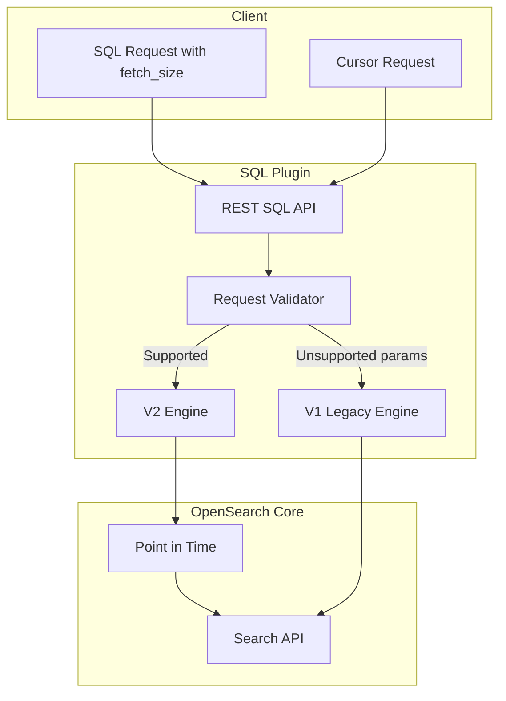
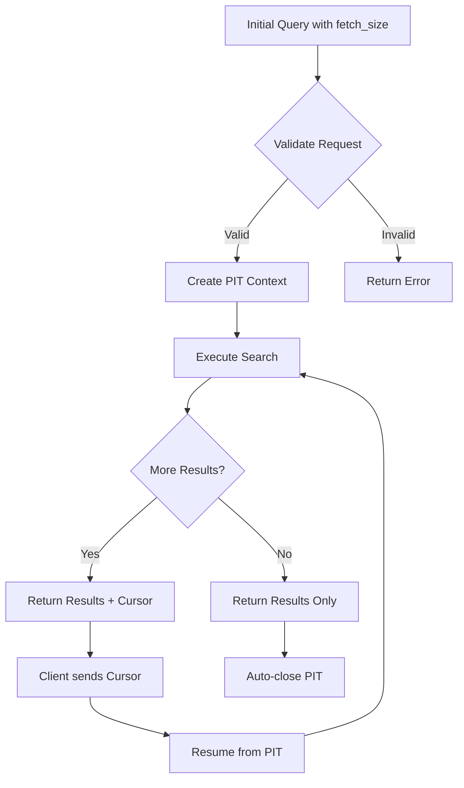

# SQL Pagination

## Summary

SQL Pagination enables paginated responses for SQL queries in OpenSearch, allowing clients to retrieve large result sets in manageable chunks. The feature uses Point in Time (PIT) internally to maintain consistent results across pagination requests, replacing the previous scroll-based implementation.

## Details

### Architecture



### Data Flow



### Components

| Component | Description |
|-----------|-------------|
| `SQLQueryRequest` | Validates request parameters and determines engine routing |
| `PrettyFormatRestExecutor` | Handles response formatting and cursor generation |
| `OpenSearchRequestBuilder` | Builds search requests with PIT support |
| `ElasticJoinExecutor` | Handles join queries with proper error handling |

### Configuration

| Setting | Description | Default |
|---------|-------------|---------|
| `plugins.sql.pagination.api` | Enable/disable pagination API | `true` |
| `plugins.sql.pagination.api.search_after` | Use PIT-based pagination (vs scroll) | `true` |

### Supported Parameters

| Parameter | Type | Description |
|-----------|------|-------------|
| `fetch_size` | Integer | Number of results per page (default: 1000, 0 = no pagination) |
| `format` | String | Response format: `jdbc`, `csv`, `raw`, `json` |
| `pretty` | Boolean | Pretty-print JSON response |

### Usage Example

```bash
# Initial paginated query
POST _plugins/_sql
{
  "query": "SELECT firstname, lastname FROM accounts WHERE age > 20 ORDER BY state ASC",
  "fetch_size": 5
}

# Response with cursor
{
  "schema": [
    {"name": "firstname", "type": "text"},
    {"name": "lastname", "type": "text"}
  ],
  "cursor": "d:eyJhIjp7fSwicyI6IkRYRjFaWEo1UVc1a1JtVjBZMmdCQUFBQUFBQUFBQU1...",
  "total": 956,
  "datarows": [["Cherry", "Carey"], ...],
  "size": 5,
  "status": 200
}

# Fetch next page using cursor
POST _plugins/_sql
{
  "cursor": "d:eyJhIjp7fSwicyI6IkRYRjFaWEo1UVc1a1JtVjBZMmdCQUFBQUFBQUFBQU1..."
}

# Close cursor explicitly (optional - auto-closes on last page)
POST _plugins/_sql/close
{
  "cursor": "d:eyJhIjp7fSwicyI6IkRYRjFaWEo1UVc1a1JtVjBZMmdCQUFBQUFBQUFBQU1..."
}
```

## Limitations

- Pagination only supports basic queries
- Not supported with aggregations, nested queries, or complex joins
- Only works with `jdbc` response format
- `fetch_size` of 0 disables pagination
- Cursor context has a timeout (configurable via PIT settings)

## Related PRs

| Version | PR | Description |
|---------|-----|-------------|
| v2.18.0 | [#3106](https://github.com/opensearch-project/sql/pull/3106) | Fix: SQL pagination with `pretty` parameter |
| v2.18.0 | [#3108](https://github.com/opensearch-project/sql/pull/3108) | Fix: PIT refactor minor issues |
| v2.18.0 | [#2759](https://github.com/opensearch-project/sql/pull/2759) | Original: Pretty parameter support |
| v2.18.0 | [#3045](https://github.com/opensearch-project/sql/pull/3045) | Original: PIT refactor bug fixes |

## References

- [Issue #2460](https://github.com/opensearch-project/sql/issues/2460): SQL pagination doesn't work in Dev tools
- [SQL and PPL API Documentation](https://docs.opensearch.org/2.18/search-plugins/sql/sql-ppl-api/): Official API documentation
- [Point in Time Documentation](https://docs.opensearch.org/2.18/search-plugins/searching-data/point-in-time/): PIT in SQL
- [Pagination Limitations](https://docs.opensearch.org/2.18/search-plugins/sql/limitation/): SQL pagination limitations

## Change History

- **v2.18.0** (2024-10-29): Fixed pagination with `pretty` parameter; Fixed PIT refactor issues (join query NPE, incorrect cursor generation)
