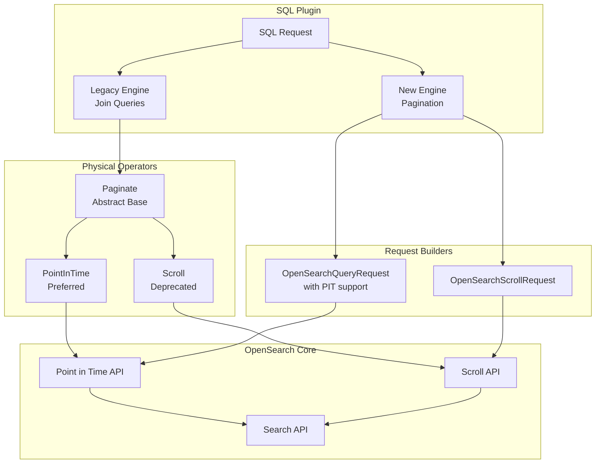
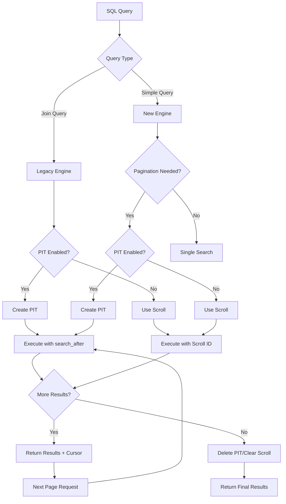

---
tags:
  - search
  - sql
---

# SQL Point in Time (PIT) Refactor

## Summary

The SQL plugin uses Point in Time (PIT) API instead of the deprecated Scroll API for join queries and pagination. PIT provides a consistent view of data during query execution, ensuring reliable results even when the underlying data changes. This refactoring improves the reliability and consistency of SQL query results, particularly for long-running queries and deep pagination scenarios.

## Details

### Architecture



### Data Flow



### Components

| Component | Description |
|-----------|-------------|
| `Paginate` | Abstract base class providing common pagination logic for both Scroll and PIT operators |
| `PointInTime` | Physical operator implementing PIT-based table scans for join queries |
| `Scroll` | Physical operator implementing Scroll-based table scans (legacy, deprecated) |
| `OpenSearchQueryRequest` | Request class extended to support PIT-based pagination with `search_after` |
| `OpenSearchScrollRequest` | Request class for Scroll-based pagination (legacy) |
| `OpenSearchRequestBuilder` | Builds appropriate request type based on configuration |
| `OpenSearchClient` | Extended with `createPit()` and `deletePit()` methods |
| `OpenSearchNodeClient` | Node client implementation of PIT operations |
| `OpenSearchRestClient` | REST client implementation of PIT operations |

### Configuration

| Setting | Description | Default |
|---------|-------------|---------|
| `plugins.sql.pagination.api` | Enable/disable pagination API | `true` |
| `plugins.sql.pagination.api.search_after` | Use PIT-based pagination instead of Scroll | `true` |
| `plugins.sql.cursor.keep_alive` | PIT/Scroll context timeout | `1m` |

### Usage Example

```sql
-- Join queries automatically use PIT when enabled
SELECT e.name, d.department_name 
FROM employees e 
JOIN departments d ON e.dept_id = d.id
WHERE e.salary > 50000;

-- Paginated queries use PIT for consistent results
POST _plugins/_sql
{
  "query": "SELECT * FROM logs WHERE timestamp > '2024-01-01'",
  "fetch_size": 1000
}

-- Cursor-based pagination maintains PIT context
POST _plugins/_sql
{
  "cursor": "d:eyJhIjp7fSwicyI6IkRYRjFaWEo1UVc1a1JtVjBZMmdCQUFBQUFBQUFBQU1..."
}
```

### Comparison: PIT vs Scroll

| Aspect | Point in Time (PIT) | Scroll |
|--------|---------------------|--------|
| Data Consistency | Fixed snapshot at PIT creation | Fixed snapshot at scroll creation |
| Navigation | Forward and backward with `search_after` | Forward only |
| Resource Usage | Retains segment copies | Keeps search context |
| Failure Recovery | Lost on cluster/node failure | Lost on cluster/node failure |
| Deprecation Status | Current, recommended | Deprecated |

## Limitations

- PIT contexts consume cluster resources (memory, disk for retained segments)
- PIT data is lost on cluster or node failure
- Additional API calls required to create/delete PIT contexts
- Not compatible with cursors from Scroll-based pagination

## Change History

- **v2.18.0** (2024-10-29): Initial implementation - Refactored SQL plugin to use PIT API for joins and pagination queries

## Related Features
- [Query Workbench](../dashboards-query-workbench/dashboards-query-workbench-query-workbench.md)
- [Observability (Dashboards)](../dashboards-observability/dashboards-observability-search-relevance-ci-tests.md)

## References

### Documentation
- [Point in Time Documentation](https://docs.opensearch.org/2.18/search-plugins/searching-data/point-in-time/): Official PIT documentation
- [PIT in SQL](https://docs.opensearch.org/2.18/search-plugins/searching-data/point-in-time/#pit-in-sql): SQL-specific PIT usage
- [Point in Time API](https://docs.opensearch.org/2.18/search-plugins/searching-data/point-in-time-api/): PIT API reference
- [SQL Pagination API](https://docs.opensearch.org/2.18/search-plugins/sql/sql-ppl-api/#paginating-results): Pagination documentation
- [Paginate Results](https://docs.opensearch.org/2.18/search-plugins/searching-data/paginate/): General pagination guide

### Pull Requests
| Version | PR | Description | Related Issue |
|---------|-----|-------------|---------------|
| v2.18.0 | [#2981](https://github.com/opensearch-project/sql/pull/2981) | Add missing refactoring of Scroll to PIT API calls for Joins and Pagination query |   |
| v2.18.0 | [#3045](https://github.com/opensearch-project/sql/pull/3045) | Bug fixes for minor issues with SQL PIT refactor |   |
| v2.18.0 | [#3106](https://github.com/opensearch-project/sql/pull/3106) | Fix: SQL pagination with `pretty` parameter |   |
| v2.18.0 | [#3108](https://github.com/opensearch-project/sql/pull/3108) | Backport: PIT refactor bug fixes |   |
