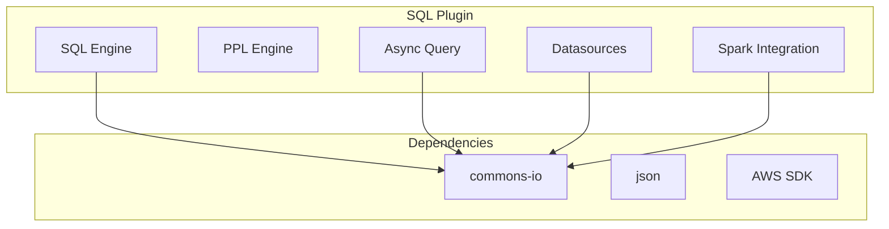

---
tags:
  - domain/search
  - component/server
  - indexing
  - search
  - security
  - sql
---
# SQL Plugin Maintenance

## Summary

The SQL plugin maintenance track covers ongoing dependency updates, security fixes, and test maintenance for the OpenSearch SQL plugin. This includes addressing security vulnerabilities in third-party libraries and ensuring test stability across release branches.

## Details

### Architecture



### Components

| Component | Description |
|-----------|-------------|
| async-query | Asynchronous query execution module |
| datasources | External data source connectors |
| spark | Apache Spark integration for analytics |

### Configuration

No specific configuration required for maintenance updates.

### Usage Example

The SQL plugin continues to work as documented. No changes to SQL or PPL query syntax.

```sql
-- SQL queries work unchanged
SELECT * FROM my_index WHERE field = 'value'
```

```ppl
-- PPL queries work unchanged
source=my_index | where field = 'value'
```

## Limitations

- Maintenance updates are typically transparent to users
- Security fixes may require cluster restart to take effect

## Change History

- **v2.18.0** (2024-11-05): Bumped commons-io to 2.14.0 to fix CVE-2024-47554, fixed test failures on 2.18 branch


## References

### Documentation
- [SQL Plugin Documentation](https://docs.opensearch.org/2.18/search-plugins/sql/sql/index/): Official SQL documentation
- [CVE-2024-47554](https://www.mend.io/vulnerability-database/CVE-2024-47554): Apache Commons IO vulnerability

### Pull Requests
| Version | PR | Description | Related Issue |
|---------|-----|-------------|---------------|
| v2.18.0 | [#3091](https://github.com/opensearch-project/sql/pull/3091) | Bump commons-io to 2.14.0 (backport) |   |
| v2.18.0 | [#3113](https://github.com/opensearch-project/sql/pull/3113) | Fix tests on 2.18 branch |   |
| v2.18.0 | [#3083](https://github.com/opensearch-project/sql/pull/3083) | Bump commons-io to 2.14.0 (main) | [#3055](https://github.com/opensearch-project/sql/issues/3055) |

### Issues (Design / RFC)
- [Issue #3055](https://github.com/opensearch-project/sql/issues/3055): CVE-2024-47554 vulnerability report
