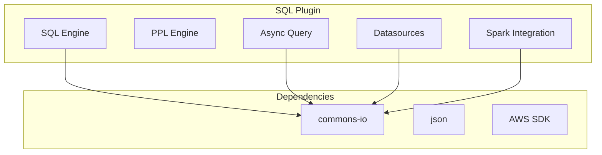

---
tags:
  - sql
---
# SQL Plugin Maintenance

## Summary

The SQL plugin maintenance track covers ongoing dependency updates, security fixes, and test maintenance for the OpenSearch SQL plugin. This includes addressing security vulnerabilities in third-party libraries and ensuring test stability across release branches.

## Details

### Architecture


```mermaid
graph TB
    subgraph "SQL Plugin"
        SQL[SQL Engine]
        PPL[PPL Engine]
        Async[Async Query]
        DS[Datasources]
        Spark[Spark Integration]
    end
    
    subgraph "Dependencies"
        CommonsIO[commons-io]
        JSON[json]
        AWS[AWS SDK]
    end
    
    SQL --> CommonsIO
    Async --> CommonsIO
    DS --> CommonsIO
    Spark --> CommonsIO
```

### Components

| Component | Description |
|-----------|-------------|
| async-query | Asynchronous query execution module |
| datasources | External data source connectors |
| spark | Apache Spark integration for analytics |

### Configuration

No specific configuration required for maintenance updates.

### Usage Example

The SQL plugin continues to work as documented. No changes to SQL or PPL query syntax.

```sql
-- SQL queries work unchanged
SELECT * FROM my_index WHERE field = 'value'
```

```ppl
-- PPL queries work unchanged
source=my_index | where field = 'value'
```

## Limitations

- Maintenance updates are typically transparent to users
- Security fixes may require cluster restart to take effect

## Change History

- **v3.6.0**: Maintainer roster updates — added @ahkcs and @songkant-aws as new maintainers, moved 8 inactive maintainers to Emeritus. Added CLAUDE.md AI coding guide. Version bump to 3.6.0-SNAPSHOT.
- **v2.18.0** (2024-11-05): Bumped commons-io to 2.14.0 to fix CVE-2024-47554, fixed test failures on 2.18 branch


## References

### Documentation
- [SQL Plugin Documentation](https://docs.opensearch.org/2.18/search-plugins/sql/sql/index/): Official SQL documentation
- [CVE-2024-47554](https://www.mend.io/vulnerability-database/CVE-2024-47554): Apache Commons IO vulnerability

### Pull Requests
| Version | PR | Description | Related Issue |
|---------|-----|-------------|---------------|
| v3.6.0 | [#5260](https://github.com/opensearch-project/sql/pull/5260) | Move maintainers to Emeritus | |
| v3.6.0 | [#5259](https://github.com/opensearch-project/sql/pull/5259) | Add CLAUDE.md | [#5242](https://github.com/opensearch-project/sql/issues/5242) |
| v3.6.0 | [#5244](https://github.com/opensearch-project/sql/pull/5244) | Add songkant-aws as maintainer | |
| v3.6.0 | [#5223](https://github.com/opensearch-project/sql/pull/5223) | Add ahkcs as maintainer | |
| v3.6.0 | [#5115](https://github.com/opensearch-project/sql/pull/5115) | Increment version to 3.6.0-SNAPSHOT | |
| v2.18.0 | [#3091](https://github.com/opensearch-project/sql/pull/3091) | Bump commons-io to 2.14.0 (backport) |   |
| v2.18.0 | [#3113](https://github.com/opensearch-project/sql/pull/3113) | Fix tests on 2.18 branch |   |
| v2.18.0 | [#3083](https://github.com/opensearch-project/sql/pull/3083) | Bump commons-io to 2.14.0 (main) | [#3055](https://github.com/opensearch-project/sql/issues/3055) |

### Issues (Design / RFC)
- [Issue #3055](https://github.com/opensearch-project/sql/issues/3055): CVE-2024-47554 vulnerability report
