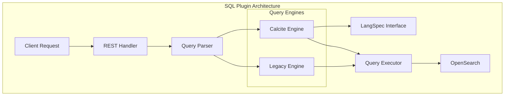
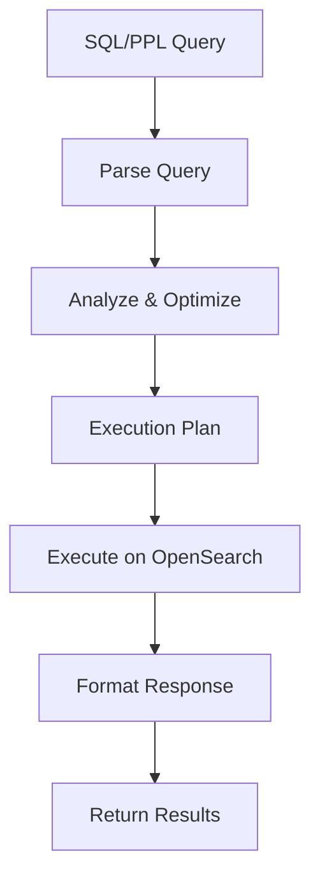

# SQL/PPL Breaking Changes

## Summary

The OpenSearch SQL plugin provides SQL and PPL (Piped Processing Language) query interfaces for OpenSearch. Major version releases introduce breaking changes to remove deprecated features, improve architecture, and align with modern standards. This document tracks breaking changes across versions.

## Details

### Architecture



### Data Flow



### Components

| Component | Description |
|-----------|-------------|
| REST Handler | Handles `/_plugins/_sql` and `/_plugins/_ppl` endpoints |
| Query Parser | Parses SQL/PPL syntax into AST |
| Calcite Engine | Apache Calcite-based query processing (v3.0.0+) |
| LangSpec Interface | Language-specific type mapping for SQL vs PPL |
| Query Executor | Translates queries to OpenSearch operations |

### Configuration

| Setting | Description | Default |
|---------|-------------|---------|
| `plugins.sql.enabled` | Enable/disable SQL plugin | `true` |
| `plugins.sql.slowlog` | Slow query log threshold | `2` (seconds) |
| `plugins.sql.cursor.keep_alive` | Cursor keep alive duration | `1m` |
| `plugins.query.memory_limit` | Query memory limit | `85%` |
| `plugins.query.size_limit` | Maximum query result size | `200` |

### Supported Response Formats (v3.0.0+)

| Format | Description |
|--------|-------------|
| `jdbc` | JDBC-compatible format (default) |
| `csv` | Comma-separated values |
| `raw` | Raw format |

### Usage Example

```bash
# SQL Query
POST /_plugins/_sql
{
  "query": "SELECT * FROM my_index WHERE status = 'active' LIMIT 10"
}

# PPL Query
POST /_plugins/_ppl
{
  "query": "source=my_index | where status = 'active' | head 10"
}

# With cursor for pagination
POST /_plugins/_sql
{
  "query": "SELECT * FROM my_index",
  "fetch_size": 100
}
```

## Limitations

- SQL plugin does not support all SQL-92 features
- Some complex joins may have performance implications
- Nested field queries have specific syntax requirements
- Calcite engine migration is ongoing; some functions may behave differently

## Related PRs

| Version | PR | Description |
|---------|-----|-------------|
| v3.0.0 | [#3306](https://github.com/opensearch-project/sql/pull/3306) | Remove SparkSQL support |
| v3.0.0 | [#3326](https://github.com/opensearch-project/sql/pull/3326) | Remove opendistro settings and endpoints |
| v3.0.0 | [#3337](https://github.com/opensearch-project/sql/pull/3337) | Deprecate SQL Delete statement |
| v3.0.0 | [#3345](https://github.com/opensearch-project/sql/pull/3345) | Unified OpenSearch PPL Data Type |
| v3.0.0 | [#3346](https://github.com/opensearch-project/sql/pull/3346) | Deprecate scroll API usage |
| v3.0.0 | [#3367](https://github.com/opensearch-project/sql/pull/3367) | Deprecate OpenSearch DSL format |
| v3.0.0 | [#3439](https://github.com/opensearch-project/sql/pull/3439) | Support CAST function with Calcite |
| v3.0.0 | [#3473](https://github.com/opensearch-project/sql/pull/3473) | Add datetime functions |
| v3.0.0 | [#3488](https://github.com/opensearch-project/sql/pull/3488) | Documentation for PPL V3 engine and limitations |

## References

- [SQL and PPL Documentation](https://docs.opensearch.org/3.0/search-plugins/sql/index/): Official SQL/PPL documentation
- [Breaking Changes](https://docs.opensearch.org/3.0/breaking-changes/): v3.0.0 breaking changes
- [OpenSearch 3.0 Blog](https://opensearch.org/blog/opensearch-3-0-what-to-expect/): What to expect in OpenSearch 3.0
- [SQL Plugin Repository](https://github.com/opensearch-project/sql): Source code
- [PPL V3 Engine Limitations](https://docs.opensearch.org/3.0/search-plugins/sql/limitation/): V3 engine limitations
- [Enhanced Log Analysis Blog](https://opensearch.org/blog/enhanced-log-analysis-with-opensearch-ppl-introducing-lookup-join-and-subsearch/): New PPL commands (join, lookup, subsearch)

## Change History

- **v3.0.0** (2025): Major breaking changes - removed SparkSQL, DELETE statement, DSL format, scroll API, opendistro settings/endpoints; added Calcite-based functions, unified PPL data types, and documentation for V3 engine with new commands (join, lookup, subquery)
