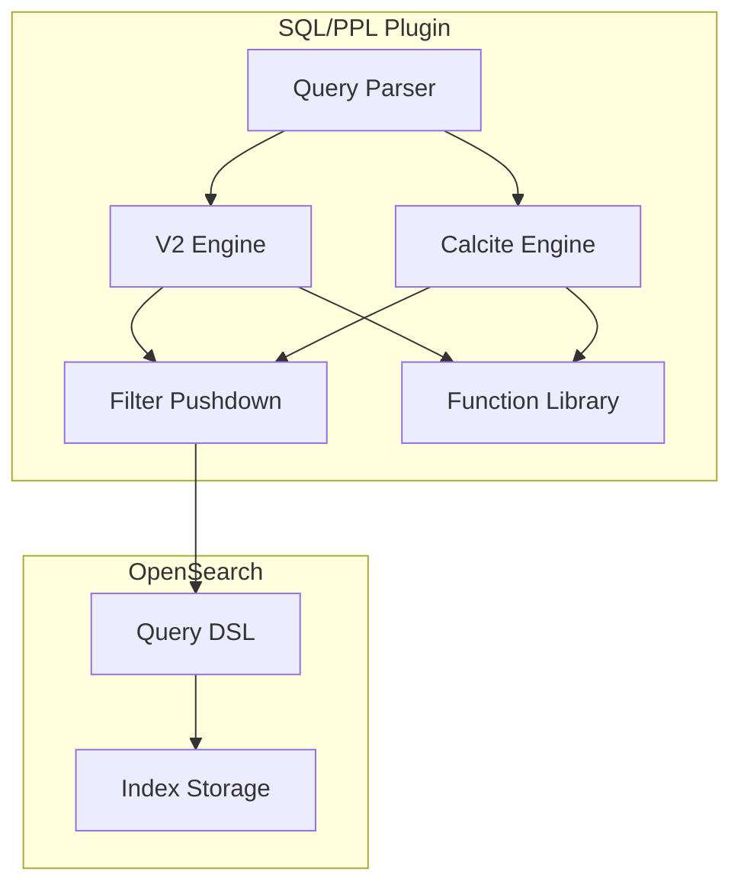

# SQL/PPL Bug Fixes

## Summary

This document tracks bug fixes and stability improvements for the OpenSearch SQL/PPL plugin. The SQL plugin enables querying OpenSearch data using familiar SQL syntax, while PPL (Piped Processing Language) provides a pipe-based query language for data exploration and analysis.

## Details

### Architecture



### Components

| Component | Description |
|-----------|-------------|
| Query Parser | Parses SQL and PPL queries into AST |
| V2 Engine | Legacy query execution engine |
| Calcite Engine | Apache Calcite-based query engine (newer) |
| Filter Pushdown | Optimizes queries by pushing filters to OpenSearch |
| Function Library | Built-in SQL/PPL functions |

### Key Bug Fix Categories

#### Query Execution

- Long IN-lists causing StackOverflowError - fixed by using balanced tree for OR operations
- NPE in aggregate queries - fixed by adding trimmed project before aggregate
- Limit with offset exceeding maxResultWindow - prevented by checking bounds before pushdown
- query.size_limit affecting intermediate results - fixed to only affect final results

#### Function Behavior

- `ATAN(x, y)` two-parameter form support in Calcite engine
- `CONV(x, a, b)` type conversion correctness
- `UNIX_TIMESTAMP` precision with timestamp strings

#### Field and Type Handling

- Alias type with nested field path support
- Script filter with struct type fields
- Filter pushdown with nested text fields
- Ambiguous column names in JOIN operations

### Configuration

| Setting | Description | Default |
|---------|-------------|---------|
| `plugins.sql.query.size_limit` | Maximum result size for queries | 200 |
| `max_result_window` | Maximum from + size for pagination | 10000 |

### Usage Example

```sql
-- SQL query with IN clause
SELECT * FROM my_index WHERE status IN ('active', 'pending', 'completed')

-- PPL query with JOIN
source=orders | join left=o right=c on o.customer_id=c.id customers | fields o.order_id, c.name

-- Using ATAN function
SELECT ATAN(y_coord, x_coord) as angle FROM coordinates

-- UNIX_TIMESTAMP with precision
SELECT UNIX_TIMESTAMP('2025-01-10 12:30:45.123') as ts FROM my_index
```

## Limitations

- Script filter pushdown disabled for struct type fields in v2 engine
- Calcite engine does not support script pushdown
- Alias fields pointing to text type require using original field's keyword for filters

## Related PRs

| Version | PR | Description |
|---------|-----|-------------|
| v3.1.0 | [#3693](https://github.com/opensearch-project/sql/pull/3693) | Fix error when pushing down script filter with struct field |
| v3.1.0 | [#3674](https://github.com/opensearch-project/sql/pull/3674) | Fix alias type referring to nested field |
| v3.1.0 | [#3660](https://github.com/opensearch-project/sql/pull/3660) | Fix: Long IN-lists causes crash |
| v3.1.0 | [#3621](https://github.com/opensearch-project/sql/pull/3621) | Add a trimmed project before aggregate to avoid NPE in Calcite |
| v3.1.0 | [#3760](https://github.com/opensearch-project/sql/pull/3760) | Fix field not found issue in join output when column names are ambiguous |
| v3.1.0 | [#3748](https://github.com/opensearch-project/sql/pull/3748) | Fix: correct ATAN(x, y) and CONV(x, a, b) functions bug |
| v3.1.0 | [#3679](https://github.com/opensearch-project/sql/pull/3679) | Return double with correct precision for UNIX_TIMESTAMP |
| v3.1.0 | [#3713](https://github.com/opensearch-project/sql/pull/3713) | Prevent push down limit with offset reach maxResultWindow |
| v3.1.0 | [#3645](https://github.com/opensearch-project/sql/pull/3645) | Fix pushing down filter with nested field of the text type |
| v3.1.0 | [#3623](https://github.com/opensearch-project/sql/pull/3623) | Make query.size_limit only affect the final results |
| v3.1.0 | [#3553](https://github.com/opensearch-project/sql/pull/3553) | Revert stream pattern method in V2 and implement SIMPLE_PATTERN |
| v3.1.0 | [#2617](https://github.com/opensearch-project/sql/pull/2617) | Remove the duplicated timestamp row in data type mapping table |
| v3.1.0 | [#3576](https://github.com/opensearch-project/sql/pull/3576) | Migrate existing UDFs to PPLFuncImpTable |
| v3.1.0 | [#3715](https://github.com/opensearch-project/sql/pull/3715) | Modified workflow: Grammar Files & Async Query Core |
| v3.1.0 | [#3656](https://github.com/opensearch-project/sql/pull/3656) | Update PPL Limitation Docs |
| v3.1.0 | [#3649](https://github.com/opensearch-project/sql/pull/3649) | Create a new directory org/opensearch/direct-query/ |
| v3.1.0 | [#3622](https://github.com/opensearch-project/sql/pull/3622) | Add a TPC-H PPL query suite |

## References

- [SQL and PPL Documentation](https://docs.opensearch.org/3.1/search-plugins/sql/index/)
- [SQL and PPL API](https://docs.opensearch.org/3.1/search-plugins/sql/sql-ppl-api/)
- [PPL Documentation](https://docs.opensearch.org/3.1/search-plugins/sql/ppl/index/)
- [Issue #1469](https://github.com/opensearch-project/sql/issues/1469): Long IN-lists causes crash
- [Issue #3312](https://github.com/opensearch-project/sql/issues/3312): Script filter with struct field error
- [Issue #3646](https://github.com/opensearch-project/sql/issues/3646): Alias type referring to nested field
- [Issue #3566](https://github.com/opensearch-project/sql/issues/3566): NPE in Calcite aggregate
- [Issue #3617](https://github.com/opensearch-project/sql/issues/3617): Field not found in join output
- [Issue #3672](https://github.com/opensearch-project/sql/issues/3672): ATAN and CONV function bugs
- [Issue #3611](https://github.com/opensearch-project/sql/issues/3611): UNIX_TIMESTAMP precision
- [Issue #3102](https://github.com/opensearch-project/sql/issues/3102): Limit with offset exceeds maxResultWindow

## Change History

- **v3.1.0** (2025-06): 17 bug fixes including long IN-list crash, function fixes (ATAN, CONV, UNIX_TIMESTAMP), field handling improvements, and Calcite engine stability
