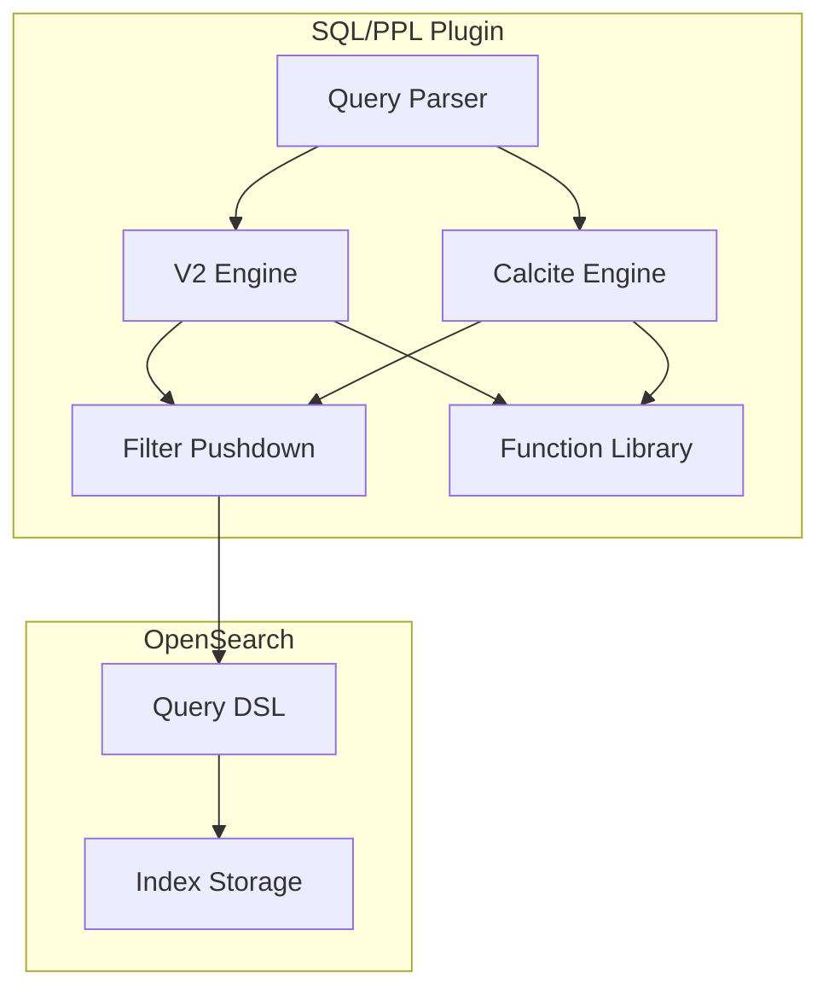

# SQL/PPL Bug Fixes

## Summary

This document tracks bug fixes and stability improvements for the OpenSearch SQL/PPL plugin. The SQL plugin enables querying OpenSearch data using familiar SQL syntax, while PPL (Piped Processing Language) provides a pipe-based query language for data exploration and analysis.

## Details

### Architecture



### Components

| Component | Description |
|-----------|-------------|
| Query Parser | Parses SQL and PPL queries into AST |
| V2 Engine | Legacy query execution engine |
| Calcite Engine | Apache Calcite-based query engine (newer) |
| Filter Pushdown | Optimizes queries by pushing filters to OpenSearch |
| Function Library | Built-in SQL/PPL functions |

### Key Bug Fix Categories

#### Query Execution

- Long IN-lists causing StackOverflowError - fixed by using balanced tree for OR operations
- NPE in aggregate queries - fixed by adding trimmed project before aggregate
- Limit with offset exceeding maxResultWindow - prevented by checking bounds before pushdown
- query.size_limit affecting intermediate results - fixed to only affect final results

#### Function Behavior

- `ATAN(x, y)` two-parameter form support in Calcite engine
- `CONV(x, a, b)` type conversion correctness
- `UNIX_TIMESTAMP` precision with timestamp strings

#### Field and Type Handling

- Alias type with nested field path support
- Script filter with struct type fields
- Filter pushdown with nested text fields
- Ambiguous column names in JOIN operations

### Configuration

| Setting | Description | Default |
|---------|-------------|---------|
| `plugins.sql.query.size_limit` | Maximum result size for queries | 200 |
| `max_result_window` | Maximum from + size for pagination | 10000 |

### Usage Example

```sql
-- SQL query with IN clause
SELECT * FROM my_index WHERE status IN ('active', 'pending', 'completed')

-- PPL query with JOIN
source=orders | join left=o right=c on o.customer_id=c.id customers | fields o.order_id, c.name

-- Using ATAN function
SELECT ATAN(y_coord, x_coord) as angle FROM coordinates

-- UNIX_TIMESTAMP with precision
SELECT UNIX_TIMESTAMP('2025-01-10 12:30:45.123') as ts FROM my_index
```

## Limitations

- Script filter pushdown disabled for struct type fields in v2 engine
- Calcite engine does not support script pushdown
- Alias fields pointing to text type require using original field's keyword for filters

## Related PRs

| Version | PR | Description |
|---------|-----|-------------|
| v3.4.0 | [#4885](https://github.com/opensearch-project/sql/pull/4885) | Add hashCode() and equals() to ExprJavaType value class |
| v3.4.0 | [#4868](https://github.com/opensearch-project/sql/pull/4868) | Fix LogPatternAggFunction parameter/return logic |
| v3.4.0 | [#4850](https://github.com/opensearch-project/sql/pull/4850) | Grouping key field type overwrite fix |
| v3.4.0 | [#4841](https://github.com/opensearch-project/sql/pull/4841) | Fix memory exhaustion for multiple filtering operations |
| v3.4.0 | [#4837](https://github.com/opensearch-project/sql/pull/4837) | Update like() syntax |
| v3.4.0 | [#4813](https://github.com/opensearch-project/sql/pull/4813) | Support escaped field names in SPath parsing |
| v3.4.0 | [#4793](https://github.com/opensearch-project/sql/pull/4793) | Fix function identify problem in SQL dialect conversion |
| v3.4.0 | [#4788](https://github.com/opensearch-project/sql/pull/4788) | Translate SAFE_CAST to TRY_CAST in Spark SQL |
| v3.4.0 | [#4783](https://github.com/opensearch-project/sql/pull/4783) | Fix search anonymizer only |
| v3.4.0 | [#4777](https://github.com/opensearch-project/sql/pull/4777) | Fix Streamstats null group handling |
| v3.4.0 | [#4758](https://github.com/opensearch-project/sql/pull/4758) | Fix eval on grouped fields after timechart |
| v3.4.0 | [#4749](https://github.com/opensearch-project/sql/pull/4749) | Support script pushdown in sort-on-measure rewriting |
| v3.4.0 | [#4744](https://github.com/opensearch-project/sql/pull/4744) | Fix filter push down redundant filter queries |
| v3.4.0 | [#4742](https://github.com/opensearch-project/sql/pull/4742) | Fix binning UDF resolution / type coercion |
| v3.4.0 | [#4719](https://github.com/opensearch-project/sql/pull/4719) | Support nested field access after fields command |
| v3.4.0 | [#4717](https://github.com/opensearch-project/sql/pull/4717) | Support decimal as span literals |
| v3.4.0 | [#4708](https://github.com/opensearch-project/sql/pull/4708) | Fix AllFieldsExcludeMeta nested field resolution |
| v3.4.0 | [#4706](https://github.com/opensearch-project/sql/pull/4706) | BucketAggregationParser handle more non-composite types |
| v3.4.0 | [#4683](https://github.com/opensearch-project/sql/pull/4683) | Fix sub-fields accessing of generated structs |
| v3.4.0 | [#4673](https://github.com/opensearch-project/sql/pull/4673) | Make nested alias type support outer context |
| v3.4.0 | [#4670](https://github.com/opensearch-project/sql/pull/4670) | Use table scan rowType in filter pushdown |
| v3.4.0 | [#4665](https://github.com/opensearch-project/sql/pull/4665) | Fix CVE-2025-48924 |
| v3.4.0 | [#4651](https://github.com/opensearch-project/sql/pull/4651) | Fix asc/desc keyword behavior for sort |
| v3.4.0 | [#4648](https://github.com/opensearch-project/sql/pull/4648) | Change ComparableLinkedHashMap to compare Key |
| v3.4.0 | [#4641](https://github.com/opensearch-project/sql/pull/4641) | Fix rex nested capture groups extraction |
| v3.4.0 | [#4633](https://github.com/opensearch-project/sql/pull/4633) | Replace dots in table scan PhysType fields |
| v3.4.0 | [#4629](https://github.com/opensearch-project/sql/pull/4629) | Return comparable LinkedHashMap in ExprTupleValue |
| v3.4.0 | [#4621](https://github.com/opensearch-project/sql/pull/4621) | Support alias fields in MIN/MAX/FIRST/LAST/TAKE |
| v3.4.0 | [#4618](https://github.com/opensearch-project/sql/pull/4618) | Support serializing external OpenSearch UDFs |
| v3.4.0 | [#4616](https://github.com/opensearch-project/sql/pull/4616) | Fix filter parsing on date fields |
| v3.4.0 | [#4608](https://github.com/opensearch-project/sql/pull/4608) | Fix compile issue in main |
| v3.4.0 | [#4606](https://github.com/opensearch-project/sql/pull/4606) | Fix bin nested fields issue |
| v3.4.0 | [#4583](https://github.com/opensearch-project/sql/pull/4583) | Add value type hint for derived aggregate group by |
| v3.4.0 | [#4572](https://github.com/opensearch-project/sql/pull/4572) | Fix push down failure for min/max on derived field |
| v3.4.0 | [#4546](https://github.com/opensearch-project/sql/pull/4546) | Fix sort push down into agg after project |
| v3.4.0 | [#4541](https://github.com/opensearch-project/sql/pull/4541) | Update request builder after pushdown sort |
| v3.4.0 | [#4539](https://github.com/opensearch-project/sql/pull/4539) | Fix percentile bug |
| v3.4.0 | [#4522](https://github.com/opensearch-project/sql/pull/4522) | Include metadata fields type in agg/filter pushdown |
| v3.4.0 | [#4520](https://github.com/opensearch-project/sql/pull/4520) | Throw error for non-boolean case conditions |
| v3.4.0 | [#4512](https://github.com/opensearch-project/sql/pull/4512) | Fixes for Multisearch and Append command |
| v3.4.0 | [#4500](https://github.com/opensearch-project/sql/pull/4500) | Fix mapping after aggregation push down |
| v3.4.0 | [#4491](https://github.com/opensearch-project/sql/pull/4491) | Fix missing keywordsCanBeId |
| v3.4.0 | [#4475](https://github.com/opensearch-project/sql/pull/4475) | Fix explicit makeNullLiteral for UDT fields |
| v3.4.0 | [#4474](https://github.com/opensearch-project/sql/pull/4474) | Fix join type ambiguous issue |
| v3.4.0 | [#4454](https://github.com/opensearch-project/sql/pull/4454) | Remove shared mutable optimizer field (race condition) |
| v3.4.0 | [#4449](https://github.com/opensearch-project/sql/pull/4449) | Fix issue 4441 |
| v3.4.0 | [#4435](https://github.com/opensearch-project/sql/pull/4435) | Revert to _doc + _id |
| v3.4.0 | [#4413](https://github.com/opensearch-project/sql/pull/4413) | Fallback to sub-aggregation if composite unsupported |
| v3.3.0 | [#4416](https://github.com/opensearch-project/sql/pull/4416) | Fix count(*) and dc(field) to be capped at MAX_INTEGER |
| v3.3.0 | [#4407](https://github.com/opensearch-project/sql/pull/4407) | Mod function should return decimal instead of float |
| v3.3.0 | [#4401](https://github.com/opensearch-project/sql/pull/4401) | Scale of decimal literal should always be positive in Calcite |
| v3.3.0 | [#4388](https://github.com/opensearch-project/sql/pull/4388) | Fix bug of missed analyzed node when pushdown filter for Search call |
| v3.3.0 | [#4381](https://github.com/opensearch-project/sql/pull/4381) | Fix parse related functions return behavior in case of NULL input |
| v3.3.0 | [#4377](https://github.com/opensearch-project/sql/pull/4377) | Prevent limit pushdown before action building |
| v3.3.0 | [#4369](https://github.com/opensearch-project/sql/pull/4369) | No index found with given index pattern should throw IndexNotFoundException |
| v3.3.0 | [#4360](https://github.com/opensearch-project/sql/pull/4360) | Fix ClassCastException for value-storing aggregates on nested PPL fields |
| v3.3.0 | [#4352](https://github.com/opensearch-project/sql/pull/4352) | Change Anonymizer to mask PPL |
| v3.3.0 | [#4334](https://github.com/opensearch-project/sql/pull/4334) | Fix alphanumeric search which starts with number |
| v3.3.0 | [#4325](https://github.com/opensearch-project/sql/pull/4325) | Fix geopoint issue in complex data types |
| v3.3.0 | [#3613](https://github.com/opensearch-project/sql/pull/3613) | Bugfix: SQL type mapping for legacy JDBC output |
| v3.1.0 | [#3693](https://github.com/opensearch-project/sql/pull/3693) | Fix error when pushing down script filter with struct field |
| v3.1.0 | [#3674](https://github.com/opensearch-project/sql/pull/3674) | Fix alias type referring to nested field |
| v3.1.0 | [#3660](https://github.com/opensearch-project/sql/pull/3660) | Fix: Long IN-lists causes crash |
| v3.1.0 | [#3621](https://github.com/opensearch-project/sql/pull/3621) | Add a trimmed project before aggregate to avoid NPE in Calcite |
| v3.1.0 | [#3760](https://github.com/opensearch-project/sql/pull/3760) | Fix field not found issue in join output when column names are ambiguous |
| v3.1.0 | [#3748](https://github.com/opensearch-project/sql/pull/3748) | Fix: correct ATAN(x, y) and CONV(x, a, b) functions bug |
| v3.1.0 | [#3679](https://github.com/opensearch-project/sql/pull/3679) | Return double with correct precision for UNIX_TIMESTAMP |
| v3.1.0 | [#3713](https://github.com/opensearch-project/sql/pull/3713) | Prevent push down limit with offset reach maxResultWindow |
| v3.1.0 | [#3645](https://github.com/opensearch-project/sql/pull/3645) | Fix pushing down filter with nested field of the text type |
| v3.1.0 | [#3623](https://github.com/opensearch-project/sql/pull/3623) | Make query.size_limit only affect the final results |
| v3.1.0 | [#3553](https://github.com/opensearch-project/sql/pull/3553) | Revert stream pattern method in V2 and implement SIMPLE_PATTERN |
| v3.1.0 | [#2617](https://github.com/opensearch-project/sql/pull/2617) | Remove the duplicated timestamp row in data type mapping table |
| v3.1.0 | [#3576](https://github.com/opensearch-project/sql/pull/3576) | Migrate existing UDFs to PPLFuncImpTable |
| v3.1.0 | [#3715](https://github.com/opensearch-project/sql/pull/3715) | Modified workflow: Grammar Files & Async Query Core |
| v3.1.0 | [#3656](https://github.com/opensearch-project/sql/pull/3656) | Update PPL Limitation Docs |
| v3.1.0 | [#3649](https://github.com/opensearch-project/sql/pull/3649) | Create a new directory org/opensearch/direct-query/ |
| v3.1.0 | [#3622](https://github.com/opensearch-project/sql/pull/3622) | Add a TPC-H PPL query suite |

## References

- [SQL and PPL Documentation](https://docs.opensearch.org/3.1/search-plugins/sql/index/)
- [SQL and PPL API](https://docs.opensearch.org/3.1/search-plugins/sql/sql-ppl-api/)
- [PPL Documentation](https://docs.opensearch.org/3.1/search-plugins/sql/ppl/index/)
- [Issue #1469](https://github.com/opensearch-project/sql/issues/1469): Long IN-lists causes crash
- [Issue #3312](https://github.com/opensearch-project/sql/issues/3312): Script filter with struct field error
- [Issue #3646](https://github.com/opensearch-project/sql/issues/3646): Alias type referring to nested field
- [Issue #3566](https://github.com/opensearch-project/sql/issues/3566): NPE in Calcite aggregate
- [Issue #3617](https://github.com/opensearch-project/sql/issues/3617): Field not found in join output
- [Issue #3672](https://github.com/opensearch-project/sql/issues/3672): ATAN and CONV function bugs
- [Issue #3611](https://github.com/opensearch-project/sql/issues/3611): UNIX_TIMESTAMP precision
- [Issue #3102](https://github.com/opensearch-project/sql/issues/3102): Limit with offset exceeds maxResultWindow

## Change History

- **v3.4.0** (2026-01): 48 bug fixes including critical memory exhaustion fix for multiple filter operations, race condition fix in concurrent queries, rex command nested capture group extraction fix, filter pushdown redundant query fix, streamstats null group handling, multisearch/append type conflict behavior change, CVE-2025-48924 security fix, and numerous field/type handling improvements
- **v3.3.0** (2026-01): 26 bug fixes including count overflow handling (integer to bigint), decimal precision fixes (MOD function, negative scale), nested field aggregation ClassCastException fix, parse/grok/patterns NULL handling, alphanumeric search grammar fix, IndexNotFoundException for missing patterns, legacy JDBC type mapping, and extensive documentation/CI improvements
- **v3.1.0** (2025-06): 17 bug fixes including long IN-list crash, function fixes (ATAN, CONV, UNIX_TIMESTAMP), field handling improvements, and Calcite engine stability
