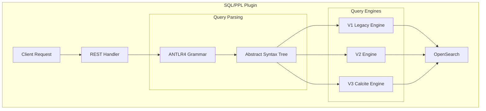

---
tags:
  - sql
---
# SQL/PPL Engine

## Summary

The OpenSearch SQL/PPL Engine provides SQL and Piped Processing Language (PPL) query interfaces for OpenSearch. The plugin supports three query engines: V1 (legacy), V2, and V3 (Calcite-based). Starting with v3.0.0, the Calcite engine enables advanced features like joins, lookups, and subsearches.

> **Note**: For detailed information about the V3 Calcite engine, including PPL commands, functions, and optimization features, see Calcite Query Engine.

## Details

### Architecture



### Query Engines

| Engine | Description | Use Case |
|--------|-------------|----------|
| V1 (Legacy) | Original SQL engine | Pagination, cursor, JSON output |
| V2 | Modern engine with improved features | General SQL/PPL queries |
| V3 (Calcite) | Apache Calcite-based with advanced optimization | Joins, lookups, subsearches, analytics |

For V3 Calcite engine details, see Calcite Query Engine.

### Configuration

| Setting | Description | Default |
|---------|-------------|---------|
| `plugins.sql.enabled` | Enable/disable SQL support | `true` |
| `plugins.ppl.enabled` | Enable/disable PPL support | `true` |
| `plugins.calcite.enabled` | Enable V3 Calcite engine | `true` (v3.3.0+) |
| `plugins.sql.slowlog` | Slow query log threshold (seconds) | `2` |
| `plugins.sql.cursor.keep_alive` | Cursor keep alive duration | `1m` |
| `plugins.query.memory_limit` | Query memory limit | `85%` |
| `plugins.query.size_limit` | Maximum query result size | `10000` |

### Usage Example

```bash
# SQL Query
POST /_plugins/_sql
{
  "query": "SELECT * FROM my_index WHERE status = 'active' LIMIT 10"
}

# PPL Query
POST /_plugins/_ppl
{
  "query": "source=my_index | where status = 'active' | head 10"
}

# PPL with join (V3 Calcite)
POST /_plugins/_ppl
{
  "query": "source=auth_logs | join ON auth_logs.user_id = users.user_id users | fields timestamp, user_id, name"
}
```

## Limitations

- Pagination/cursor only supported in V1 engine
- JSON formatted output only in V1 engine
- V3 Calcite limitations: see [Calcite Query Engine - Limitations](sql-calcite-query-engine.md#limitations)

## Change History

- **v3.5.0**: New PPL commands (`transpose`, `spath`, `mvcombine`, `addtotals`/`addcoltotals`); new eval functions (`tonumber`, `mvzip`, `split`, `mvfind`, `mvmap`); Unified Query API (`UnifiedQueryTranspiler`, `UnifiedQueryCompiler`, `UnifiedQueryContext`); query profiling framework; query optimization enhancements (nested field filter pushdown, SortMergeJoin optimization, join with TopHits, dedup pushdown, nested aggregation, enumerable TopK); bug fixes for PIT context leak and NOT BETWEEN query
- **v3.3.0**: Calcite enabled by default; see Calcite Query Engine for details
- **v3.0.0**: Apache Calcite integration (V3 engine)
- **v2.19.0**: PPL metadata fields support (`_id`, `_index`, etc.); grammar validation for PPL; async query state management improvements; bug fixes for datetime parsing, CSV output, and FilterOperator
- **v2.17.0**: Increased default query size limit (200 → 10000)
- **v2.16.0**: Registered system indices (`.ql-datasources`, `.spark-request-buffer*`) through `SystemIndexPlugin.getSystemIndexDescriptors` for formal system index protection


## References

### Documentation
- [SQL and PPL Documentation](https://docs.opensearch.org/3.0/search-plugins/sql/index/)
- [SQL Settings](https://docs.opensearch.org/3.0/search-plugins/sql/settings/)
- [SQL Plugin Repository](https://github.com/opensearch-project/sql)

### Pull Requests
| Version | PR | Description | Related Issue |
|---------|-----|-------------|---------------|
| v3.5.0 | [#4871](https://github.com/opensearch-project/sql/pull/4871) | Add unified query transpiler API | [#4870](https://github.com/opensearch-project/sql/issues/4870) |
| v3.5.0 | [#4974](https://github.com/opensearch-project/sql/pull/4974) | Add unified query compiler API | [#4894](https://github.com/opensearch-project/sql/issues/4894) |
| v3.5.0 | [#4983](https://github.com/opensearch-project/sql/pull/4983) | Support profile options for PPL | [#4294](https://github.com/opensearch-project/sql/issues/4294) |
| v3.5.0 | [#5009](https://github.com/opensearch-project/sql/pull/5009) | Fix PIT context leak in Legacy SQL | [#5002](https://github.com/opensearch-project/sql/issues/5002) |
| v3.5.0 | [#5028](https://github.com/opensearch-project/sql/pull/5028) | Implement spath command with field resolution | [#4984](https://github.com/opensearch-project/sql/issues/4984) |
| v2.16.0 | [#2772](https://github.com/opensearch-project/sql/pull/2772) | Register system index descriptors through SystemIndexPlugin | [security#4439](https://github.com/opensearch-project/security/issues/4439) |
| v2.16.0 | [#2817](https://github.com/opensearch-project/sql/pull/2817) | Backport: Register system index descriptors through SystemIndexPlugin | [security#4439](https://github.com/opensearch-project/security/issues/4439) |
