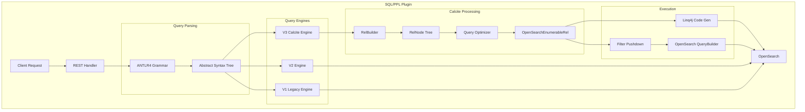
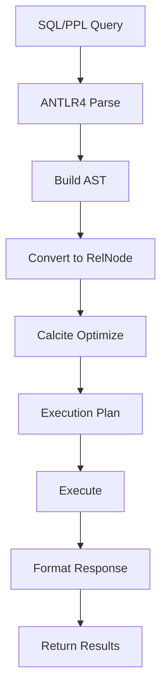

# SQL/PPL Engine

## Summary

The OpenSearch SQL/PPL Engine provides SQL and Piped Processing Language (PPL) query interfaces for OpenSearch. Starting with v3.0.0, the plugin integrates Apache Calcite as a new query engine (V3) that enables advanced features like joins, lookups, and subsearches for complex log analysis and data correlation workflows.

## Details

### Architecture



### Data Flow



### Components

| Component | Description |
|-----------|-------------|
| REST Handler | Handles `/_plugins/_sql` and `/_plugins/_ppl` endpoints |
| ANTLR4 Parser | Parses SQL/PPL syntax into parse tree, then AST |
| V1 Engine | Original SQL processing engine (legacy) |
| V2 Engine | Modern query engine with improved features |
| V3 Calcite Engine | Apache Calcite-based engine with advanced optimization |
| PPLFuncImpTable | Logical-level function implementation registry |
| PPLBuiltinOperators | Physical-level UDF implementations |
| RelBuilder | Converts AST to Calcite RelNode tree |
| Query Optimizer | Applies transformation rules for optimization |
| OpenSearchEnumerableRel | OpenSearch-specific Calcite operators |
| Linq4j | Code generation for row-by-row processing |

### Configuration

| Setting | Description | Default |
|---------|-------------|---------|
| `plugins.sql.enabled` | Enable/disable SQL support | `true` |
| `plugins.ppl.enabled` | Enable/disable PPL support | `true` |
| `plugins.calcite.enabled` | Enable V3 Calcite engine | `false` |
| `plugins.sql.slowlog` | Slow query log threshold (seconds) | `2` |
| `plugins.sql.cursor.keep_alive` | Cursor keep alive duration | `1m` |
| `plugins.query.memory_limit` | Query memory limit | `85%` |
| `plugins.query.size_limit` | Maximum query result size | `10000` (v2.17.0+), `200` (prior) |
| `plugins.query.field_type_tolerance` | Handle array datasets | `true` |

### PPL Commands (V3)

| Command | Description | Example |
|---------|-------------|---------|
| `lookup` | Enrich data with reference table | `source=logs \| lookup users user_id` |
| `join` | Correlate data from multiple indexes | `source=a \| join ON a.id = b.id b` |
| `subsearch` | Dynamic filtering with subqueries | `source=a \| where exists [source=b \| where ...]` |
| `patterns` | Extract log patterns (Brain algorithm) | `source=logs \| patterns message` |

### Usage Example

```bash
# Enable Calcite engine
PUT _cluster/settings
{
  "transient": {
    "plugins.calcite.enabled": true
  }
}

# SQL Query
POST /_plugins/_sql
{
  "query": "SELECT * FROM my_index WHERE status = 'active' LIMIT 10"
}

# PPL Query with lookup
POST /_plugins/_ppl
{
  "query": "source=auth_logs | lookup user_info user_id | where status='failed'"
}

# PPL Query with join
POST /_plugins/_ppl
{
  "query": "source=auth_logs | join left=l right=r ON l.user_id = r.user_id app_logs | fields timestamp, user_id, action"
}

# PPL Query with subsearch
POST /_plugins/_ppl
{
  "query": "source=auth_logs | where status='failed' AND exists [source=app_logs | where user_id=auth_logs.user_id]"
}

# PPL with comments
POST /_plugins/_ppl
{
  "query": "source=logs /* main logs */ | where level = 'ERROR' // filter errors"
}

# JSON functions
POST /_plugins/_ppl
{
  "query": "source=data | eval parsed = json(json_string) | fields parsed"
}
```

## Limitations

- V3 Calcite engine is experimental (v3.0.0)
- JOIN queries auto-terminate after 60 seconds by default
- Some features not supported in V3: `trendline`, `top`, `rare`, `fillnull`, `dedup` with `consecutive=true`
- Pagination/cursor only supported in V1 engine
- JSON formatted output only in V1 engine
- Aggregation over expressions not supported
- Subquery in FROM clause has limited support

### PPL Functions (v3.1.0+)

#### JSON Functions

| Function | Syntax | Description |
|----------|--------|-------------|
| `json` | `json(value)` | Returns value if valid JSON, else null |
| `json_valid` | `json_valid(value)` | Returns true if value is valid JSON |
| `json_object` | `json_object(key1, val1, ...)` | Creates JSON object from key-value pairs |
| `json_array` | `json_array(val1, val2, ...)` | Creates JSON array from values |
| `json_array_length` | `json_array_length(json_string)` | Returns array length |
| `json_extract` | `json_extract(target, path1, ...)` | Extracts values using paths |
| `json_delete` | `json_delete(target, path1, ...)` | Removes values at paths |
| `json_set` | `json_set(target, path1, val1, ...)` | Sets values at paths |
| `json_append` | `json_append(target, path, val)` | Appends to array at path |
| `json_extend` | `json_extend(target, path, array)` | Extends array at path |
| `json_keys` | `json_keys(target)` | Returns object keys |

#### Lambda and Array Functions

| Function | Syntax | Description |
|----------|--------|-------------|
| `array` | `array(val1, val2, ...)` | Creates array with type inference |
| `array_length` | `array_length(arr)` | Returns array length |
| `forall` | `forall(arr, x -> predicate)` | True if all elements satisfy predicate |
| `exists` | `exists(arr, x -> predicate)` | True if any element satisfies predicate |
| `filter` | `filter(arr, x -> predicate)` | Returns elements satisfying predicate |
| `transform` | `transform(arr, x -> expr)` | Transforms each element |
| `reduce` | `reduce(arr, init, (acc, x) -> expr)` | Reduces array to single value |

#### Cryptographic Hash Functions

| Function | Syntax | Description |
|----------|--------|-------------|
| `md5` | `md5(string)` | MD5 hash |
| `sha1` | `sha1(string)` | SHA-1 hash |
| `sha2` | `sha2(string, bits)` | SHA-2 hash (224, 256, 384, 512) |

#### Time Condition Functions

| Function | Syntax | Description |
|----------|--------|-------------|
| `earliest` | `earliest(relative_time)` | Calculates timestamp from relative time string |
| `latest` | `latest(relative_time)` | Calculates timestamp from relative time string |

#### Aggregation Functions

| Function | Syntax | Description |
|----------|--------|-------------|
| `distinct_count_approx` | `distinct_count_approx(field)` | Approximate cardinality using HyperLogLog++ |

## Related PRs

| Version | PR | Description |
|---------|-----|-------------|
| v3.1.0 | [#3559](https://github.com/opensearch-project/sql/pull/3559) | Add JSON functions |
| v3.1.0 | [#3584](https://github.com/opensearch-project/sql/pull/3584) | Add lambda function and array related functions |
| v3.1.0 | [#3574](https://github.com/opensearch-project/sql/pull/3574) | Implement cryptographic hash UDFs |
| v3.1.0 | [#3640](https://github.com/opensearch-project/sql/pull/3640) | Add earliest and latest condition functions |
| v3.1.0 | [#3654](https://github.com/opensearch-project/sql/pull/3654) | Add DISTINCT_COUNT_APPROX function |
| v3.1.0 | [#3653](https://github.com/opensearch-project/sql/pull/3653) | Support merging object-type fields from multiple indices |
| v3.1.0 | [#3663](https://github.com/opensearch-project/sql/pull/3663) | Support match_only_text field type |
| v3.1.0 | [#3698](https://github.com/opensearch-project/sql/pull/3698) | Switch percentile to MergingDigest algorithm |
| v3.0.0 | [#3448](https://github.com/opensearch-project/sql/pull/3448) | Merge Calcite engine to main |
| v2.17.0 | [#2877](https://github.com/opensearch-project/sql/pull/2877) | Change default value of plugins.query.size_limit to 10000 |
| v2.17.0 | [#2896](https://github.com/opensearch-project/sql/pull/2896) | Support common format geo point |
| v2.17.0 | [#2906](https://github.com/opensearch-project/sql/pull/2906) | Add TakeOrderedOperator |
| v2.17.0 | [#2970](https://github.com/opensearch-project/sql/pull/2970) | IF function complex predicate support in PPL |
| v2.17.0 | [#2842](https://github.com/opensearch-project/sql/pull/2842) | Boolean function in PPL case insensitivity fix |
| v2.17.0 | [#2884](https://github.com/opensearch-project/sql/pull/2884) | Restrict UDF functions in async query API |
| v2.17.0 | [#2890](https://github.com/opensearch-project/sql/pull/2890) | Update SqlBaseParser for build fix |
| v2.17.0 | [#2972](https://github.com/opensearch-project/sql/pull/2972) | Fix SparkExecutionEngineConfigClusterSetting deserialize issue |
| v2.17.0 | [#2982](https://github.com/opensearch-project/sql/pull/2982) | Fix jobType for Batch and IndexDML query |
| v2.17.0 | [#2983](https://github.com/opensearch-project/sql/pull/2983) | Fix handler for existing query |
| v2.17.0 | [#2996](https://github.com/opensearch-project/sql/pull/2996) | Fix BWC integration test |
| v3.0.0 | [#3243](https://github.com/opensearch-project/sql/pull/3243) | Add `json` function and `cast(x as json)` |
| v3.0.0 | [#3263](https://github.com/opensearch-project/sql/pull/3263) | Improved patterns command with Brain algorithm |
| v3.0.0 | [#2806](https://github.com/opensearch-project/sql/pull/2806) | Support line and block comments in PPL |
| v3.0.0 | [#3522](https://github.com/opensearch-project/sql/pull/3522) | Function framework refactoring |
| v3.0.0 | [#3304](https://github.com/opensearch-project/sql/pull/3304) | Add functions to SQL query validator |
| v3.0.0 | [#3306](https://github.com/opensearch-project/sql/pull/3306) | Remove SparkSQL support |
| v3.0.0 | [#3326](https://github.com/opensearch-project/sql/pull/3326) | Remove opendistro settings and endpoints |
| v3.0.0 | [#3337](https://github.com/opensearch-project/sql/pull/3337) | Deprecate SQL Delete statement |
| v3.0.0 | [#3345](https://github.com/opensearch-project/sql/pull/3345) | Unified OpenSearch PPL Data Type |
| v3.0.0 | [#3346](https://github.com/opensearch-project/sql/pull/3346) | Deprecate scroll API usage |
| v3.0.0 | [#3367](https://github.com/opensearch-project/sql/pull/3367) | Deprecate OpenSearch DSL format |

## References

- [SQL and PPL Documentation](https://docs.opensearch.org/3.0/search-plugins/sql/index/): Official documentation
- [SQL Settings](https://docs.opensearch.org/3.0/search-plugins/sql/settings/): Configuration reference
- [SQL Limitations](https://docs.opensearch.org/3.0/search-plugins/sql/limitation/): Engine limitations
- [PPL Commands](https://docs.opensearch.org/3.0/search-plugins/sql/ppl/functions/): PPL command reference
- [Enhanced Log Analysis Blog](https://opensearch.org/blog/enhanced-log-analysis-with-opensearch-ppl-introducing-lookup-join-and-subsearch/): New PPL commands
- [SQL Plugin Repository](https://github.com/opensearch-project/sql): Source code

## Change History

- **v3.1.0** (2025-07-15): New functions - JSON manipulation (json, json_valid, json_object, json_array, json_extract, json_delete, json_set, json_append, json_extend, json_keys), lambda/array functions (array, array_length, forall, exists, filter, transform, reduce), cryptographic hashes (md5, sha1, sha2), time conditions (earliest, latest), approximate distinct count (distinct_count_approx); Enhancements - match_only_text field type support, object field merging across indices; Breaking change - percentile function switched to MergingDigest algorithm
- **v3.0.0** (2025-05-06): Major update - Apache Calcite integration (V3 engine), new PPL commands (lookup, join, subsearch), json functions, improved patterns command with Brain algorithm, comment support, function framework refactoring; breaking changes include removal of SparkSQL, DELETE statement, DSL format, scroll API, and opendistro settings
- **v2.17.0** (2024-09-17): Enhancements - increased default query size limit (200 → 10000), common geo point format support, TakeOrderedOperator for query optimization, complex predicate support in PPL IF function; Bugfixes - PPL boolean function case insensitivity, UDF function restrictions, SqlBaseParser build fix, Spark execution engine config deserialization fix, job type handling fixes
