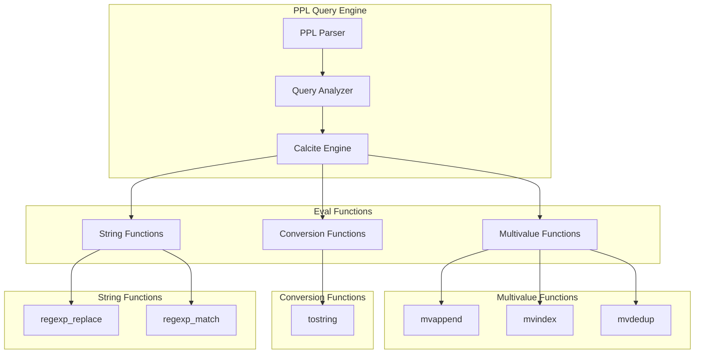

---
tags:
  - domain/search
  - component/server
  - indexing
  - observability
  - search
  - sql
---
# PPL Eval Functions

## Summary

PPL (Piped Processing Language) eval functions provide data transformation capabilities within OpenSearch queries. These functions enable users to manipulate multivalue arrays, convert data types, and perform string operations directly in PPL queries. The eval functions are particularly useful for log analysis, data processing pipelines, and complex field transformations.

## Details

### Architecture



### Components

| Component | Description |
|-----------|-------------|
| `mvappend` | Combines multiple values/arrays into a single array |
| `mvindex` | Extracts elements from arrays by index or range |
| `mvdedup` | Removes duplicate values from arrays (order-preserving) |
| `tostring` | Converts values to strings with optional formatting |
| `regexp_replace` | Replaces text matching regex patterns (alias for `replace`) |
| `regexp_match` | Matches text against regex patterns |

### Function Reference

#### mvappend(value1, value2, ...)

Combines all arguments into a single array.

| Parameter | Type | Description |
|-----------|------|-------------|
| value1, value2, ... | any | Values, arrays, or null to combine |

**Returns**: Array containing all input values flattened

```ppl
source=index | eval combined = mvappend(array('a', 'b'), 'c', array('d'))
# Result: ['a', 'b', 'c', 'd']
```

#### mvindex(array, index) / mvindex(array, start, end)

Returns element(s) from an array by index or range.

| Parameter | Type | Description |
|-----------|------|-------------|
| array | array | Input array |
| index | integer | Single index (0-based, negative supported) |
| start | integer | Start index for range (inclusive) |
| end | integer | End index for range (inclusive) |

**Indexing Rules**:
- 0-based indexing (first element at index 0)
- Negative indexing (-1 = last, -2 = second-to-last)
- Range is inclusive on both ends

```ppl
# Single element
source=people | eval result = mvindex(array('a','b','c','d','e'), 1)
# Result: b

# Negative index
source=people | eval result = mvindex(array('a','b','c','d','e'), -1)
# Result: e

# Range
source=people | eval result = mvindex(array(1,2,3,4,5), 1, 3)
# Result: [2, 3, 4]
```

#### mvdedup(array)

Removes duplicate values from an array while preserving order.

| Parameter | Type | Description |
|-----------|------|-------------|
| array | array | Input array with potential duplicates |

**Returns**: Array with duplicates removed (first occurrence kept)

```ppl
source=index | eval result = mvdedup(array(1, 2, 2, 3, 1, 4))
# Result: [1, 2, 3, 4]
```

#### tostring(value, format)

Converts a value to a string with optional formatting.

| Parameter | Type | Description |
|-----------|------|-------------|
| value | any | Value to convert |
| format | string | Optional format: "binary", "hex", "commas", "duration" |

**Format Options**:

| Format | Description | Example |
|--------|-------------|---------|
| `"binary"` | Binary representation | `tostring(9, "binary")` → `"1001"` |
| `"hex"` | Hexadecimal representation | `tostring(15, "hex")` → `"0xF"` |
| `"commas"` | Number with commas (2 decimal places) | `tostring(12345.6789, "commas")` → `"12,345.68"` |
| `"duration"` | Seconds to HH:MM:SS | `tostring(615, "duration")` → `"00:10:15"` |

**Boolean Conversion**: Returns `"True"` or `"False"`

```ppl
# Combined example
... | eval n = tostring(1==1) + " " + tostring(15, "hex") + " " + tostring(12345.6789, "commas")
# Result: "True 0xF 12,345.68"
```

#### regexp_replace(string, pattern, replacement)

Replaces text matching a regex pattern. Alias for `replace()`.

```ppl
source=index | eval result = regexp_replace(field, "pattern", "replacement")
```

### Usage Examples

#### Log Processing with Multivalue Functions

```ppl
source=logs 
| eval tags = mvappend(existing_tags, extracted_tags)
| eval unique_tags = mvdedup(tags)
| eval first_tag = mvindex(unique_tags, 0)
```

#### Data Formatting

```ppl
source=metrics
| eval formatted_value = tostring(value, "commas")
| eval duration_str = tostring(elapsed_seconds, "duration")
| eval binary_flags = tostring(flags, "binary")
```

## Limitations

- `mvindex` range is inclusive on both ends (differs from Python-style slicing)
- `tostring` format argument only applies to numeric values
- Functions require the Calcite-based PPL engine
- `mvdedup` preserves first occurrence only; cannot preserve last

## Change History

- **v3.4.0** (2026-01-11): Added `mvappend`, `mvindex`, `mvdedup`, `tostring`, and `regexp_replace` functions


## References

### Documentation
- [OpenSearch PPL Documentation](https://docs.opensearch.org/3.0/search-plugins/sql/ppl/index/)
- [OpenSearch SQL Functions](https://docs.opensearch.org/3.0/search-plugins/sql/functions/)

### Pull Requests
| Version | PR | Description | Related Issue |
|---------|-----|-------------|---------------|
| v3.4.0 | [#4438](https://github.com/opensearch-project/sql/pull/4438) | Add `mvappend` function | [#4433](https://github.com/opensearch-project/sql/issues/4433) |
| v3.4.0 | [#4497](https://github.com/opensearch-project/sql/pull/4497) | Support `tostring()` eval function | [#4492](https://github.com/opensearch-project/sql/issues/4492) |
| v3.4.0 | [#4765](https://github.com/opensearch-project/sql/pull/4765) | Add `regexp_replace()` as alias | [#4764](https://github.com/opensearch-project/sql/issues/4764) |
| v3.4.0 | [#4794](https://github.com/opensearch-project/sql/pull/4794) | Support `mvindex` eval function |   |
| v3.4.0 | [#4828](https://github.com/opensearch-project/sql/pull/4828) | Support `mvdedup` eval function |   |

### Issues (Design / RFC)
- [Issue #4492](https://github.com/opensearch-project/sql/issues/4492): tostring implementation request
- [Issue #4433](https://github.com/opensearch-project/sql/issues/4433): mvappend function request
- [Issue #4764](https://github.com/opensearch-project/sql/issues/4764): regexp_replace alias request
- [RFC #4287](https://github.com/opensearch-project/sql/issues/4287): tostring function RFC
