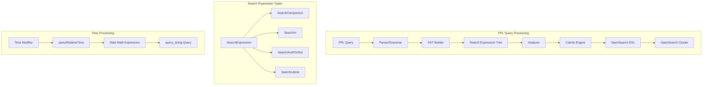
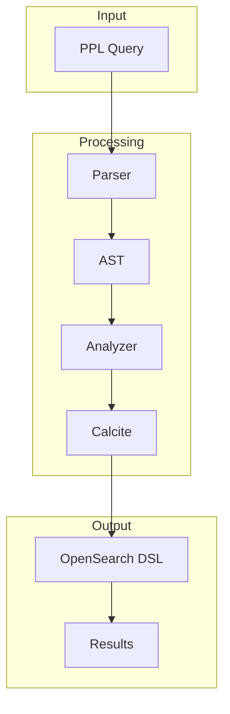

---
tags:
  - domain/search
  - component/server
  - performance
  - search
  - sql
---
# PPL Query Enhancements

## Summary

PPL (Piped Processing Language) Query Enhancements provide advanced query capabilities for OpenSearch, including a revamped search command with full-text search support, time modifiers for temporal filtering, date/time formatting functions, enhanced JOIN operations, and additional aggregation and eval functions. These enhancements improve query expressiveness and performance by translating PPL expressions directly to optimized OpenSearch DSL.

## Details

### Architecture



### Data Flow



### Components

| Component | Description |
|-----------|-------------|
| `OpenSearchPPLParser.g4` | Grammar extensions for search expression syntax |
| `AstBuilder.java` | Constructs Search AST from parse tree |
| `AstExpressionBuilder.java` | Builds search expression tree and time modifier processing |
| `Search.java` | Enhanced Search AST node with expression support |
| `SearchExpression.java` | Base interface for search expressions |
| `SearchComparison.java` | Field comparison operators (=, !=, <, >, <=, >=) |
| `SearchIn.java` | IN operator implementation |
| `SearchAnd/Or/Not.java` | Boolean operators |
| `SearchLiteral.java` | Free text search support |
| `DateTimeUtils.java` | Time format conversion with `parseRelativeTime` method |
| `OpenSearchConstants.java` | Implicit `@timestamp` field constant |
| `MaxFunction.java` | Calcite UDF for max eval function |
| `MinFunction.java` | Calcite UDF for min eval function |
| `Analyzer.java` | Integrates search expression analysis into query pipeline |
| `CalciteRelNodeVisitor.java` | Converts Search nodes to relational operations |

### Search Command

The search command supports full-text search with direct translation to OpenSearch's `query_string` DSL:

```
search source=logs status=200 AND method="GET"
search source=logs status IN (200, 201, 204)
search source=logs responseTime>100 AND responseTime<=500
search source=logs "error message"
```

### Time Modifiers

Time modifiers enable temporal filtering in the search command:

| PPL Time Modifier | OpenSearch Date Math | Description |
|-------------------|----------------------|-------------|
| `'2023-01-01'` | `2023-01-01` | Absolute date |
| `'2023-01-01 13:45:30'` | `2023-01-01T13:45:30Z` | Date with time |
| `now` | `now` | Current time |
| `-30s` | `now-30s` | 30 seconds ago |
| `-1h` | `now-1h` | 1 hour ago |
| `+1d` | `now+1d` | 1 day in future |
| `-1d@d` | `now-1d/d` | 1 day ago, rounded to day |
| `@h` | `now/h` | Round to current hour |
| `@M` | `now/M` | Round to current month |
| `@w0` | `/w-1d` or `/w+6d` | Previous Sunday |
| `@w1` | `/w` | Start of week (Monday) |
| `@q` | `/M` or `/M-1M` or `/M-2M` | Start of current quarter |
| `-2q` | `-6M` | 2 quarters ago |
| `1234.567` | `1234567` | Unix timestamp (seconds → milliseconds) |
| `-1d+1y@mon` | `now-1d+1y/M` | Complex expression |

### strftime Function

Formats Unix timestamps into human-readable date/time strings:

| Format | Description |
|--------|-------------|
| `%Y` | Year (4 digits) |
| `%m` | Month (01-12) |
| `%d` | Day (01-31) |
| `%H` | Hour (00-23) |
| `%M` | Minute (00-59) |
| `%S` | Second (00-59) |
| `%F` | YYYY-MM-DD |
| `%T` | HH:MM:SS |
| `%B` | Full month name |

### JOIN Options

| Option | Description | Default |
|--------|-------------|---------|
| `type` | Join type (inner, left, right, full) | inner |
| `overwrite` | Overwrite duplicate fields from right side | true |
| `max` | Maximum matches per row | unlimited |
| `left` | Alias for left table | - |
| `right` | Alias for right table | - |

### Usage Examples

#### Search with Time Modifiers
```
source=logs earliest=-7d latest=now
source=logs earliest='2020-12-10' latest='2025-09-10 13:00:12'
source=logs earliest='-1d@d'
```

#### strftime Function
```
source=logs | eval formatted = strftime(1521467703, "%Y-%m-%d %H:%M:%S")
source=logs | eval current = strftime(now(), "%B %d, %Y")
source=logs | eval ts = unix_timestamp("2018-03-19 13:55:03") | eval formatted = strftime(ts, "%m/%d/%Y")
```

#### JOIN with Options
```
source=state_country
| join type=inner overwrite=false max=1 name occupation
| stats avg(salary) by span(age, 10) as age_span, country

source=state_country
| join type=left overwrite=true name [
    source=occupation
    | where salary > 0
    | fields name, country, salary
  ]
| stats avg(salary) by span(age, 10) as age_span, country
```

#### max/min Eval Functions
```
source=accounts | eval max_age = MAX(age, 30) | fields age, max_age
source=accounts | eval result = MAX(age, 'John', firstname) | fields age, firstname, result
source=accounts | eval result = MIN(age, 35, firstname) | fields age, firstname, result
```

#### count() Shortcut
```
source=logs | stats c() as total
```

## Limitations

- Time modifiers with chained offsets (e.g., `-1day@month+1h`) must be quoted
- `strftime` does not directly accept string inputs; use `unix_timestamp()` for conversion first
- All timestamps in `strftime` are interpreted as UTC timezone
- Search command is designed exclusively for full-text search; use `where` command for additional filtering

## Change History

- **v3.3.0**: Search command revamp with full-text search, time modifiers, strftime function, JOIN enhancements, max/min eval functions, count() shortcut, ISO8601 support


## References

### Documentation
- [PPL Documentation](https://docs.opensearch.org/3.0/search-plugins/sql/ppl/index/)
- [SQL and PPL API](https://docs.opensearch.org/3.0/search-plugins/sql/sql-ppl-api/)
- [Lucene Query Parser Syntax](https://lucene.apache.org/core/2_9_4/queryparsersyntax.html)

### Pull Requests
| Version | PR | Description | Related Issue |
|---------|-----|-------------|---------------|
| v3.3.0 | [#4378](https://github.com/opensearch-project/sql/pull/4378) | Change default search sort tiebreaker to `_shard_doc` for PIT search | [#3064](https://github.com/opensearch-project/sql/issues/3064) |
| v3.3.0 | [#4375](https://github.com/opensearch-project/sql/pull/4375) | Support direct query data sources (experimental) |   |
| v3.3.0 | [#4344](https://github.com/opensearch-project/sql/pull/4344) | Add error handling for known limitation of SQL JOIN | [#4058](https://github.com/opensearch-project/sql/issues/4058) |
| v3.3.0 | [#4337](https://github.com/opensearch-project/sql/pull/4337) | Optimize count aggregation performance using native doc_count | [#4265](https://github.com/opensearch-project/sql/issues/4265) |
| v3.3.0 | [#4333](https://github.com/opensearch-project/sql/pull/4333) | Add max/min eval functions | [#4341](https://github.com/opensearch-project/sql/issues/4341) |
| v3.3.0 | [#4327](https://github.com/opensearch-project/sql/pull/4327) | Date/Time based Span aggregation null bucket fix | [#4318](https://github.com/opensearch-project/sql/issues/4318) |
| v3.3.0 | [#4281](https://github.com/opensearch-project/sql/pull/4281) | Add non-numeric field support for max/min functions | [#4050](https://github.com/opensearch-project/sql/issues/4050) |
| v3.3.0 | [#4276](https://github.com/opensearch-project/sql/pull/4276) | Add `values` stats function with UDAF | [#4026](https://github.com/opensearch-project/sql/issues/4026) |
| v3.3.0 | [#4246](https://github.com/opensearch-project/sql/pull/4246) | Support ISO8601-formatted string in PPL | [#4188](https://github.com/opensearch-project/sql/issues/4188) |
| v3.3.0 | [#4224](https://github.com/opensearch-project/sql/pull/4224) | Support time modifiers in search command | [#4135](https://github.com/opensearch-project/sql/issues/4135) |
| v3.3.0 | [#4152](https://github.com/opensearch-project/sql/pull/4152) | Search command revamp | [#4007](https://github.com/opensearch-project/sql/issues/4007) |
| v3.3.0 | [#4142](https://github.com/opensearch-project/sql/pull/4142) | Add shortcut for count() |   |
| v3.3.0 | [#4106](https://github.com/opensearch-project/sql/pull/4106) | strftime function implementation |   |
| v3.3.0 | [#3803](https://github.com/opensearch-project/sql/pull/3803) | Support join field list and join options | [#3775](https://github.com/opensearch-project/sql/issues/3775) |

### Issues (Design / RFC)
- [Issue #4135](https://github.com/opensearch-project/sql/issues/4135): Time modifiers feature request
- [Issue #4007](https://github.com/opensearch-project/sql/issues/4007): Search command revamp request
- [Issue #3775](https://github.com/opensearch-project/sql/issues/3775): Join field list and options request
- [Issue #4341](https://github.com/opensearch-project/sql/issues/4341): max/min eval functions request
