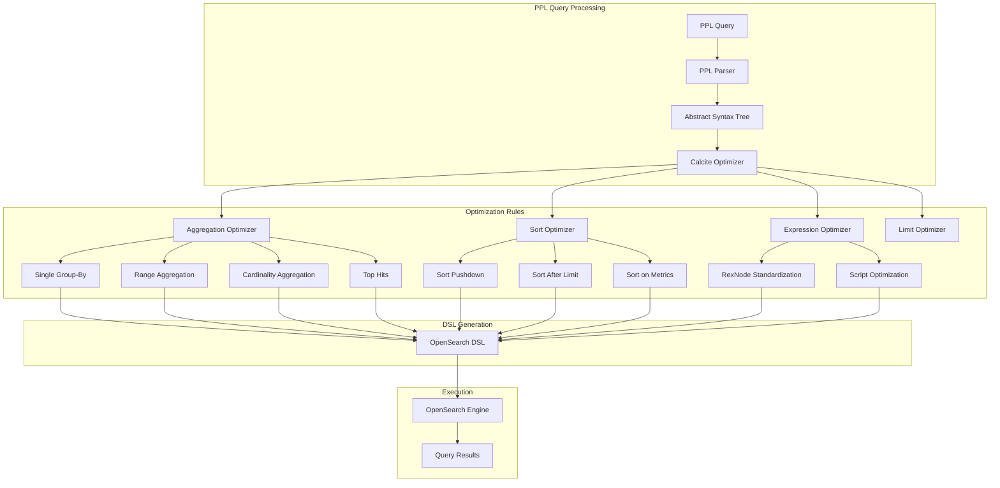

---
tags:
  - sql
---
# PPL Query Optimization

## Summary

PPL Query Optimization is a comprehensive set of performance enhancements for the Piped Processing Language (PPL) in OpenSearch. These optimizations leverage the Apache Calcite query engine to translate PPL operations directly into efficient OpenSearch DSL queries, bypassing expensive coordination-node processing. Key optimizations include aggregation pushdown, sort pushdown, expression standardization, and intelligent query rewriting—delivering up to 100x performance improvements for analytics workloads.

## Details

### Architecture



### Data Flow


### Components

| Component | Description |
|-----------|-------------|
| `SingleGroupByOptimizer` | Converts single group-by to terms aggregation instead of composite |
| `RangeAggregationBuilder` | Translates CASE expressions to range aggregations |
| `CardinalityAggregationBuilder` | Pushes distinct count approx to cardinality aggregation |
| `TopHitsAggregationBuilder` | Builds top_hits for earliest/latest functions |
| `AutoDateHistogramBuilder` | Builds auto_date_histogram for time-based binning |
| `SortPushdownRule` | Pushes sort operations to OpenSearch scan |
| `LimitPushdownRule` | Pushes LIMIT into aggregation bucket sizes |
| `RexNodeStandardizer` | Standardizes expressions for script pushdown |
| `ScriptSizeOptimizer` | Minimizes script size with necessary fields only |

### Configuration

| Setting | Description | Default |
|---------|-------------|---------|
| `plugins.calcite.enabled` | Enable Calcite engine for advanced optimizations | `false` |
| `plugins.query.buckets` | Composite aggregation bucket size | 10000 |
| `plugins.ppl.subsearch.maxout` | Maximum rows from subsearch | 10000 |
| `plugins.ppl.join.subsearch_maxout` | Maximum rows for join subsearch | 50000 |
| `plugins.ppl.syntax.legacy.preferred` | Use legacy PPL behavior | `true` |

### Optimization Categories

#### 1. Aggregation Pushdown

**Single Group-By Optimization**: Replaces composite aggregations with faster terms aggregations.

```ppl
source=accounts | stats avg(balance) by state
```

**Before (Composite):**
```json
{
  "aggregations": {
    "composite_buckets": {
      "composite": {
        "size": 1000,
        "sources": [{"state": {"terms": {"field": "state"}}}]
      }
    }
  }
}
```

**After (Terms):**
```json
{
  "aggregations": {
    "state": {
      "terms": {"field": "state", "size": 1000},
      "aggregations": {"avg(balance)": {"avg": {"field": "balance"}}}
    }
  }
}
```

#### 2. Case-to-Range Aggregation

Converts CASE expressions in aggregations to efficient range queries.

```ppl
source=bank | eval age_range = case(age < 30, 'young', age < 50, 'middle' else 'senior') 
| stats avg(balance) by age_range
```

Generated DSL:
```json
{
  "aggregations": {
    "age_range": {
      "range": {
        "field": "age",
        "ranges": [
          {"key": "young", "to": 30},
          {"key": "middle", "from": 30, "to": 50},
          {"key": "senior", "from": 50}
        ],
        "keyed": true
      },
      "aggregations": {
        "avg(balance)": {"avg": {"field": "balance"}}
      }
    }
  }
}
```

#### 3. Distinct Count Approximation

Pushes `DISTINCT_COUNT_APPROX` to OpenSearch cardinality aggregation using HyperLogLog++.

```ppl
source=logs | stats distinct_count_approx(user_id) as unique_users
```

#### 4. Sort Pushdown

**Sort by Complex Expressions:**
```ppl
source=accounts | sort abs(balance - 1000) | head 10
```

**Sort After Limit:**
```ppl
source=accounts | head 100 | sort balance
# Transformed to: sort balance | head 100
```

**Sort on Aggregation Metrics:**
```ppl
source=sales | stats sum(amount) by product | sort -sum(amount) | head 10
```

Converts composite aggregation to terms/multi-terms with order parameter.

#### 5. Filtered Aggregation

```ppl
source=logs | stats count(eval(status="200")) as success_count
```

Generated DSL:
```json
{
  "aggregations": {
    "success_count": {
      "filter": {"term": {"status": "200"}},
      "aggregations": {
        "success_count": {"value_count": {"field": "_index"}}
      }
    }
  }
}
```

#### 6. Auto Date Histogram

```ppl
source=logs | stats count() by bins(@timestamp, 20)
```

Generated DSL:
```json
{
  "aggregations": {
    "date": {
      "auto_date_histogram": {
        "field": "@timestamp",
        "buckets": 20
      }
    }
  }
}
```

### Internal Functions

| Function | Description | Version |
|----------|-------------|---------|
| `MAP_REMOVE(map, key)` | Remove key from map | v3.4.0 |
| `MAP_APPEND(map, key, value)` | Append value to map | v3.4.0 |
| `MAP_CONCAT(map1, map2)` | Concatenate maps | v3.4.0 |
| `JSON_EXTRACT_ALL(json)` | Extract all values from JSON | v3.4.0 |

### Command Enhancements

#### fillnull Command (v3.4.0)

New option-style syntax alongside existing `with/using` syntax:

```ppl
# New syntax
source=accounts | fillnull value=0 balance age
source=accounts | fillnull value='N/A' name

# Existing syntax (still supported)
source=accounts | fillnull with 0 in balance, age
source=accounts | fillnull using balance=0, age=0
```

#### Explain API YAML Format (v3.4.0)

```ppl
explain format=yaml source=accounts | where age > 30
```

Output:
```yaml
calcite:
  logical: |
    LogicalSystemLimit(fetch=[10000], type=[QUERY_SIZE_LIMIT])
      LogicalFilter(condition=[>($5, 30)])
        CalciteLogicalIndexScan(table=[[OpenSearch, accounts]])
  physical: |
    CalciteEnumerableIndexScan(table=[[OpenSearch, accounts]], 
      PushDownContext=[[FILTER->>($5, 30), LIMIT->10000]])
```

## Limitations

- Requires `plugins.calcite.enabled=true` for advanced optimizations
- Case-to-range pushdown only works with:
  - String literal results
  - Numeric fields
  - Closed-open intervals [a, b)
- Range aggregations ignore null values (differs from CASE function)
- Single group-by optimization only applies with exactly one group-by expression
- Sort pushdown for complex expressions requires Calcite engine
- Some functions are not pushdown-compatible and execute post-aggregation

## Change History

- **v3.4.0** (2026-01-11): Added sort pushdown for complex expressions, sort after limit, sort on aggregation metrics, distinct count approx pushdown, case-to-range aggregation, fillnull command enhancement, YAML explain format, configurable subsearch/join limits, composite bucket size configuration, and internal map/JSON functions
- **v3.3.0** (2025-10-01): Added single group-by optimization, filtered aggregation pushdown, limit pushdown, SUM literal optimization, earliest/latest pushdown, and auto_date_histogram support


## References

### Documentation
- [PPL Commands Documentation](https://docs.opensearch.org/3.0/search-plugins/sql/ppl/functions/)
- [OpenSearch Aggregations](https://docs.opensearch.org/3.0/aggregations/)
- [SQL and PPL API](https://docs.opensearch.org/3.0/search-plugins/sql/sql-ppl-api/)

### Blog Posts
- [OpenSearch PPL Blog: Lookup, Join, and Subsearch](https://opensearch.org/blog/enhanced-log-analysis-with-opensearch-ppl-introducing-lookup-join-and-subsearch/)

### Pull Requests
| Version | PR | Description | Related Issue |
|---------|-----|-------------|---------------|
| v3.4.0 | [#4750](https://github.com/opensearch-project/sql/pull/4750) | Pushdown sort by complex expressions | [#3912](https://github.com/opensearch-project/sql/issues/3912) |
| v3.4.0 | [#4657](https://github.com/opensearch-project/sql/pull/4657) | Support push down sort after limit | [#4570](https://github.com/opensearch-project/sql/issues/4570) |
| v3.4.0 | [#4603](https://github.com/opensearch-project/sql/pull/4603) | Pushdown sort aggregate metrics | [#4282](https://github.com/opensearch-project/sql/issues/4282) |
| v3.4.0 | [#4614](https://github.com/opensearch-project/sql/pull/4614) | Pushdown distinct count approx |   |
| v3.4.0 | [#4400](https://github.com/opensearch-project/sql/pull/4400) | Pushdown case function as range queries | [#4201](https://github.com/opensearch-project/sql/issues/4201) |
| v3.4.0 | [#4421](https://github.com/opensearch-project/sql/pull/4421) | PPL fillnull command enhancement | [#4419](https://github.com/opensearch-project/sql/issues/4419) |
| v3.4.0 | [#4446](https://github.com/opensearch-project/sql/pull/4446) | Support format=yaml in Explain API | [#4351](https://github.com/opensearch-project/sql/issues/4351) |
| v3.4.0 | [#4501](https://github.com/opensearch-project/sql/pull/4501) | Configurable subsearch/join limits | [#3731](https://github.com/opensearch-project/sql/issues/3731) |
| v3.4.0 | [#4544](https://github.com/opensearch-project/sql/pull/4544) | Make composite bucket size configurable | [#4517](https://github.com/opensearch-project/sql/issues/4517) |
| v3.3.0 | [#3550](https://github.com/opensearch-project/sql/pull/3550) | Single group-by optimization | [#3528](https://github.com/opensearch-project/sql/issues/3528) |
| v3.3.0 | [#4166](https://github.com/opensearch-project/sql/pull/4166) | Pushdown earliest/latest functions | [#3639](https://github.com/opensearch-project/sql/issues/3639) |
| v3.3.0 | [#4213](https://github.com/opensearch-project/sql/pull/4213) | Filtered aggregation pushdown | [#3949](https://github.com/opensearch-project/sql/issues/3949) |
| v3.3.0 | [#4228](https://github.com/opensearch-project/sql/pull/4228) | Limit pushdown into bucket size | [#3961](https://github.com/opensearch-project/sql/issues/3961) |
| v3.3.0 | [#4329](https://github.com/opensearch-project/sql/pull/4329) | Auto date histogram pushdown | [#4210](https://github.com/opensearch-project/sql/issues/4210) |

### Issues (Design / RFC)
- [Issue #4201](https://github.com/opensearch-project/sql/issues/4201): Pushdown case function in aggregations
- [Issue #4282](https://github.com/opensearch-project/sql/issues/4282): Pushdown sort aggregate metrics
- [Issue #3912](https://github.com/opensearch-project/sql/issues/3912): Pushdown sort by complex expressions
- [Issue #3528](https://github.com/opensearch-project/sql/issues/3528): Span query slower than date histogram
