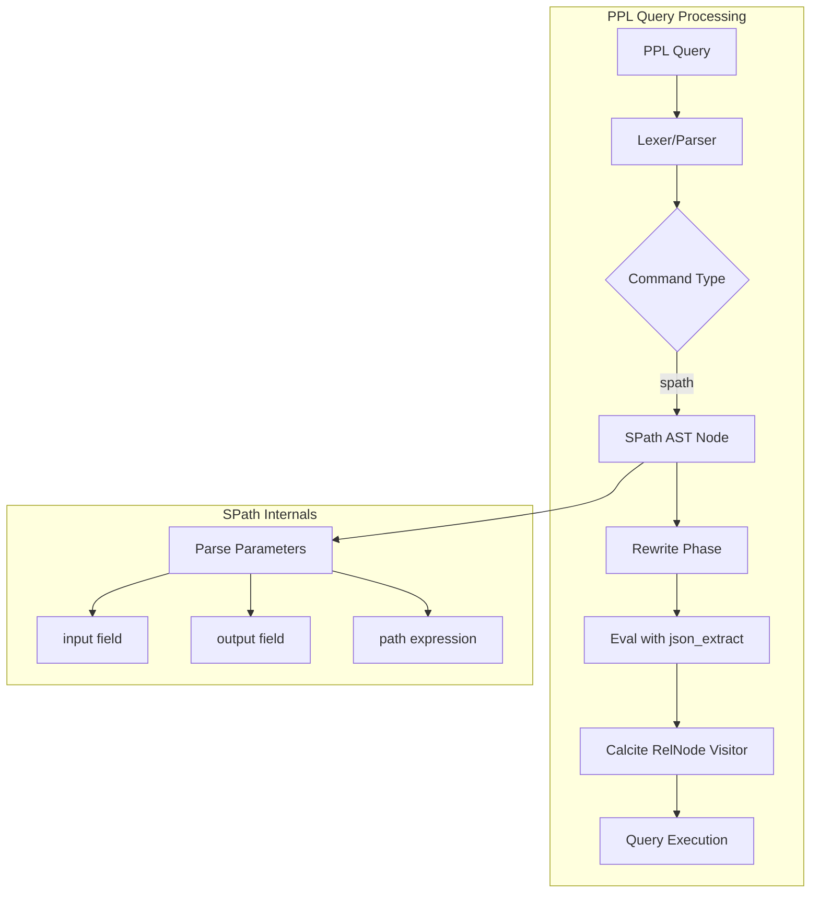
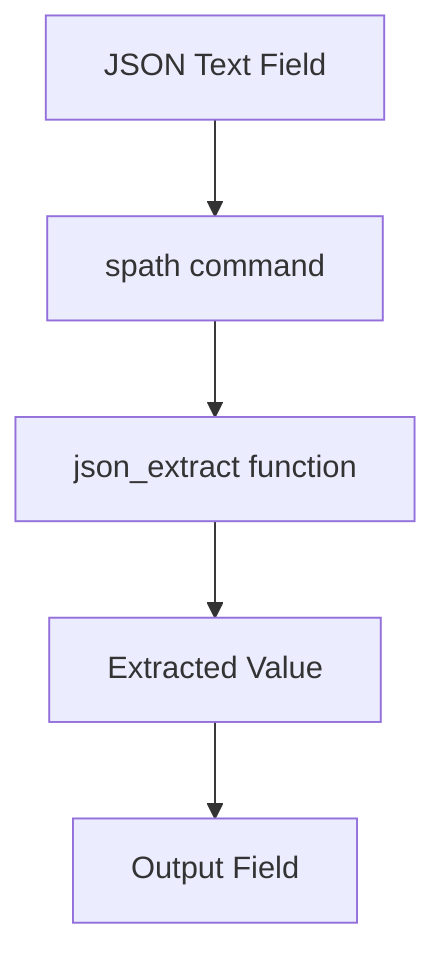

---
tags:
  - search
  - sql
---

# PPL Spath Command

## Summary

The `spath` command is a PPL (Piped Processing Language) command that provides a simple, intuitive way to extract fields from structured JSON data stored in text fields. It offers a more user-friendly alternative to the `json_extract()` function, with plans for future XML support and additional structured data extraction capabilities.

## Details

### Architecture



### Data Flow



### Components

| Component | Description |
|-----------|-------------|
| `SPath` | AST node class representing the spath command in the query tree |
| `AstBuilder.visitSpathCommand` | Parser visitor that constructs SPath nodes from PPL syntax |
| `CalciteRelNodeVisitor.visitSpath` | Visitor that converts SPath to Calcite RelNode via eval rewrite |
| `OpenSearchPPLLexer` | Extended with SPATH, INPUT, OUTPUT, PATH tokens |
| `OpenSearchPPLParser` | Extended with spath command grammar rules |

### Configuration

| Parameter | Description | Required | Default |
|-----------|-------------|----------|---------|
| `input` | The field containing JSON data to scan | Yes | N/A |
| `output` | The destination field for extracted data | No | Value of `path` |
| `path` | The JSON path expression to extract | Yes | N/A |

### Syntax

```
spath input=<field> [output=<field>] [path=]<path>
```

### Path Expression Syntax

The path parameter supports various JSON path expressions:

| Pattern | Description | Example |
|---------|-------------|---------|
| `field` | Simple field access | `n` |
| `parent.child` | Nested field access | `nest_out.nest_in` |
| `array{}` | All array elements | `list{}` |
| `array{N}` | Specific array index | `list{0}` |
| `['field']` | Escaped field names | `['a.b.c']` |

### Usage Examples

**Example 1: Simple Field Extraction**

```sql
source=logs | spath input=doc n
```

**Example 2: With Custom Output Field**

```sql
source=logs | spath input=doc output=user_id path=user.id
```

**Example 3: Array Element Extraction**

```sql
source=logs | spath input=doc output=first list{0}
           | spath input=doc output=all list{}
```

**Example 4: Nested Field Extraction**

```sql
source=logs | spath input=doc output=nested nest_out.nest_in
```

**Example 5: With Type Casting and Aggregation**

```sql
source=logs | spath input=doc n 
           | eval n=cast(n as int) 
           | stats sum(n)
```

**Example 6: Escaped Path Names**

```sql
source=logs | spath output=a input=doc "['a fancy field name']"
           | spath output=b input=doc "['a.b.c']"
```

## Limitations

- **No pushdown optimization**: Extraction happens at the coordinating node, not pushed down to shards
- **Performance on large datasets**: May be slow on large datasets; consider indexing frequently filtered fields
- **JSON only**: Currently supports only JSON data (XML support planned for future)
- **String output**: Always returns string values; explicit casting required for numeric operations
- **No automatic type inference**: Unlike direct field indexing, types must be cast manually

## Change History

- **v3.3.0** (2025-08-28): Initial implementation with JSON path support, rewriting to json_extract internally

## Related Features
- [Query Workbench](../dashboards-query-workbench/dashboards-query-workbench-query-workbench.md)
- [Observability (Dashboards)](../dashboards-observability/dashboards-observability-search-relevance-ci-tests.md)

## References

### Documentation
- [PPL Commands Documentation](https://docs.opensearch.org/3.3/search-plugins/sql/ppl/functions/): Official PPL commands reference
- [json_extract Function](https://github.com/opensearch-project/sql/blob/main/integ-test/src/test/java/org/opensearch/sql/calcite/remote/CalcitePPLJsonBuiltinFunctionIT.java): Related JSON extraction tests

### Pull Requests
| Version | PR | Description | Related Issue |
|---------|-----|-------------|---------------|
| v3.3.0 | [#4120](https://github.com/opensearch-project/sql/pull/4120) | Starter implementation for `spath` command | [#4119](https://github.com/opensearch-project/sql/issues/4119) |

### Issues (Design / RFC)
- [Issue #4119](https://github.com/opensearch-project/sql/issues/4119): RFC - Improved structured data extraction with `spath`
