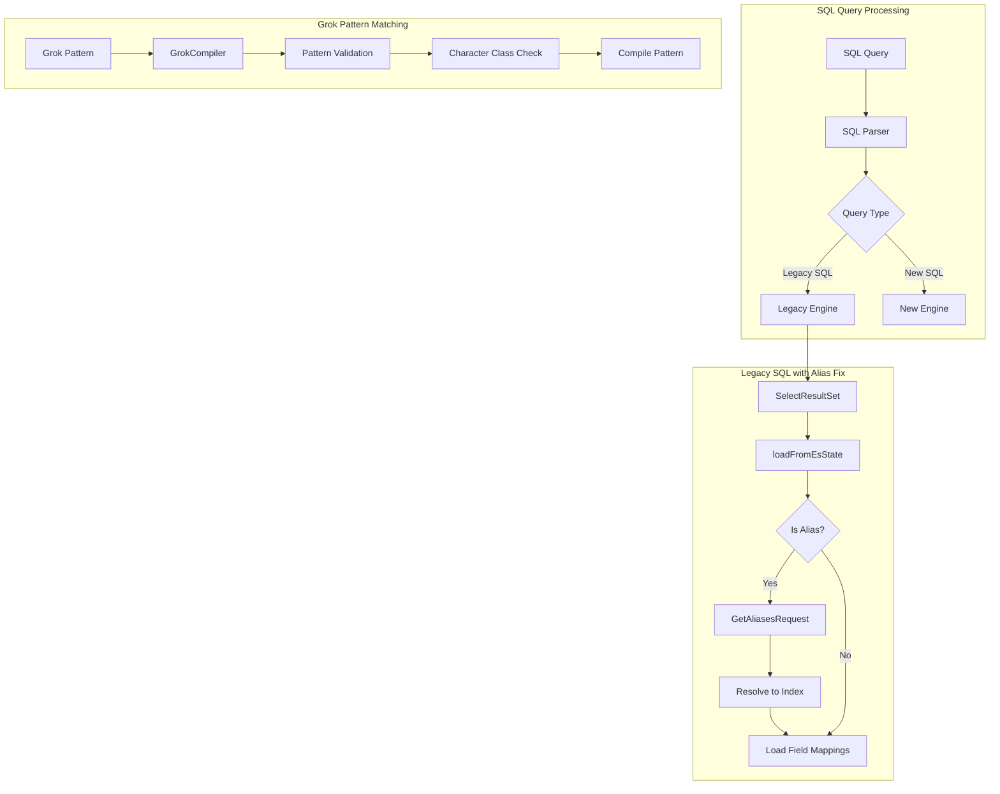

# SQL Query Fixes

## Summary

This feature documents bug fixes for the OpenSearch SQL plugin that improve query reliability. Key fixes include resolving alias issues in legacy SQL queries with filters and correcting overly permissive regular expression patterns in the Grok compiler.

## Details

### Architecture



### Components

| Component | Description |
|-----------|-------------|
| `SelectResultSet` | Handles result set formatting for legacy SQL queries |
| `GrokCompiler` | Compiles Grok patterns for log parsing |
| `GrokUtils` | Utility functions for Grok pattern processing |

### Bug Fixes

#### 1. Alias Resolution in Legacy SQL

When using legacy SQL queries with index aliases and filters, the query would fail because the alias name was used directly for field mapping lookups instead of the actual index name.

**Before (Error)**:
```json
{
  "error": {
    "reason": "There was internal problem at backend",
    "details": "Index type [my-alias] does not exist",
    "type": "IllegalArgumentException"
  },
  "status": 500
}
```

**After (Success)**:
```json
{
  "schema": [
    { "name": "field1", "type": "text" },
    { "name": "field2", "type": "keyword" }
  ],
  "total": 1,
  "datarows": [["value1", "value2"]],
  "size": 1,
  "status": 200
}
```

#### 2. Regex Character Range Fix

The regular expression `[A-z]` was corrected to `[a-zA-Z_]` to prevent matching unintended special characters (`[ \ ] ^ _ \``).

### Usage Example

```bash
# Create index with data
PUT /products
{
  "mappings": {
    "properties": {
      "name": { "type": "text" },
      "category": { "type": "keyword" },
      "price": { "type": "float" }
    }
  }
}

# Create alias
POST /_aliases
{
  "actions": [
    { "add": { "index": "products", "alias": "product-alias" } }
  ]
}

# Query using alias with filter (works after fix)
POST /_plugins/_sql
{
  "query": "SELECT * FROM product-alias",
  "fetch_size": 10,
  "filter": {
    "term": {
      "category": "electronics"
    }
  }
}
```

## Limitations

- Alias resolution fix applies only to legacy SQL engine queries
- When an alias points to multiple indices, the first index is used for field mapping resolution
- The regex fix affects Grok pattern compilation; existing patterns using `[A-z]` may need review

## Related PRs

| Version | PR | Description |
|---------|-----|-------------|
| v2.18.0 | [#3109](https://github.com/opensearch-project/sql/pull/3109) | Backport: Resolve Alias Issues in Legacy SQL with Filters |
| v2.18.0 | [#3107](https://github.com/opensearch-project/sql/pull/3107) | Backport: Correct regular expression range |
| main | [#2960](https://github.com/opensearch-project/sql/pull/2960) | Original: Resolve Alias Issues in Legacy SQL with Filters |
| main | [#2836](https://github.com/opensearch-project/sql/pull/2836) | Original: Correct regular expression range |

## References

- [Issue #2912](https://github.com/opensearch-project/sql/issues/2912): Pagination of index aliases is not supported - Re-opened
- [Issue #1398](https://github.com/opensearch-project/sql/issues/1398): Original alias pagination bug report
- [SQL Documentation](https://docs.opensearch.org/2.18/search-plugins/sql/sql/index/): OpenSearch SQL plugin documentation
- [SQL and PPL API](https://docs.opensearch.org/2.18/search-plugins/sql/sql-ppl-api/): SQL API reference

## Change History

- **v2.18.0** (2024-10-29): Fixed alias resolution in legacy SQL with filters, corrected regex character range in Grok compiler
