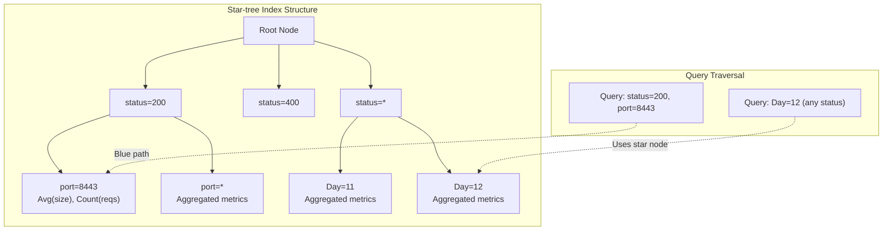
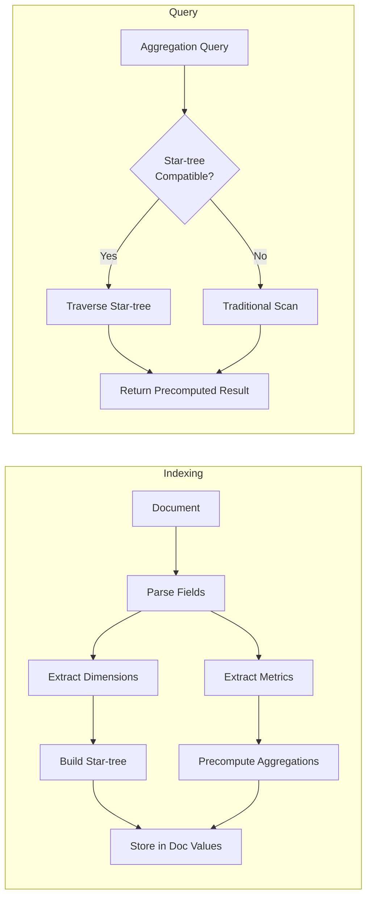

# Star-tree Index Enhancements

## Summary

Star-tree index is a multi-field index that precomputes aggregations during indexing, delivering up to 100x reduction in query latency for aggregation workloads. In OpenSearch v3.0.0, star-tree indexing capabilities were significantly expanded to support keyword and numeric bucket aggregations with metric sub-aggregations, numeric range aggregations, and Boolean queries.

Key benefits:
- **Predictable latency**: Query performance is independent of matching document count
- **Multi-aggregation support**: Native multi-field support eliminates repeated tree traversals
- **Real-time compatibility**: Operates on live data with minimal indexing overhead
- **No query changes required**: OpenSearch automatically routes eligible queries to star-tree

## Details

### Architecture



### Data Flow



### Components

| Component | Description |
|-----------|-------------|
| Star-tree | Hierarchical tree organizing dimension values for efficient traversal |
| Star Nodes | Catch-all nodes containing aggregated data across all values of a dimension |
| Leaf Nodes | Terminal nodes pointing to precomputed aggregations (max docs controlled by `max_leaf_docs`) |
| Doc Values | Columnar storage for preaggregated results |
| BoolStarTreeFilterProvider | Handles Boolean query processing for star-tree (v3.0.0) |
| DimensionFilterMerger | Manages filter intersections for complex queries (v3.0.0) |

### Configuration

| Setting | Description | Default |
|---------|-------------|---------|
| `index.composite_index` | Enable composite index support | `false` |
| `index.append_only.enabled` | Required for star-tree (data must be immutable) | `false` |
| `max_leaf_docs` | Maximum documents per leaf node (lower = faster queries, more storage) | `10000` |
| `skip_star_node_creation_for_dimensions` | Dimensions to skip star node creation (reduces storage) | `[]` |
| `ordered_dimensions` | Fields for aggregation grouping (2-10 dimensions) | Required |
| `date_dimension` | Date field with calendar intervals for time-based aggregations | Optional |
| `metrics` | Fields and stats to precompute (sum, min, max, value_count, avg) | Required |

### Supported Queries (v3.0.0)

| Query Type | Support |
|------------|---------|
| Term query | ✓ |
| Terms query | ✓ |
| Range query | ✓ |
| Match all docs | ✓ |
| Boolean query | ✓ (with restrictions) |

**Boolean Query Restrictions:**
- `must`/`filter`: Can operate across different dimensions, one condition per dimension
- `should`: Must operate on same dimension only
- `must_not`: Not supported
- `minimum_should_match`: Not supported

### Supported Aggregations (v3.0.0)

| Aggregation Type | Support |
|------------------|---------|
| Sum | ✓ |
| Min | ✓ |
| Max | ✓ |
| Value Count | ✓ |
| Average | ✓ (derived from sum/count) |
| Date Histogram | ✓ (with metric sub-aggregations) |
| Terms (keyword) | ✓ |
| Terms (numeric) | ✓ |
| Range | ✓ |

### Usage Example

```json
PUT logs
{
  "settings": {
    "index.number_of_shards": 1,
    "index.number_of_replicas": 0,
    "index.composite_index": true,
    "index.append_only.enabled": true
  },
  "mappings": {
    "composite": {
      "request_aggs": {
        "type": "star_tree",
        "config": {
          "date_dimension": {
            "name": "@timestamp",
            "calendar_intervals": ["month", "day"]
          },
          "ordered_dimensions": [
            {"name": "status"},
            {"name": "port"},
            {"name": "method"}
          ],
          "metrics": [
            {
              "name": "request_size",
              "stats": ["sum", "value_count", "min", "max"]
            },
            {
              "name": "latency",
              "stats": ["sum", "value_count", "min", "max"]
            }
          ]
        }
      }
    },
    "properties": {
      "@timestamp": {"type": "date"},
      "status": {"type": "integer"},
      "port": {"type": "integer"},
      "request_size": {"type": "integer"},
      "method": {"type": "keyword"},
      "latency": {"type": "scaled_float", "scaling_factor": 10}
    }
  }
}
```

### Performance Benchmarks

| Query | Documents | Traditional Latency | Star-tree Latency |
|-------|-----------|---------------------|-------------------|
| Metric agg (status=200) | 200M | 4.2s | 6.3ms |
| Metric agg (status=400) | 3K | 5ms | 6.5ms |
| Date histogram + sum | 120M | 13s | 94ms |

## Limitations

- **Immutable data only**: Updates and deletions are not reflected in star-tree index
- **Cannot be disabled**: Requires reindexing to remove star-tree configuration
- **High cardinality impact**: High-cardinality dimensions increase storage and latency
- **Multi-values not supported**: Array fields are not supported
- **Limited query/aggregation types**: Only specific queries and aggregations are supported

## Related PRs

| Version | PR | Description |
|---------|-----|-------------|
| v3.0.0 | [#17165](https://github.com/opensearch-project/OpenSearch/pull/17165) | Keyword & Numeric Terms Aggregation support |
| v3.0.0 | [#17273](https://github.com/opensearch-project/OpenSearch/pull/17273) | Range aggregations with star-tree |
| v3.0.0 | [#17941](https://github.com/opensearch-project/OpenSearch/pull/17941) | Boolean queries support in aggregations |

## References

- [Star-tree index documentation](https://docs.opensearch.org/3.0/search-plugins/star-tree-index/)
- [Star-tree field type](https://docs.opensearch.org/3.0/field-types/supported-field-types/star-tree/)
- [Blog: The power of star-tree indexes](https://opensearch.org/blog/the-power-of-star-tree-indexes-supercharging-opensearch-aggregations/)
- [Issue #16551](https://github.com/opensearch-project/OpenSearch/issues/16551): Terms aggregation feature request
- [Issue #16553](https://github.com/opensearch-project/OpenSearch/issues/16553): Range aggregation feature request
- [Issue #17267](https://github.com/opensearch-project/OpenSearch/issues/17267): Boolean query support request

## Change History

- **v3.0.0** (2026): Added keyword/numeric terms aggregations, range aggregations, and Boolean query support
- **v2.18** (2024): Initial experimental release with metric aggregations and date histograms
