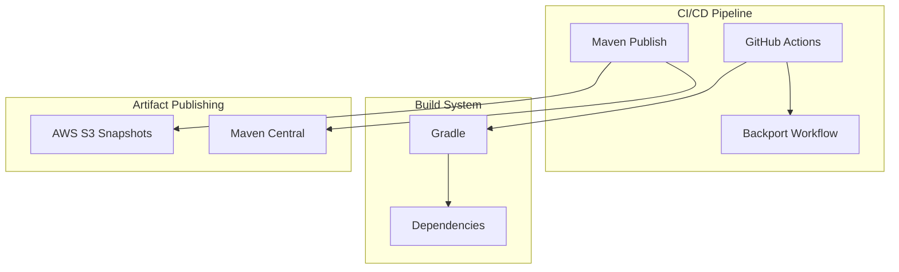
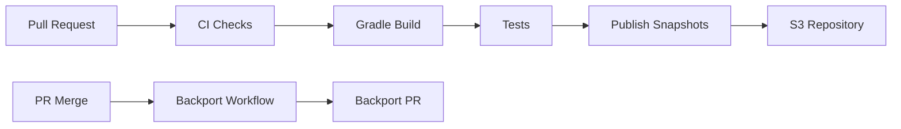

# User Behavior Insights Build Infrastructure

## Summary

This document tracks the build infrastructure and CI/CD configuration for the User Behavior Insights (UBI) plugin. UBI is a plugin that captures client-side events and queries for improving search relevance and user experience. The build infrastructure ensures proper dependency management, snapshot publishing, and automated workflows.

## Details

### Architecture



### Data Flow



### Components

| Component | Description |
|-----------|-------------|
| `build.gradle` | Main build configuration with dependency and publishing setup |
| `maven-publish.yml` | GitHub Actions workflow for publishing Maven snapshots |
| `backport.yml` | Automated backporting workflow for merged PRs |
| `delete_backport_branch.yml` | Cleanup workflow for backport branches |

### Configuration

| Setting | Description | Default |
|---------|-------------|---------|
| `MAVEN_SNAPSHOTS_S3_REPO` | S3 repository URL for snapshot publishing | `ci.opensearch.org/ci/dbc/snapshots/maven/` |
| `MAVEN_SNAPSHOTS_S3_ROLE` | IAM role for S3 access | (from secrets) |

### Repository URLs

| Purpose | URL |
|---------|-----|
| Snapshot Repository | `https://ci.opensearch.org/ci/dbc/snapshots/maven/` |
| Gradle Plugins | `https://plugins.gradle.org/m2/` |
| JitPack | `https://jitpack.io` |

### Usage Example

To use UBI snapshots in your project:

```groovy
repositories {
    maven { url "https://ci.opensearch.org/ci/dbc/snapshots/maven/" }
    mavenCentral()
}

dependencies {
    implementation "org.opensearch.plugin:opensearch-ubi:3.4.0-SNAPSHOT"
}
```

## Limitations

- Snapshot publishing requires AWS credentials (handled automatically in CI)
- Backport workflow requires GitHub App token for cross-branch operations
- S3 repository does not provide the same browsing interface as Sonatype

## Related PRs

| Version | PR | Description |
|---------|-----|-------------|
| v3.4.0 | [#140](https://github.com/opensearch-project/user-behavior-insights/pull/140) | Onboarding new maven snapshots publishing to s3 |
| v3.3.0 | [#127](https://github.com/opensearch-project/user-behavior-insights/pull/127) | Increment version to 3.3.0-SNAPSHOT |
| v3.3.0 | [#128](https://github.com/opensearch-project/user-behavior-insights/pull/128) | Fix dependency errors for integration tests |

## References

- [Issue #5360](https://github.com/opensearch-project/opensearch-build/issues/5360): Migration from sonatype snapshots repo to ci.opensearch.org
- [User Behavior Insights Repository](https://github.com/opensearch-project/user-behavior-insights): Main UBI repository
- [UBI Documentation](https://docs.opensearch.org/3.0/search-plugins/ubi/index/): Official OpenSearch UBI documentation
- [UBI Specification](https://github.com/o19s/ubi): Industry-standard UBI schema

## Change History

- **v3.4.0** (2026-01-11): Migrated Maven snapshot publishing from Sonatype to S3, added backport workflows
- **v3.3.0** (2026-01-11): Fixed dependency version conflicts for integration tests
