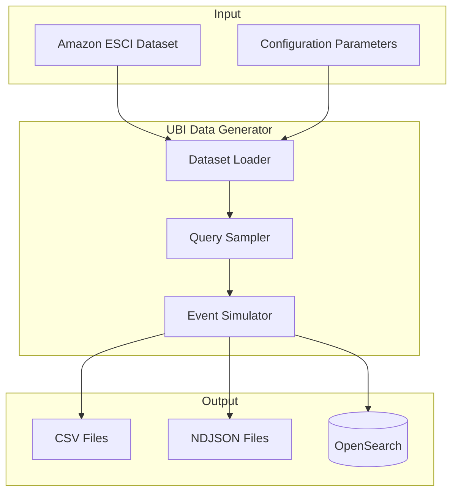
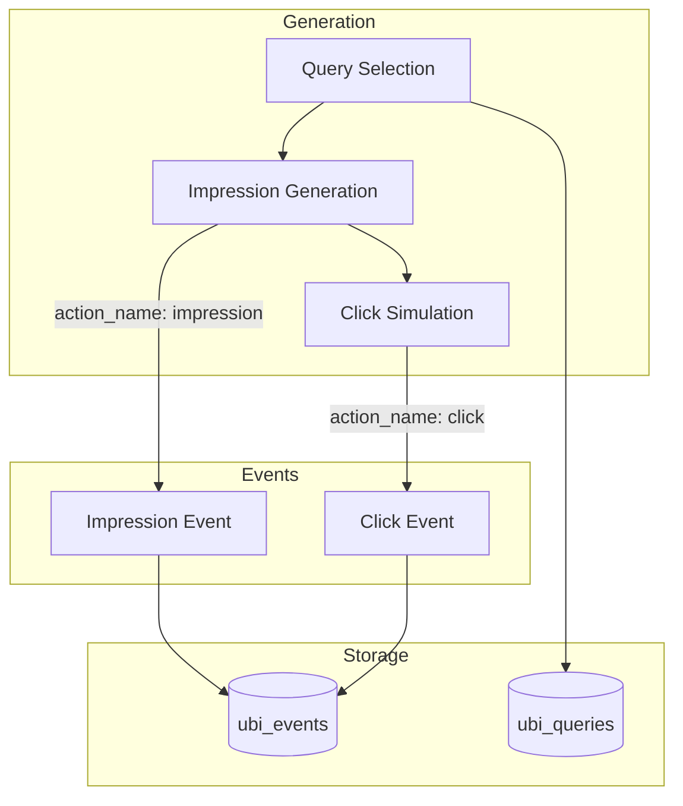

# User Behavior Insights Data Generator

## Summary

The UBI Data Generator is a Python tool that generates synthetic User Behavior Insights (UBI) data for testing, development, and demonstration purposes. It creates realistic query and event data based on the Amazon ESCI (Shopping Queries) dataset, simulating user search behavior including queries, impressions, and clicks with configurable parameters.

## Details

### Architecture



### Data Flow



### Components

| Component | Description |
|-----------|-------------|
| `load_esci()` | Loads and preprocesses the Amazon ESCI dataset |
| `GenConfig` | Configuration dataclass for generation parameters |
| `make_top_queries()` | Selects top queries and computes sampling probabilities |
| `make_result_sample_per_query()` | Creates sampling structure for search results |
| `simulate_events()` | Generates query and event data streams |
| `make_ubi_event()` | Constructs UBI event objects with all required fields |

### Configuration

| Setting | Description | Default |
|---------|-------------|---------|
| `--esci-dataset-path` | Path to ESCI dataset (required) | - |
| `--num-search-results` | Maximum results per query | 5 |
| `--num-unique-queries` | Total unique queries | 200 |
| `--num-query-events` | Total query events to generate | 1000 |
| `--time-period-days` | Time span for generated events | 7 |
| `--datetime-start` | Start date for events | 2024/06/01 |
| `--seconds-between-clicks` | Average time between clicks | 1.0 |
| `--opensearch-url` | OpenSearch endpoint URL | http://localhost:9200 |

### Output Formats

| Format | Flag | Output Files |
|--------|------|--------------|
| CSV | `--generate-csv` | `ubi_queries.csv`, `ubi_events.csv` |
| NDJSON | `--generate-ndjson` | `ubi_queries_events.ndjson` |
| OpenSearch | `--generate-opensearch` | Indexes: `ubi_queries`, `ubi_events` |

### Event Structure

Generated events follow the UBI specification with the following structure:

```json
{
  "application": "esci_ubi_sample",
  "action_name": "impression|click",
  "query_id": "<uuid>",
  "session_id": "<uuid>",
  "client_id": "<uuid>",
  "timestamp": "2024-06-01T10:30:00.000Z",
  "user_query": "laptop",
  "event_attributes": {
    "object": {
      "object_id": "B08N5WRWNW",
      "object_id_field": "product_id",
      "search_config": "teamA"
    },
    "position": {
      "ordinal": 0
    }
  }
}
```

### Usage Example

```bash
# Generate CSV files
python ubi_data_generator.py \
  --esci-dataset-path /path/to/esci \
  --num-query-events 10000 \
  --generate-csv

# Generate and index into OpenSearch
python ubi_data_generator.py \
  --esci-dataset-path /path/to/esci \
  --num-query-events 5000 \
  --opensearch-url http://localhost:9200 \
  --generate-opensearch
```

## Limitations

- Requires the Amazon ESCI dataset as input
- Click probability model uses a simplified cascade model based on position
- `search_config` values are hardcoded to "teamA" and "teamB"
- Distribution probabilities for A/B testing simulation are not configurable

## Change History

- **v3.2.0** (2025-06-26): Added `search_config` field to support A/B TDI testing simulation

## References

### Documentation
- [UBI Documentation](https://docs.opensearch.org/3.0/search-plugins/ubi/index/): Official OpenSearch UBI documentation
- [User Behavior Insights Plugin](https://github.com/opensearch-project/user-behavior-insights): Main UBI repository
- [UBI Specification](https://github.com/o19s/ubi): Industry-standard UBI schema
- [Amazon ESCI Dataset](https://github.com/amazon-science/esci-data): Shopping Queries Dataset

### Pull Requests
| Version | PR | Description |
|---------|-----|-------------|
| v3.2.0 | [#102](https://github.com/opensearch-project/user-behavior-insights/pull/102) | Added search_config field for A/B TDI testing |

### Issues (Design / RFC)
- [RFC: Team Draft Interleaving](https://github.com/opensearch-project/OpenSearch/issues/18383): A/B testing RFC
