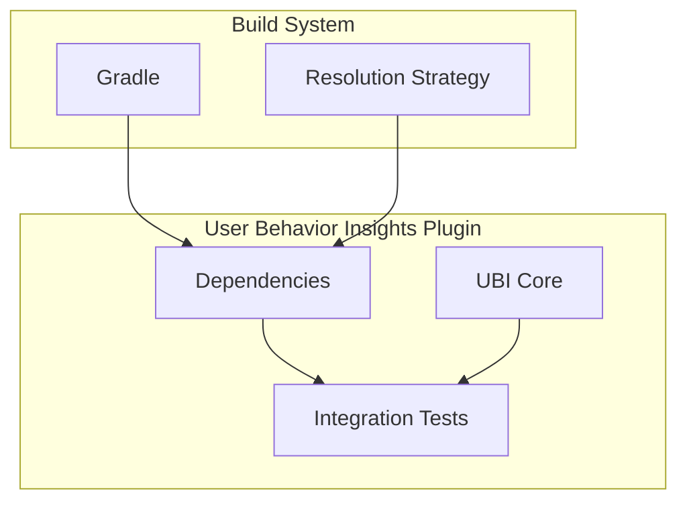

# User Behavior Insights Plugin Fixes

## Summary

This document tracks bug fixes and maintenance updates for the User Behavior Insights (UBI) plugin. UBI is a plugin that captures client-side events and queries for improving search relevance and user experience.

## Details

### Architecture

### Components

| Component | Description |
|-----------|-------------|
| UBI Core | Main plugin functionality for capturing user events |
| Integration Tests | Tests that verify plugin behavior with OpenSearch |
| Build Configuration | Gradle configuration managing dependencies |

### Configuration

| Setting | Description | Default |
|---------|-------------|---------|
| `error_prone_annotations` | Error-prone static analysis annotations | 2.41.0 (forced) |

## Limitations

- Dependency version forcing may need updates as upstream libraries evolve
- Integration tests require a running OpenSearch instance

## Related PRs

| Version | PR | Description |
|---------|-----|-------------|
| v3.3.0 | [#128](https://github.com/opensearch-project/user-behavior-insights/pull/128) | Fix dependency errors for integration tests |

## References

- [User Behavior Insights Plugin](https://github.com/opensearch-project/user-behavior-insights): Main UBI repository
- [UBI Documentation](https://docs.opensearch.org/3.0/search-plugins/ubi/index/): Official OpenSearch UBI documentation
- [UBI Specification](https://github.com/o19s/ubi): Industry-standard UBI schema

## Change History

- **v3.3.0** (2026-01-11): Fixed dependency version conflicts for integration tests
