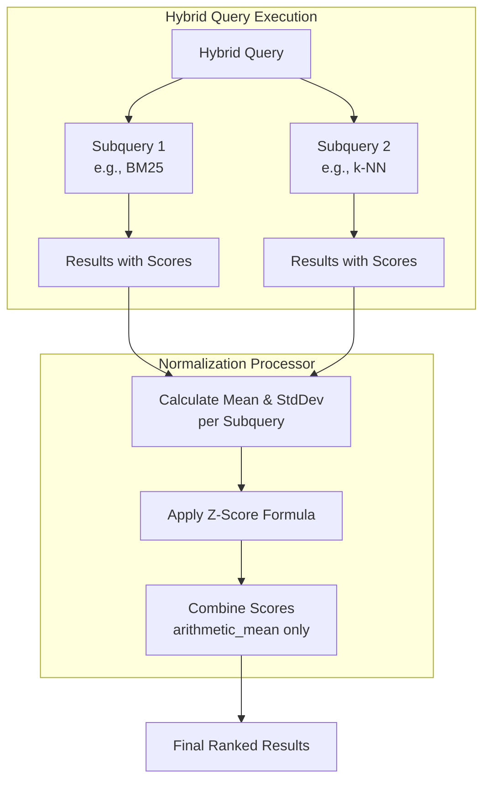
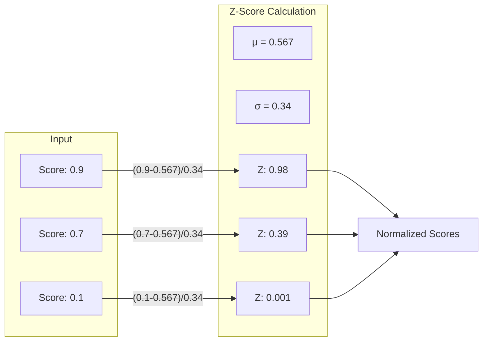

# Z-Score Normalization for Hybrid Search

## Summary

Z-score normalization is a new score normalization technique for hybrid search introduced in OpenSearch 3.0. It transforms scores using mean and standard deviation, making it more robust to outliers compared to the default min-max normalization. This technique is particularly effective when search results follow a normal distribution pattern.

**Key Benefits:**
- Better handling of outliers in search results
- Preserves the shape of the original score distribution
- Provides ~2% improvement in search relevance (NDCG@10) with minimal latency impact

## Details

### How Z-Score Normalization Works

The z-score formula transforms each score based on the mean and standard deviation of all scores:

```
Z = (X - μ) / σ
```

Where:
- X = original score
- μ = mean of all scores
- σ = standard deviation

### Architecture



### Data Flow



### Components

| Component | Description |
|-----------|-------------|
| `ZScoreNormalizationTechnique` | Core implementation calculating mean, std dev, and normalized scores |
| `ScoreNormalizationFactory` | Factory class updated to support `z_score` technique |
| `TechniqueCompatibilityCheckDTO` | DTO for validating normalization/combination compatibility |
| `ProcessorUtils.getNumOfSubqueries()` | Utility method extracted for reuse across normalization techniques |

### Configuration

| Setting | Description | Default |
|---------|-------------|---------|
| `normalization.technique` | Set to `z_score` to enable | `min_max` |
| `combination.technique` | Must be `arithmetic_mean` | `arithmetic_mean` |
| `combination.parameters.weights` | Optional weights for subqueries | Equal weights |

### Usage Example

Create a search pipeline with z-score normalization:

```json
PUT /_search/pipeline/z_score-pipeline
{
  "description": "Z-score normalization for hybrid search",
  "phase_results_processors": [
    {
      "normalization-processor": {
        "normalization": {
          "technique": "z_score"
        },
        "combination": {
          "technique": "arithmetic_mean",
          "parameters": {
            "weights": [0.5, 0.5]
          }
        }
      }
    }
  ]
}
```

Execute a hybrid query with the pipeline:

```json
POST /my-index/_search?search_pipeline=z_score-pipeline
{
  "query": {
    "hybrid": {
      "queries": [
        {
          "match": {
            "text": "search query"
          }
        },
        {
          "neural": {
            "embedding_field": {
              "query_text": "semantic search",
              "model_id": "model-id",
              "k": 10
            }
          }
        }
      ]
    }
  }
}
```

### When to Use Z-Score vs Min-Max

| Scenario | Recommended Technique |
|----------|----------------------|
| Results are evenly distributed (normal distribution) | Z-Score |
| Results are tightly clustered | Min-Max |
| Dataset has significant outliers | Z-Score |
| Need geometric/harmonic mean combination | Min-Max |

## Limitations

- **Combination technique restriction**: Z-score normalization only supports `arithmetic_mean` combination. Using `geometric_mean` or `harmonic_mean` will result in an error.
- **Edge cases**: When standard deviation is 0 (all scores identical), returns the minimum score. When only one result exists, returns the maximum score.
- **Negative scores**: Normalized scores below 0 are clamped to 0.001 to ensure valid positive scores.

## Related PRs

| Version | PR | Description |
|---------|-----|-------------|
| v3.0.0 | [neural-search#1224](https://github.com/opensearch-project/neural-search/pull/1224) | Adds Z-Score Normalization Technique |

## References

- [Issue #376](https://github.com/opensearch-project/neural-search/issues/376): Original feature request
- [Issue #1209](https://github.com/opensearch-project/neural-search/issues/1209): RFC for Z-Score Normalization
- [Normalization Processor Documentation](https://docs.opensearch.org/3.0/search-plugins/search-pipelines/normalization-processor/)
- [Hybrid Search Documentation](https://docs.opensearch.org/3.0/vector-search/ai-search/hybrid-search/index/)
- [Blog: Introducing the z-score normalization technique for hybrid search](https://opensearch.org/blog/introducing-the-z-score-normalization-technique-for-hybrid-search/)

## Change History

- **v3.0.0**: Initial implementation of z-score normalization technique
