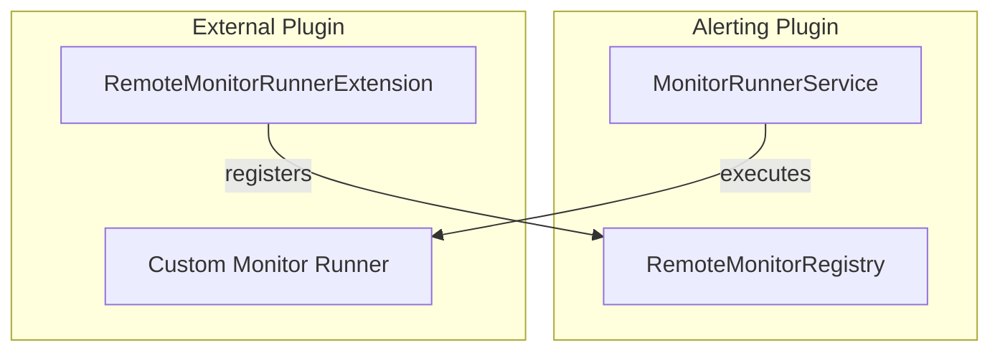

---
tags:
  - alerting
---
# Cross-Cluster & Remote Monitors

## Summary

OpenSearch v2.16.0 introduces cross-cluster monitoring and remote monitors support in the Alerting plugin. This enhancement enables monitors to query data across multiple clusters and allows external plugins to define custom monitor types through a new SPI (Service Provider Interface).

## Details

### What's New in v2.16.0

#### Cross-Cluster Monitoring Enabled by Default

The `plugins.alerting.cross_cluster_monitoring_enabled` cluster setting is now enabled by default (`true`), allowing monitors to query indices across connected remote clusters without additional configuration.

```yaml
# Cluster setting (now defaults to true)
plugins.alerting.cross_cluster_monitoring_enabled: true
```

#### Remote Monitors SPI

A new `alerting-spi` module introduces the `RemoteMonitorRunnerExtension` interface, enabling downstream OpenSearch plugins to integrate custom monitor types with the Alerting infrastructure.



#### Architecture Changes

| Component | Description |
|-----------|-------------|
| `alerting-spi` | New module exposing interfaces for remote monitor integration |
| `RemoteMonitorRegistry` | Registry for custom monitor types and their runners |
| `RemoteDocumentLevelMonitorRunner` | Runner for remote document-level monitors |

#### Common-Utils Integration

Key model classes moved to `common-utils` for shared access:
- `MonitorMetadata`
- `WorkflowMetadata`
- `WorkflowRunContext`
- `IndexExecutionContext`
- Various trigger run result classes

### Technical Changes

- Monitor type checking now uses string comparison (`monitor.monitorType.endsWith(...)`) to support custom monitor type naming
- `DocLevelMonitorFanOutAction` and related classes moved to `common-utils`
- `AlertingException` utility moved to `common-utils`
- Plugin loading via `ExtensiblePlugin.ExtensionLoader` for remote monitor extensions

## Limitations

- Remote monitors require the external plugin to be installed and properly configured
- Cross-cluster monitoring requires remote cluster connections to be established
- Custom monitor types must follow the naming convention ending with standard monitor type suffixes

## References

### Pull Requests
| PR | Description | Related Issue |
|----|-------------|---------------|
| [#1612](https://github.com/opensearch-project/alerting/pull/1612) | Enable cross-cluster monitor cluster setting | - |
| [#1589](https://github.com/opensearch-project/alerting/pull/1589) | Commits to support remote monitors in alerting | [#1546](https://github.com/opensearch-project/alerting/issues/1546) |
| [#694](https://github.com/opensearch-project/common-utils/pull/694) | [Backport 2.x] Add support for remote monitors | - |

### Documentation
- [Per cluster metrics monitors](https://docs.opensearch.org/2.16/observing-your-data/alerting/per-cluster-metrics-monitors/)
