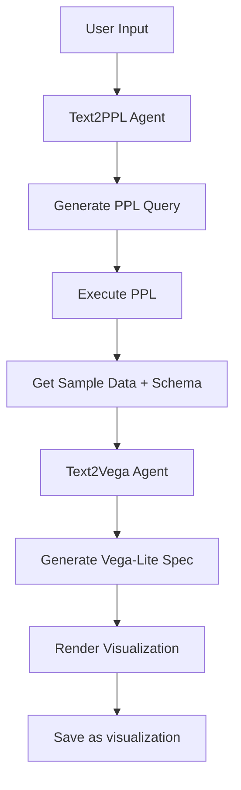

---
tags:
  - dashboards-assistant
---
# Text to Visualization

## Summary

Text to Visualization (t2viz) is a new experimental feature that enables users to create data visualizations using natural language queries. Users can describe their visualization needs in plain English, and the system automatically generates Vega-Lite specifications through ML Commons agents connected to LLM providers.

## Details

### What's New in v2.16.0

This release introduces the initial implementation of the Text to Visualization feature:

- **Text2Viz Page**: New dedicated page for creating visualizations from natural language
- **Text2Vega Service**: Coordinates the pipeline from natural language to Vega-Lite specification
- **Text2PPL API**: Converts natural language questions to PPL queries
- **Text2Vega API**: Generates Vega-Lite specs from PPL results and user input
- **Source Selector**: Index pattern selection for data source
- **Visualization Alias**: Registered as experimental visualization type in the visualize app

### Technical Changes

#### New APIs

| API | Method | Path | Description |
|-----|--------|------|-------------|
| Text2PPL | POST | `/api/assistant/text2ppl` | Convert question to PPL query |
| Text2Vega | POST | `/api/assistant/text2vega` | Generate Vega-Lite from PPL and sample data |

#### New Components

| Component | Description |
|-----------|-------------|
| `Text2Viz` | Main page component |
| `Text2Vega` | Service class using RxJS for reactive pipeline |
| `SourceSelector` | Data source selection component |
| `Text2VizEmpty` | Empty state component |
| `Text2VizLoading` | Loading state component |

#### Configuration

The feature is controlled by the `assistant.next.enabled` configuration flag (disabled by default).

#### ML Agents Required

- `text2vega`: Agent for generating Vega-Lite specifications
- `text2ppl`: Agent for generating PPL queries from natural language

### Data Flow

## Limitations

- Experimental feature, not recommended for production
- Requires external LLM provider configuration
- Requires ML Commons agents to be set up
- Only generates Vega-Lite visualizations

## References

### Pull Requests

| PR | Description | Related Issue |
|----|-------------|---------------|
| [#218](https://github.com/opensearch-project/dashboards-assistant/pull/218) | Initial implementation of text to visualization | |
| [#223](https://github.com/opensearch-project/dashboards-assistant/pull/223) | Backport to 2.16 branch | |
