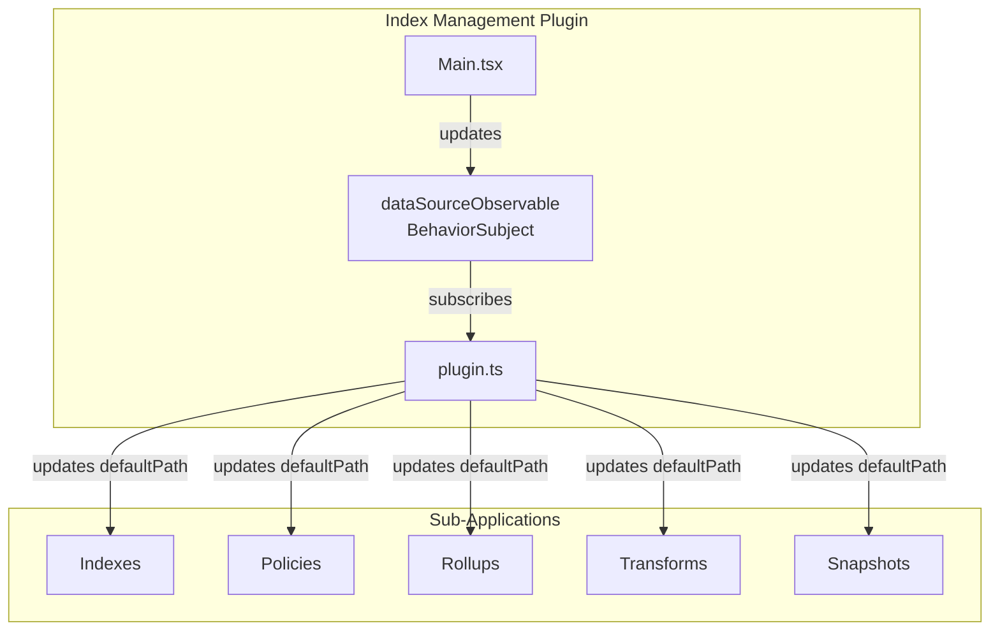

---
tags:
  - index-management-dashboards
---
# Index Management DataSource Persistence

## Summary

Fixed an issue where the selected data source was not persisted when navigating between Index Management sub-applications (Indexes, Policies, Rollups, etc.) under the new navigation UX introduced in OpenSearch Dashboards 2.16.

## Details

### What's New in v2.16.0

This bug fix ensures that when users select a data source in one Index Management page, that selection is maintained when navigating to other Index Management pages using the new left navigation.

### Problem

When the new navigation UX was enabled in OpenSearch Dashboards 2.16, users experienced data source selection being lost when switching between Index Management sub-applications. For example:

1. User selects a remote cluster data source on the Indexes page
2. User clicks on "Rollup Jobs" in the left navigation
3. The data source selection resets to local cluster

### Solution

The fix introduces a `BehaviorSubject` observable (`dataSourceObservable`) that maintains the current data source selection across all Index Management sub-applications:

### Technical Changes

| Component | Change |
|-----------|--------|
| `Main.tsx` | Added `dataSourceObservable` BehaviorSubject to track data source selection |
| `Main.tsx` | Updated constructor to emit data source on initialization if present in URL |
| `Main.tsx` | Updated `setDataSourceId` to emit changes to observable |
| `plugin.ts` | Added `AppUpdater` that updates `defaultPath` with current `dataSourceId` |
| `plugin.ts` | Added `updater$` to all sub-application registrations |
| `plugin.ts` | Added subscription to `dataSourceObservable` to trigger app updates |

### Implementation Details

The fix uses the OpenSearch Dashboards `AppUpdater` pattern:

1. When a data source is selected, `dataSourceObservable.next()` emits the new value
2. The plugin subscribes to this observable
3. On each emission, `appStateUpdater.next()` triggers an update
4. Each sub-application's `defaultPath` is updated to include `dataSourceId` query parameter
5. When navigating, the new navigation uses the updated `defaultPath`

## Limitations

- Only applies when the new navigation UX is enabled
- Requires Multi-Data Source (MDS) feature to be enabled in OpenSearch Dashboards

## References

### Pull Requests
| PR | Description | Related Issue |
|----|-------------|---------------|
| [#1088](https://github.com/opensearch-project/index-management-dashboards-plugin/pull/1088) | Persist dataSourceId across applications under new Nav change | [OpenSearch-Dashboards#7027](https://github.com/opensearch-project/OpenSearch-Dashboards/issues/7027) |
