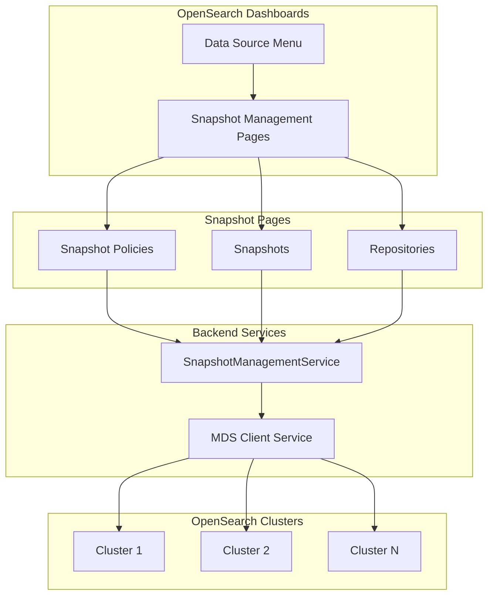

---
tags:
  - index-management-dashboards
---
# Index Management MDS Support

## Summary

This enhancement adds Multi-Data Source (MDS) support to the Snapshot Management pages in the Index Management Dashboards plugin. Users can now manage snapshots, snapshot policies, and repositories across multiple OpenSearch clusters from a single dashboard.

## Details

### What's New in v2.16.0

The Snapshot Management pages now support Multi-Data Source (MDS), enabling users to:
- View and manage snapshots from different connected OpenSearch clusters
- Create and manage snapshot policies across multiple data sources
- Configure and manage repositories for different clusters
- Create and restore snapshots on remote clusters

### Technical Changes

The implementation extends the existing MDS infrastructure to snapshot management components:

| Component | Changes |
|-----------|---------|
| `SnapshotManagementService` | Extended `MDSEnabledClientService` to support data source routing |
| `CreateSnapshotPolicy` | Added `DataSourceMenuContext` integration and state reset on data source change |
| `SnapshotPolicies` | Added MDS query parameters and data source-aware state management |
| `SnapshotPolicyDetails` | Extended with MDS properties and URL synchronization |
| `Snapshots` | Added data source filtering and component update handling |
| `Repositories` | Added MDS support with data source-aware repository listing |
| `CreateRepositoryFlyout` | Added data source context and state reset on change |
| `CreateSnapshotFlyout` | Added MDS integration for snapshot creation |
| `RestoreSnapshotFlyout` | Added data source support for restore operations |
| `SnapshotFlyout` | Added MDS context for snapshot details view |

### Architecture

### Routes Updated

The following server routes were updated to accept `dataSourceId` query parameter:

- `GET /api/_snapshots` - List all snapshots
- `GET/DELETE/PUT/POST /api/_snapshots/{id}` - Snapshot operations
- `GET/POST/PUT/DELETE /api/ism/sm_policies/{id}` - SM policy operations
- `POST /api/ism/sm_policies/{id}/_start` - Start policy
- `POST /api/ism/sm_policies/{id}/_stop` - Stop policy
- `GET /api/_cat/repositories` - List repositories
- `GET/PUT/DELETE /api/_cat/repositories/{id}` - Repository operations
- `GET /api/_recovery` - Index recovery status

## Limitations

- Requires Multi-Data Source feature to be enabled in OpenSearch Dashboards
- Data source must be configured before snapshot operations can be performed on remote clusters
- Snapshot policies are cluster-specific and cannot span multiple data sources

## References

### Pull Requests
| PR | Description | Related Issue |
|----|-------------|---------------|
| [#1084](https://github.com/opensearch-project/index-management-dashboards-plugin/pull/1084) | Add MDS support to snapshot pages | [#1067](https://github.com/opensearch-project/index-management-dashboards-plugin/issues/1067) |

### Documentation
- [Snapshot Management Documentation](https://docs.opensearch.org/2.16/dashboards/sm-dashboards/)
- [Configuring Multiple Data Sources](https://docs.opensearch.org/2.16/dashboards/management/multi-data-sources/)
