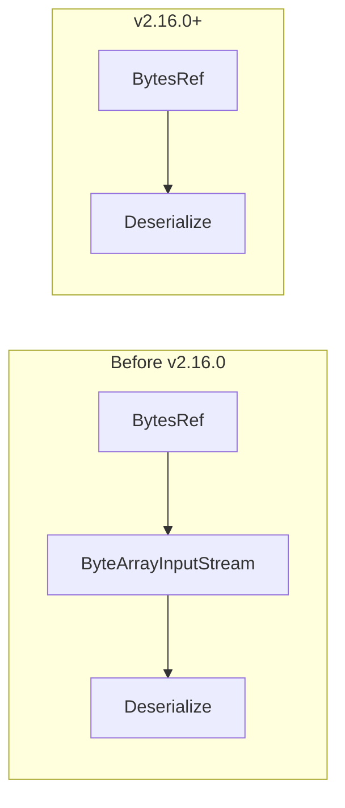

---
tags:
  - k-nn
---
# k-NN Serialization

## Summary

Optimized k-NN vector serialization by switching from byte streams to byte references (BytesRef), eliminating unnecessary memory copies during serialization and deserialization operations. This change improves exact search performance by 15-20%.

## Details

### What's New in v2.16.0

The k-NN plugin previously used `ByteArrayInputStream` for vector serialization/deserialization, which required copying data from `BytesRef` to a stream before processing. This change eliminates the intermediate copy by working directly with `BytesRef`.

### Technical Changes

| Component | Change |
|-----------|--------|
| `KNNVectorSerializer` | Interface updated to accept `BytesRef` instead of `ByteArrayInputStream` |
| `KNNVectorSerializerFactory` | New methods `getSerializerByBytesRef()` and `getSerializerModeFromBytesRef()` |
| `VectorTransfer` | Transfer methods now accept `BytesRef` directly |
| `KNNCodecUtil` | Removed `ByteArrayInputStream` wrapper in `getPair()` |
| `FilteredIdsKNNIterator` | Direct `BytesRef` usage in `computeScore()` |

### Performance Impact

Benchmark results from exact search operations:

| Metric | Before | After | Improvement |
|--------|--------|-------|-------------|
| p50 latency | 674 ms | 568 ms | 15.7% |
| p90 latency | 684 ms | 584 ms | 14.6% |
| p99 latency | 692 ms | 596 ms | 13.9% |

The improvement is most significant for exact search operations where vectors are read from binary doc values. Approximate search using native indexes (FAISS, NMSLIB) is not affected as those use optimized native serialization.

### Affected Classes

- `VectorDataType.getVectorFromBytesRef()`
- `VectorTransfer.transfer()` and `getSerializationMode()`
- `VectorTransferByte` and `VectorTransferFloat`
- `KNNVectorAsArraySerializer.byteToFloatArray()`
- `KNNVectorAsCollectionOfFloatsSerializer.byteToFloatArray()`
- `FilteredIdsKNNIterator.computeScore()`

## Limitations

- This optimization primarily benefits exact search and filtered k-NN queries
- Approximate search using native indexes already uses optimized serialization
- Future migration to Lucene's native vector format will supersede this optimization

## References

### Pull Requests
| PR | Description | Related Issue |
|----|-------------|---------------|
| [#1825](https://github.com/opensearch-project/k-NN/pull/1825) | Switch from byte stream to byte ref for serde | [#1736](https://github.com/opensearch-project/k-NN/issues/1736) |

### Issues
- [#1736](https://github.com/opensearch-project/k-NN/issues/1736): Avoid additional copy to stream during binary doc values deserialization
- [#1709](https://github.com/opensearch-project/k-NN/issues/1709): Related performance investigation
