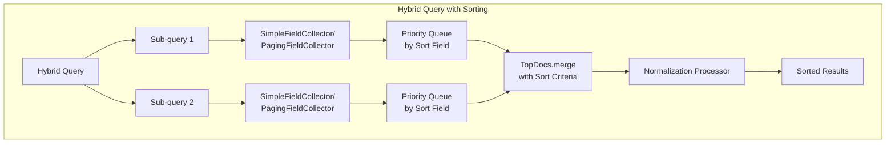

---
tags:
  - neural-search
---
# Hybrid Search Enhancements

## Summary

OpenSearch 2.16.0 introduces sorting and `search_after` pagination support for hybrid queries. This enhancement allows users to sort hybrid search results by specific fields (such as price, date, or stock) and use `search_after` for efficient deep pagination, providing greater flexibility beyond the default relevance-based ordering.

## Details

### What's New in v2.16.0

This release adds two key capabilities to hybrid queries:

1. **Field-based Sorting**: Sort hybrid query results by document fields instead of relevance scores
2. **search_after Pagination**: Use cursor-based pagination with sorted hybrid queries for efficient deep pagination

### Architecture



### Technical Changes

| Component | Description |
|-----------|-------------|
| `HybridTopFieldDocSortCollector` | Abstract base collector for sorted hybrid queries |
| `SimpleFieldCollector` | Collector for basic field sorting without pagination |
| `PagingFieldCollector` | Collector for `search_after` pagination with sorting |
| `HybridSearchCollector` | Common interface for hybrid search collectors |
| `CombineScoresDto` | DTO for passing sort criteria to score combiner |
| `HybridQueryFieldDocComparator` | Comparator for merging sorted field docs |
| `MultiLeafFieldComparator` | Handles multi-field sort criteria |
| `HybridSearchSortUtil` | Utility for evaluating and creating sort criteria |

### How Sorting Works

1. **Query Phase**: Each sub-query executes and results are collected into priority queues ordered by the sort field
2. **Shard-level Merge**: Sub-query results are merged using `TopDocs.merge()` with the sort criteria
3. **Normalization**: Relevance scores are preserved for normalization but don't affect sort order
4. **Coordinator Merge**: Results from all shards are merged maintaining sort order

### Usage Example

**Basic Sorting**:
```json
GET /my-index/_search?search_pipeline=hybrid-pipeline
{
  "query": {
    "hybrid": {
      "queries": [
        { "match": { "title": "wind" } },
        { "neural": { "embedding": { "query_text": "wind energy", "model_id": "..." } } }
      ]
    }
  },
  "sort": [
    { "price": { "order": "desc" } }
  ]
}
```

**With search_after**:
```json
GET /my-index/_search?search_pipeline=hybrid-pipeline
{
  "query": {
    "hybrid": {
      "queries": [
        { "match": { "title": "wind" } },
        { "neural": { "embedding": { "query_text": "wind energy", "model_id": "..." } } }
      ]
    }
  },
  "sort": [
    { "price": { "order": "desc" } }
  ],
  "search_after": [25.99]
}
```

**Multiple Sort Fields**:
```json
GET /my-index/_search?search_pipeline=hybrid-pipeline
{
  "query": {
    "hybrid": {
      "queries": [
        { "match": { "title": "wind" } },
        { "neural": { "embedding": { "query_text": "wind energy", "model_id": "..." } } }
      ]
    }
  },
  "sort": [
    { "stock": { "order": "desc" } },
    { "_doc": { "order": "asc" } }
  ]
}
```

## Limitations

- **Cannot mix `_score` with other sort fields**: Sorting by multiple fields cannot include `_score` because sub-query results can only be combined based on either sort fields or `_score`, but not both
- **Incompatible with `track_scores`**: When sorting by fields, `track_scores` must be set to `false` because score recalculation during fetch phase would produce incorrect results after normalization
- **Sort by `_score` alone is allowed**: You can sort by `_score` only (ascending or descending) as a single sort criterion

## References

### Documentation
- [Hybrid Search - Using Sorting](https://docs.opensearch.org/2.16/search-plugins/hybrid-search/#using-sorting-with-a-hybrid-query)
- [How Sorting Works in Hybrid Queries (Blog)](https://opensearch.org/blog/internal-functioning-of-sorting-in-hybrid-query/)

### Pull Requests
| PR | Description | Related Issue |
|----|-------------|---------------|
| [#827](https://github.com/opensearch-project/neural-search/pull/827) | Enable sorting and search_after features in Hybrid Search | [#507](https://github.com/opensearch-project/neural-search/issues/507), [#742](https://github.com/opensearch-project/neural-search/issues/742), [#741](https://github.com/opensearch-project/neural-search/issues/741) |
| [#797](https://github.com/opensearch-project/neural-search/pull/797) | Sorting implementation (cherry-picked into #827) | |
| [#802](https://github.com/opensearch-project/neural-search/pull/802) | search_after implementation (cherry-picked into #827) | |
| [#808](https://github.com/opensearch-project/neural-search/pull/808) | Additional sorting fixes (cherry-picked into #827) | |

### Issues
- [#507](https://github.com/opensearch-project/neural-search/issues/507): Sorting support for Hybrid Search
- [#742](https://github.com/opensearch-project/neural-search/issues/742): Related sorting issue
- [#741](https://github.com/opensearch-project/neural-search/issues/741): Related sorting issue
- [#828](https://github.com/opensearch-project/neural-search/issues/828): Related issue
