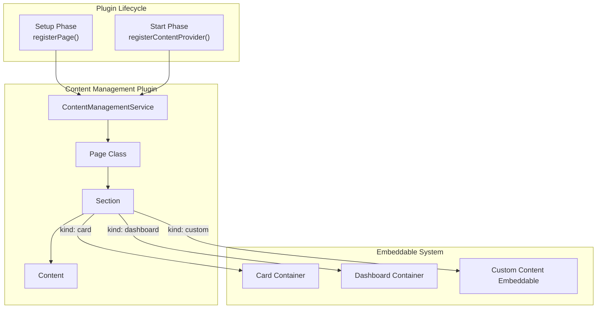

---
tags:
  - opensearch-dashboards
---
# Content Management Plugin

## Summary

OpenSearch Dashboards v2.16.0 introduces the Content Management plugin, a new core plugin that provides a framework for dynamically rendering pages with customizable sections. This plugin enables other plugins to create flexible, composable page layouts by registering pages and content providers.

## Details

### What's New in v2.16.0

The Content Management plugin is a foundational feature that addresses the growing demand for displaying customizable dynamic content within OpenSearch Dashboards. Key capabilities include:

- **Page Registration**: Plugins can register pages with unique IDs during the setup phase
- **Content Providers**: Plugins can register content providers during the start phase to contribute content to specific page sections
- **Section Types**: Three section types are supported:
  - `dashboard`: Embeds saved dashboards with visualizations
  - `card`: Displays card-based content for quick links and summaries
  - `custom`: Renders arbitrary React components for maximum flexibility
- **Dynamic Content**: Pages can aggregate and display content from multiple plugins

### Architecture



### Technical Changes

| Component | Description |
|-----------|-------------|
| `ContentManagementService` | Core service managing pages and content providers |
| `Page` | Class representing a renderable page with sections |
| `PageRender` | React component for rendering pages |
| `SectionRender` | React component for rendering different section types |
| `CardContainer` | Embeddable container for card-based content |
| `CardEmbeddable` | Individual card embeddable using EuiCard |
| `CustomContentEmbeddable` | Embeddable for rendering arbitrary React components |

### API

#### Setup Phase
```typescript
interface ContentManagementPluginSetup {
  registerPage: (pageConfig: PageConfig) => void;
}

interface PageConfig {
  id: string;
  title?: string;
  description?: string;
  sections?: Section[];
}
```

#### Start Phase
```typescript
interface ContentManagementPluginStart {
  registerContentProvider: (provider: ContentProvider) => void;
  renderPage: (id: string) => React.ReactNode;
}

interface ContentProvider {
  id: string;
  getContent: () => Content;
  getTargetArea: () => string;  // Format: "{pageId}/{sectionId}"
}
```

### Usage Example

```typescript
// Plugin setup phase
setup(core, { contentManagement }) {
  contentManagement.registerPage({
    id: 'home',
    sections: [{ id: 'section1', kind: 'card', order: 10 }]
  });
}

// Plugin start phase
start(core, { contentManagement }) {
  contentManagement.registerContentProvider({
    id: 'my-provider',
    getTargetArea: () => 'home/section1',
    getContent: () => ({
      kind: 'card',
      id: 'my-card',
      order: 0,
      title: 'Quick Start',
      description: 'Get started with OpenSearch'
    })
  });
  
  // Render the page
  return contentManagement.renderPage('home');
}
```

## Limitations

- Dashboard sections are exclusive - one section can only hold one dashboard
- Content providers must be registered during the start phase
- The plugin is client-side only (`server: false`)

## References

### Pull Requests
| PR | Description | Related Issue |
|----|-------------|---------------|
| [#7201](https://github.com/opensearch-project/OpenSearch-Dashboards/pull/7201) | New core plugin for dynamic content rendering | [#7228](https://github.com/opensearch-project/OpenSearch-Dashboards/issues/7228) |

### Issues (Design / RFC)
- [#7228](https://github.com/opensearch-project/OpenSearch-Dashboards/issues/7228): RFC - Dynamic content creation within OSD
