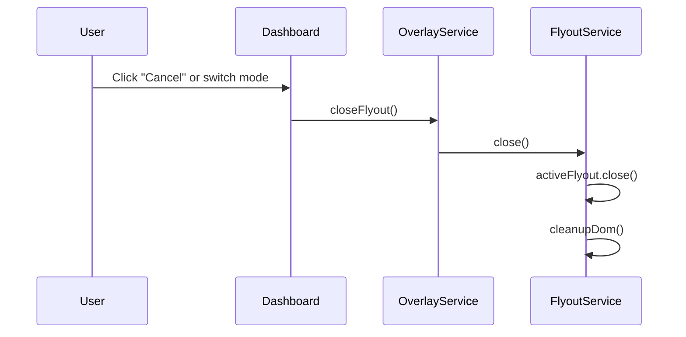

---
tags:
  - opensearch-dashboards
---
# Dashboard Flyout Fix

## Summary

Fixes an issue where system flyouts (such as the add panel flyout) remained open when switching dashboard view modes. The fix adds a `closeFlyout()` method to the overlay service and calls it when transitioning between edit and view modes.

## Details

### What's New in v2.16.0

A new `close()` method was added to the `FlyoutService` that allows programmatic closing of any active flyout. This method is now called when:

1. Switching from edit mode to view mode without changes
2. Discarding changes and switching to view mode

### Technical Changes



#### API Changes

New method added to `OverlayFlyoutStart` interface:

```typescript
interface OverlayFlyoutStart {
  open(mount: MountPoint, options?: OverlayFlyoutOpenOptions): OverlayRef;
  close(): void;  // New in v2.16.0
}
```

New method exposed on `OverlayStart`:

```typescript
interface OverlayStart {
  openFlyout: OverlayFlyoutStart['open'];
  closeFlyout: OverlayFlyoutStart['close'];  // New in v2.16.0
  // ... other methods
}
```

#### Implementation

The `close()` method in `FlyoutService`:

```typescript
close: () => {
  if (this.activeFlyout) {
    this.activeFlyout.close();
    this.cleanupDom();
  }
}
```

#### Files Changed

| File | Change |
|------|--------|
| `src/core/public/overlays/flyout/flyout_service.tsx` | Added `close()` method to `FlyoutService` |
| `src/core/public/overlays/overlay_service.ts` | Exposed `closeFlyout` on `OverlayStart` |
| `src/plugins/dashboard/public/application/utils/get_nav_actions.tsx` | Call `closeFlyout()` on mode change |

## Limitations

- The `close()` method only closes the currently active flyout
- Multiple calls to `close()` are safe (no-op if no active flyout)

## References

### Pull Requests
| PR | Description | Related Issue |
|----|-------------|---------------|
| [#6923](https://github.com/opensearch-project/OpenSearch-Dashboards/pull/6923) | Close any open flyouts when changing view mode of the dashboard | |
