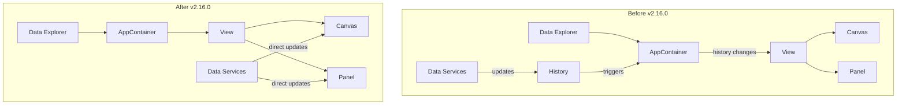

---
tags:
  - opensearch-dashboards
---
# Data Explorer

## Summary

Data Explorer is the container application in OpenSearch Dashboards that hosts the Discover plugin and manages the overall data exploration experience. In v2.16.0, a performance optimization was introduced to allow View components to render directly without going through the Data Explorer's AppContainer, reducing unnecessary re-renders when data services update.

## Details

### What's New in v2.16.0

The main change in this release addresses a performance issue where the entire AppContainer would re-render whenever data services (query, filter, or time range) were updated. This happened because the history object changes triggered re-renders at the top level.

### Technical Changes

**Before (v2.15.0 and earlier):**
- Data Explorer's AppContainer subscribed to history changes
- Query, filter, or time range updates modified the history object
- History changes triggered full AppContainer re-renders
- Child components (Canvas, Panel) re-rendered as a consequence

**After (v2.16.0):**
- View components (Canvas, Panel) render directly based on data updates
- Components subscribe to data service changes independently
- History object changes no longer trigger AppContainer re-renders
- Only affected components re-render when data updates occur

### Architecture

### Code Changes

The changes were made in `src/plugins/data_explorer/public/components/`:

| File | Changes |
|------|---------|
| `app.tsx` | Removed history subscription and URL sync logic; simplified to render View directly |
| `app_container.tsx` | Removed re-render triggers based on history changes |

Key modifications:
- Removed `useLocation` hook from `DataExplorerApp`
- Removed `syncQueryStateWithUrl` call that caused re-renders
- Simplified component to pass params directly to View

## Limitations

- This optimization is specific to the Data Explorer plugin architecture
- Other plugins using similar patterns may need separate optimization

## References

### Pull Requests
| PR | Description | Related Issue |
|----|-------------|---------------|
| [#6167](https://github.com/opensearch-project/OpenSearch-Dashboards/pull/6167) | Allow render from View directly, not from Data Explorer | - |
