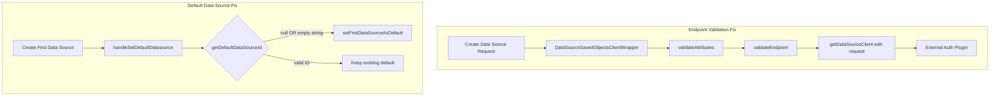

---
tags:
  - opensearch-dashboards
---
# Data Source Client Fixes

## Summary

OpenSearch Dashboards v2.16.0 includes bug fixes for the data source client, addressing issues with endpoint validation during data source creation and default data source assignment when creating new data sources.

## Details

### What's New in v2.16.0

#### Endpoint Validation Fix
Fixed server-side endpoint validation by passing the request object when creating the data source client. While the request parameter is optional for built-in authentication types (NoAuth, BasicAuth, SigV4), external plugins may register custom authentication types that depend on the request context. This fix ensures endpoint validation works correctly for all authentication types.

**Technical Change:**
- Modified `DataSourceSavedObjectsClientWrapper` to pass the request object to `getDataSourceClient` during endpoint validation
- Updated `validateAttributes` and `validateEndpoint` methods to accept and forward the request parameter
- Added error logging for endpoint validation failures

#### Default Data Source Assignment Fix
Fixed an issue where the first created data source was not automatically set as the default data source. The bug occurred because the check for an existing default data source only looked for `null` values, but the UI settings API could return an empty string when a default data source was accidentally removed.

**Technical Change:**
- Changed the condition in `handleSetDefaultDatasource` from `=== null` to a falsy check (`!getDefaultDataSourceId(uiSettings)`)
- This ensures empty strings are also treated as "no default data source set"

### Technical Changes

### Files Changed

| File | Change |
|------|--------|
| `data_source_saved_objects_client_wrapper.ts` | Pass request to endpoint validation |
| `utils.ts` | Fix default data source check condition |

## Limitations

- External authentication plugins must handle cases where the request parameter may be undefined for backward compatibility

## References

### Pull Requests
| PR | Description | Related Issue |
|----|-------------|---------------|
| [#6822](https://github.com/opensearch-project/OpenSearch-Dashboards/pull/6822) | Fix endpoint validation by passing in request when creating datasource client | - |
| [#6908](https://github.com/opensearch-project/OpenSearch-Dashboards/pull/6908) | Fix not setting the default data source when creating data source | [#6835](https://github.com/opensearch-project/OpenSearch-Dashboards/issues/6835) |

### Related Issues
| Issue | Description |
|-------|-------------|
| [#6835](https://github.com/opensearch-project/OpenSearch-Dashboards/issues/6835) | Set default data source unstable issue |
