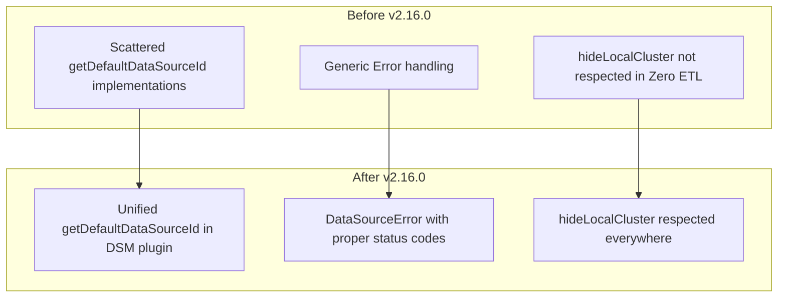

---
tags:
  - opensearch-dashboards
---
# Data Source Management Bug Fixes

## Summary

OpenSearch Dashboards v2.16.0 includes multiple bug fixes for the Data Source Management feature, addressing issues with default data source handling, local cluster configuration, error handling, and UI improvements in the data source selector components.

## Details

### What's New in v2.16.0

This release focuses on stability and usability improvements for the Multiple Data Sources (MDS) feature:

#### Default Data Source API Improvements
- Unified `getDefaultDataSourceId` and `getDefaultDataSourceId$` functions in the Data Source Management plugin
- Exported these functions in the plugin setup for other plugins to consume
- Standardized the default data source UI settings ID across the codebase

#### Error Handling Enhancements
- Replaced generic `Error` with `DataSourceError` in `getDataSourceById` calls
- Improved error handling for 404 (not found) responses when fetching data sources
- Better error messages for data source retrieval failures

#### Local Cluster Configuration Fixes
- Fixed the `data_source.hideLocalCluster` configuration to properly hide local cluster in the Zero ETL data source panel
- Fixed data source picker triggering local cluster calls by default when it shouldn't
- Added local cluster to datasources fetch function in Discover
- Added duplicate detection when fetching external datasources to prevent local cluster appearing twice

#### UI Fixes
- Fixed data source selector position in Dev Tools tab (moved back to left alignment)
- Fixed tables not displaying properly in the DataSet Navigator
- Removed restriction on setting default data source, allowing more flexible configuration

#### Plugin Configuration Changes
- Moved `manageableBy` feature flag from Data Source plugin to Data Source Management plugin
- Removed data sources as a required plugin dependency for query enhancements toggle
- Cleaned up unused config settings

### Technical Changes

### Configuration

| Setting | Description | Default |
|---------|-------------|---------|
| `data_source.hideLocalCluster` | Hide local cluster from data source selectors | `false` |
| `data_source_management.manageableBy` | Control who can manage data sources (`all`, `none`, `dashboard_admin`) | `all` |

## Limitations

- The `manageableBy` configuration was moved to the Data Source Management plugin; existing configurations in the Data Source plugin will need to be migrated

## References

### Pull Requests
| PR | Description | Related Issue |
|----|-------------|---------------|
| [#6843](https://github.com/opensearch-project/OpenSearch-Dashboards/pull/6843) | Unify getDefaultDataSourceId and export | - |
| [#6903](https://github.com/opensearch-project/OpenSearch-Dashboards/pull/6903) | Use DataSourceError to replace Error in getDataSourceById call | [#6738](https://github.com/opensearch-project/OpenSearch-Dashboards/issues/6738) |
| [#7314](https://github.com/opensearch-project/OpenSearch-Dashboards/pull/7314) | Remove unused config setting and data sources as required plugin | - |
| [#7347](https://github.com/opensearch-project/OpenSearch-Dashboards/pull/7347) | Fix data source selector position in Dev Tools tab | [#7349](https://github.com/opensearch-project/OpenSearch-Dashboards/issues/7349) |
| [#7396](https://github.com/opensearch-project/OpenSearch-Dashboards/pull/7396) | Remove restriction on setting default data source | - |
| [#7440](https://github.com/opensearch-project/OpenSearch-Dashboards/pull/7440) | Move manageableBy feature flag to DSM plugin | - |
| [#7497](https://github.com/opensearch-project/OpenSearch-Dashboards/pull/7497) | Fix hideLocalCluster config in Zero ETL panel | - |
| [#7528](https://github.com/opensearch-project/OpenSearch-Dashboards/pull/7528) | Fix data source picker triggering local cluster call by default | - |
| [#7542](https://github.com/opensearch-project/OpenSearch-Dashboards/pull/7542) | Fix tables not displaying in navigator and add local cluster to datasources | - |
