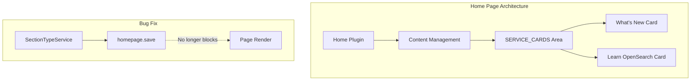

---
tags:
  - opensearch-dashboards
---
# Home Page Enhancements

## Summary

OpenSearch Dashboards v2.16.0 introduces static list cards to the new home page and fixes a critical bug that caused the home page to crash for users without write permissions.

## Details

### What's New in v2.16.0

#### Static List Cards

A new `HomeListCard` component provides configurable static content cards for the home page. Two pre-configured cards are registered:

| Card | Purpose |
|------|---------|
| What's New | Displays latest updates and announcements |
| Learn OpenSearch | Links to quickstart guide, visualization docs, and dashboard creation guides |

The cards are rendered in the `SERVICE_CARDS` content area with configurable order (3 and 4 respectively).

#### Bug Fix: Anonymous User Support

Fixed a critical issue where the new home page crashed for users without index write permissions. The fix removes the error handling that blocked page rendering when the `homepage.save({})` call failed.

### Technical Changes



#### New Component: HomeListCard

```typescript
interface Config {
  title: string;
  list: Array<{
    label: string;
    href: string;
    description: string;
  }>;
  allLink?: string;
}
```

The component renders:
- A title header
- A description list with external links
- Optional "View all" link

## Limitations

- Static list card content is hardcoded and not configurable via settings
- The bug fix is a temporary solution; a more robust permission-aware approach may be needed

## References

### Pull Requests
| PR | Description | Related Issue |
|----|-------------|---------------|
| [#7351](https://github.com/opensearch-project/OpenSearch-Dashboards/pull/7351) | Add home page static list card | - |
| [#7054](https://github.com/opensearch-project/OpenSearch-Dashboards/pull/7054) | Fix crash for users without write permission | [#6320](https://github.com/opensearch-project/OpenSearch-Dashboards/issues/6320) |
