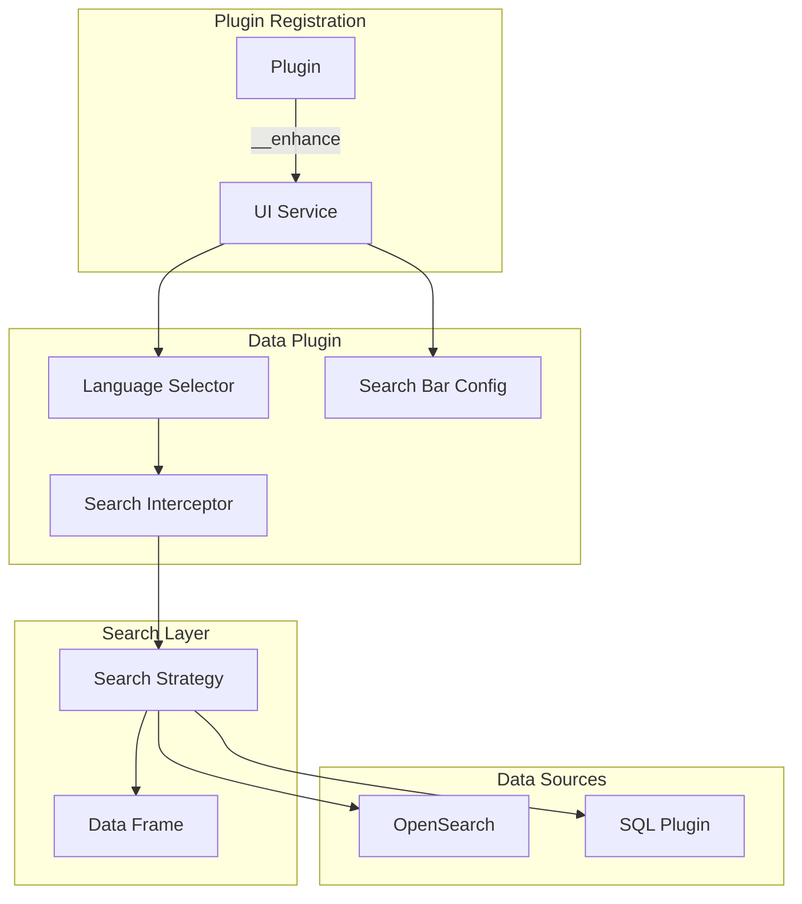

---
tags:
  - opensearch-dashboards
---
# Language Selector

## Summary

OpenSearch Dashboards v2.16.0 introduces the Language Selector feature, enabling plugins to register custom query languages and dynamically switch the search interceptor at runtime. This foundational change allows the Data plugin to support multiple query languages (SQL, PPL) alongside DQL and Lucene, with configurable UI components per language.

## Details

### What's New in v2.16.0

The Language Selector feature introduces an extensible architecture for multiple query language support:

1. **UI Service Enhancement**: Plugins can register query language enhancements that modify the search bar behavior
2. **Dynamic Search Interceptor**: The search service can switch interceptors at runtime based on selected language
3. **Data Frame Support**: New data structure for handling query results from non-DSL query languages
4. **Configuration Flag**: Enable via `data.enhancements.enabled: true` in `opensearch_dashboards.yml`

### Architecture



### Query Enhancement Interface

Plugins register language support using the `QueryEnhancement` interface:

```typescript
interface QueryEnhancement {
  language: string;
  search: SearchInterceptor;
  searchBar?: {
    showQueryInput?: boolean;
    showFilterBar?: boolean;
    showDatePicker?: boolean;
    showAutoRefreshOnly?: boolean;
    queryStringInput?: {
      initialValue?: string;  // '<data_source>' placeholder supported
    };
    dateRange?: {
      initialFrom?: string;
      initialTo?: string;
    };
  };
  fields?: {
    filterable?: boolean;
    visualizable?: boolean;
  };
  showDocLinks?: boolean;
}
```

### Registration Example

```typescript
data.__enhance({
  ui: {
    query: {
      language: 'SQL',
      search: sqlSearchInterceptor,
      searchBar: {
        showDatePicker: false,
        showFilterBar: false,
        queryStringInput: {
          initialValue: 'SELECT * FROM <data_source>'
        },
      },
    },
  },
});
```

### Data Frame Structure

New `IDataFrame` interface for standardized result handling:

| Field | Type | Description |
|-------|------|-------------|
| `type` | `DATA_FRAME_TYPES` | Frame type (default or polling) |
| `name` | `string` | Data source name |
| `schema` | `IFieldType[]` | Available fields from data source |
| `fields` | `IFieldType[]` | Fields in result set |
| `size` | `number` | Number of rows |
| `meta` | `Record<string, any>` | Aggregation config and metadata |

### Technical Changes

- Added `data.enhancements.enabled` configuration option
- New `@opensearch/datemath` package dependency for date handling
- Extended `opensearch-datemath` with `isDateTime()` function
- Added `DataSourceService` and `DataSourceFactory` for data source management
- New UI settings: `query:dataSourceReadOnly`, `dataframe:hydrationStrategy`
- Search request extended with `language` property
- Build query returns `unsupported` type for non-native languages

## Limitations

- Feature is experimental and disabled by default
- Requires `data.enhancements.enabled: true` to activate
- Time range handling may have issues when switching between languages with different time formats
- Index patterns created with unique IDs require existing pattern for visualization compatibility

## References

### Pull Requests
| PR | Description | Related Issue |
|----|-------------|---------------|
| [#6613](https://github.com/opensearch-project/OpenSearch-Dashboards/pull/6613) | Support language selector from the data plugin | [#6639](https://github.com/opensearch-project/OpenSearch-Dashboards/issues/6639), [#5504](https://github.com/opensearch-project/OpenSearch-Dashboards/issues/5504) |

### Related Issues
- [#6639](https://github.com/opensearch-project/OpenSearch-Dashboards/issues/6639): Multiple Query Languages Support Proposal
- [#5504](https://github.com/opensearch-project/OpenSearch-Dashboards/issues/5504): Multiple query language support tracking
