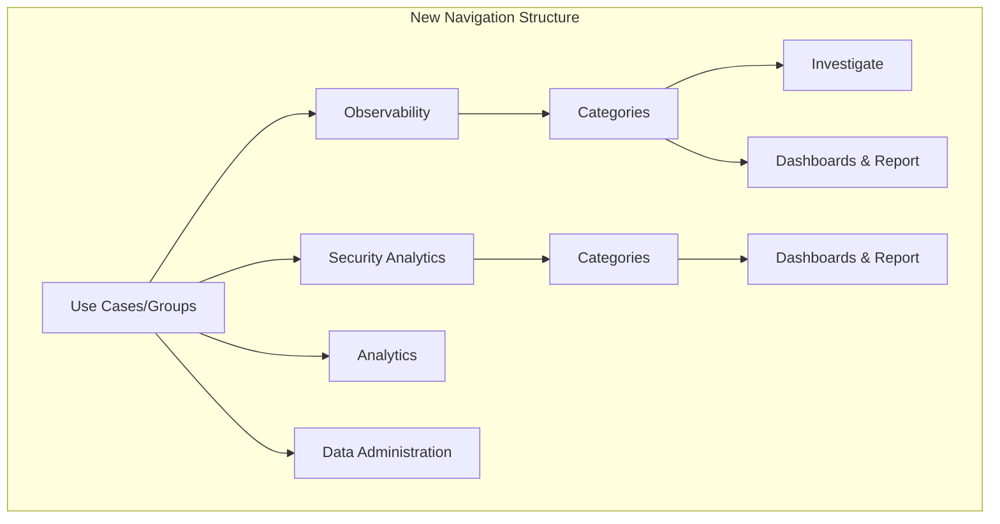

---
tags:
  - opensearch-dashboards
---
# Navigation & NavGroups

## Summary

OpenSearch Dashboards v2.16.0 introduces NavGroups, a new navigation architecture that groups related applications and categories into higher-level use cases. This addresses the growing complexity of the left navigation menu as the number of plugins increases. All major dashboard plugins have been updated to register their applications to appropriate NavGroups.

## Details

### What's New in v2.16.0

The NavGroups feature introduces a hierarchical navigation structure:



### Key Changes

1. **Chrome Service Extension**: New `navGroup.addNavLinksToGroup()` API allows plugins to register applications to multiple groups with different categories
2. **Decoupled Applications and Categories**: Applications can now belong to multiple categories under different groups
3. **Feature Flag Control**: Navigation changes are controlled by a feature flag, maintaining backward compatibility
4. **Plugin Registration**: All major plugins updated to register with appropriate NavGroups

### Plugin Registration Summary

| Plugin | Group | Category |
|--------|-------|----------|
| Notebooks | Observability, Security Analytics, Analytics | Dashboards and Report |
| Integrations | Observability | Dashboards and Report |
| Metrics | Observability | Investigate |
| Applications | Observability | Dashboards and Report |
| Traces | Observability | Investigate |
| Alerting | Observability, Security Analytics | Detect |
| Anomaly Detection | Observability | Detect |
| Index Management | Data Administration | Data Management |
| Security | Data Administration | Security |
| ML Commons | Analytics | Machine Learning |
| Notifications | Observability, Security Analytics | Notifications |

### Technical Implementation

Plugins register to NavGroups using the chrome service API:

```typescript
// Register application (unchanged)
coreSetup.application.register({
    id: 'myApp',
    title: 'My Application',
    category: DEFAULT_APP_CATEGORIES.opensearchDashboards,
});

// Register to NavGroup (new in v2.16.0)
coreSetup.chrome.navGroup.addNavLinksToGroup(
    DEFAULT_USE_CASES.observability, 
    [{
        id: 'myApp',
        category: DEFAULT_APP_CATEGORIES.investigate
    }]
);
```

## Limitations

- Feature is controlled by a feature flag and may not be enabled by default
- Deep links using old URL patterns (`app/${applicationId}`) continue to work for backward compatibility
- Some plugins may appear in multiple navigation groups, which could cause initial user confusion

## References

### Pull Requests

| PR | Repository | Description |
|----|------------|-------------|
| [#1926](https://github.com/opensearch-project/dashboards-observability/pull/1926) | dashboards-observability | Register all plugins to NavGroups |
| [#1950](https://github.com/opensearch-project/dashboards-observability/pull/1950) | dashboards-observability | Remove integrations from new NavGroups |
| [#1007](https://github.com/opensearch-project/alerting-dashboards-plugin/pull/1007) | alerting-dashboards-plugin | Side nav changes for alerting |
| [#810](https://github.com/opensearch-project/anomaly-detection-dashboards-plugin/pull/810) | anomaly-detection-dashboards-plugin | AD side navigation redesign |
| [#635](https://github.com/opensearch-project/dashboards-maps/pull/635) | dashboards-maps | Add support new navigation for maps |
| [#406](https://github.com/opensearch-project/dashboards-maps/pull/406) | dashboards-maps | Register all plugins to NavGroups |
| [#343](https://github.com/opensearch-project/ml-commons-dashboards/pull/343) | ml-commons-dashboards | Update category to Machine learning |
| [#337](https://github.com/opensearch-project/ml-commons-dashboards/pull/337) | ml-commons-dashboards | Register admin UI as AI models |
| [#222](https://github.com/opensearch-project/dashboards-notifications/pull/222) | dashboards-notifications | Side navigation changes for notifications |
| [#369](https://github.com/opensearch-project/dashboards-reporting/pull/369) | dashboards-reporting | Register all plugins to NavGroups |
| [#1085](https://github.com/opensearch-project/index-management-dashboards-plugin/pull/1085) | index-management-dashboards-plugin | New Navigation UX change |
| [#2022](https://github.com/opensearch-project/security-dashboards-plugin/pull/2022) | security-dashboards-plugin | Conform to Navigation changes from OSD core |
| [#1084](https://github.com/opensearch-project/security-dashboards-plugin/pull/1084) | security-dashboards-plugin | Side nav changes for SA |

### Related Issues

| Issue | Repository | Description |
|-------|------------|-------------|
| [#7029](https://github.com/opensearch-project/OpenSearch-Dashboards/issues/7029) | OpenSearch-Dashboards | RFC: Introduce `group` in chrome service |
