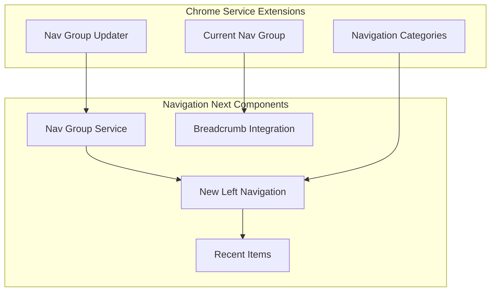

---
tags:
  - opensearch-dashboards
---
# Navigation Next

## Summary

OpenSearch Dashboards v2.16.0 introduces the "Navigation Next" feature, a major overhaul of the left navigation system. This release adds a new collapsible left navigation with navigation groups, recent items tracking, breadcrumb integration, and workspace-aware navigation. The feature is enabled via the "Use New Home Page" advanced setting.

## Details

### What's New in v2.16.0

### Key Features

| Feature | Description |
|---------|-------------|
| New Left Navigation | Collapsible sidebar with navigation groups |
| Nav Group Service | Chrome service extension for managing navigation groups |
| Nav Group Updater | Plugin API to dynamically update navigation groups |
| Current Nav Group | Tracks active navigation group in session |
| Breadcrumb Integration | Prepends current nav group to breadcrumbs |
| Recent Items | Homepage section showing recently accessed items |
| Recent Items Popup | Top navigation popup for quick access to recent items |
| New Categories | Added new navigation categories for organization |

### Technical Changes

#### Chrome Service Extensions

The Chrome service was extended with navigation group management:

- `registerNavGroupUpdater`: Allows plugins to register updaters that modify navigation groups
- `currentNavGroup$`: Observable for tracking the current navigation group
- Navigation group state persisted in session storage

#### New Left Navigation Component

- Registers core apps within navigation groups
- Supports data source enabled/disabled modes
- Configurable via "Use New Home Page" advanced setting

#### Recent Items

- Recent works section added to new homepage
- Recent items popup accessible from top navigation clock icon
- Supports workspace-enabled and workspace-disabled modes
- Empty state handling for new users

#### Index Pattern Redirect Fix

When navigation groups are enabled, users are redirected to the correct index pattern application instead of the legacy management page.

### Configuration

| Setting | Description | Default |
|---------|-------------|---------|
| `home:useNewHomePage` | Enable new home page with navigation-next features | `false` |

### Enabling Navigation Next

1. Navigate to **Management > Advanced Settings**
2. Enable "Use New Home Page" setting
3. The new left navigation and homepage features become active

## Limitations

- Feature is opt-in via advanced settings (not enabled by default)
- Navigation state stored in session storage (cleared on browser close)
- Some plugins may require updates to fully integrate with navigation groups

## References

### Pull Requests
| PR | Description | Related Issue |
|----|-------------|---------------|
| [#7117](https://github.com/opensearch-project/OpenSearch-Dashboards/pull/7117) | Add register nav group updater to chrome service | [#7147](https://github.com/opensearch-project/OpenSearch-Dashboards/issues/7147) |
| [#7166](https://github.com/opensearch-project/OpenSearch-Dashboards/pull/7166) | Add current nav group into chrome service, prepend to breadcrumbs | [#7131](https://github.com/opensearch-project/OpenSearch-Dashboards/issues/7131), [#7132](https://github.com/opensearch-project/OpenSearch-Dashboards/issues/7132) |
| [#7230](https://github.com/opensearch-project/OpenSearch-Dashboards/pull/7230) | Add new left navigation | [#7148](https://github.com/opensearch-project/OpenSearch-Dashboards/issues/7148), [#7094](https://github.com/opensearch-project/OpenSearch-Dashboards/issues/7094) |
| [#7237](https://github.com/opensearch-project/OpenSearch-Dashboards/pull/7237) | Add recent works in new homepage | - |
| [#7257](https://github.com/opensearch-project/OpenSearch-Dashboards/pull/7257) | Add recent items popup in top navigation | - |
| [#7275](https://github.com/opensearch-project/OpenSearch-Dashboards/pull/7275) | Add new navigation category | - |
| [#7305](https://github.com/opensearch-project/OpenSearch-Dashboards/pull/7305) | Fix redirect to standard index pattern app when nav group enabled | - |
