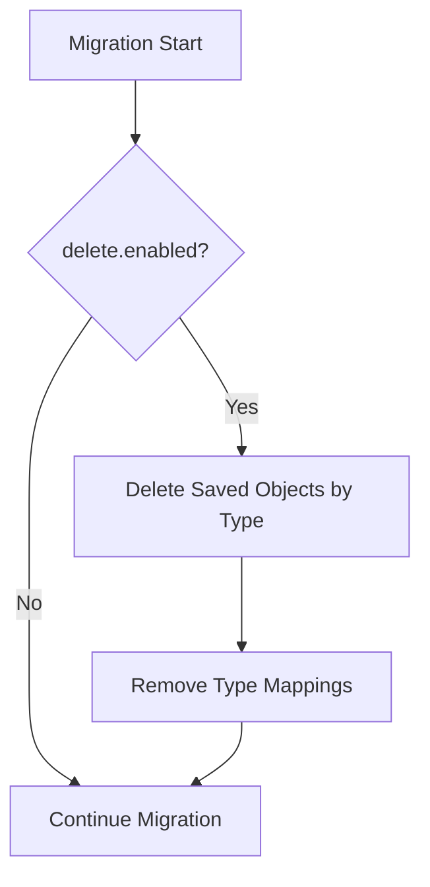

---
tags:
  - opensearch-dashboards
---
# Saved Objects Migration

## Summary

OpenSearch Dashboards v2.16.0 introduces a new configuration option to delete saved objects by type during migration. This feature helps resolve compatibility issues when migrating from legacy systems (like Kibana OSS) where incompatible saved object types may prevent successful migration.

## Details

### What's New in v2.16.0

Two new configuration settings enable administrators to specify saved object types that should be deleted during the migration process:

| Setting | Type | Default | Description |
|---------|------|---------|-------------|
| `migrations.delete.enabled` | boolean | `false` | Enable deletion of saved objects by type during migration |
| `migrations.delete.types` | string[] | `[]` | List of saved object types to delete |

### Technical Changes

The implementation adds a `deleteSavedObjectsByType` function to the migration process that:

1. Checks if `migrations.delete.enabled` is `true`
2. Retrieves the list of types from `migrations.delete.types`
3. Executes a `deleteByQuery` operation on the source index before migration
4. Removes corresponding type mappings from the target index



### Configuration Example

```yaml
# opensearch_dashboards.yml
migrations:
  delete:
    enabled: true
    types:
      - ui-metric
      - telemetry
```

### Use Case

This feature addresses a common migration issue where:

1. Users migrate from Kibana OSS to OpenSearch Dashboards
2. Legacy saved objects (e.g., telemetry, ui-metric) exist in the `.kibana` index
3. These types are not defined by any enabled plugin in OpenSearch Dashboards
4. Migration fails because OpenSearch Dashboards cannot process unknown types

With this feature, administrators can configure OpenSearch Dashboards to automatically delete these incompatible types during migration.

## Limitations

- **Data Loss Risk**: Deleted saved objects cannot be recovered. Use with caution and ensure you have backups.
- **Validation**: If `migrations.delete.enabled` is `true`, `migrations.delete.types` must not be empty (validation enforced).
- **One-time Operation**: Deletion occurs during migration; it does not affect saved objects created after migration.

## References

### Pull Requests
| PR | Description | Related Issue |
|----|-------------|---------------|
| [#6443](https://github.com/opensearch-project/OpenSearch-Dashboards/pull/6443) | Enable deletion of saved objects by type if configured | [#1040](https://github.com/opensearch-project/OpenSearch-Dashboards/issues/1040) |

### Related Issues
- [#1040](https://github.com/opensearch-project/OpenSearch-Dashboards/issues/1040) - Telemetry docs migration issue
