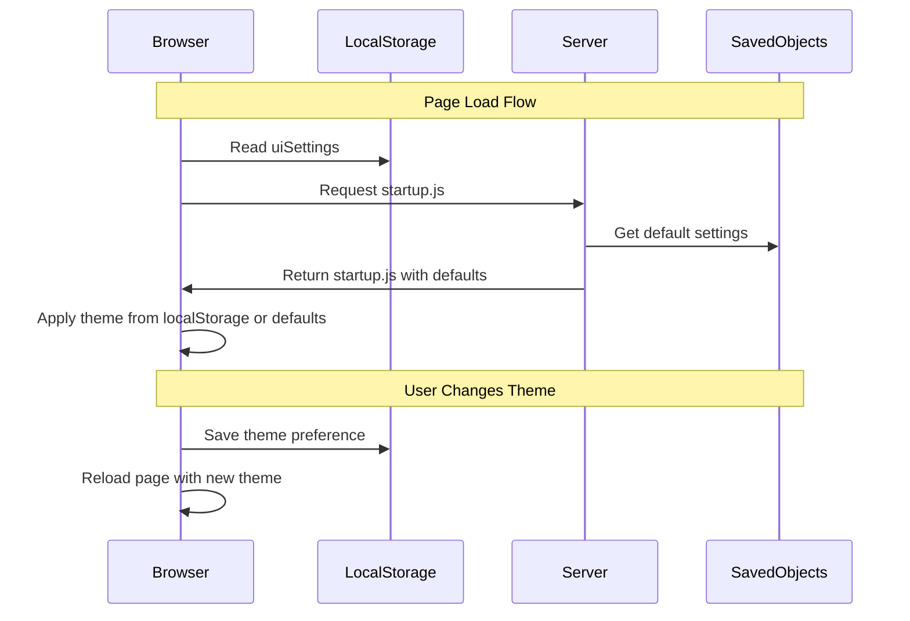

---
tags:
  - opensearch-dashboards
---
# Theme & Dark Mode Settings

## Summary

OpenSearch Dashboards v2.16.0 introduces user-specific theme and dark mode settings, allowing individual users to customize their appearance preferences independently of cluster-wide settings. Theme settings are now stored in browser local storage rather than as cluster-wide saved objects, enabling different users on the same instance to use different themes.

## Details

### What's New in v2.16.0

This release fundamentally changes how theme settings work in OpenSearch Dashboards:

1. **User-Specific Settings**: Theme version and dark mode are now stored per-device in browser local storage
2. **Appearance Menu**: New global navigation control for quick theme switching
3. **Browser Settings Support**: Option to automatically match browser/OS dark mode preferences
4. **Admin Opt-Out**: Administrators can disable user control via Advanced Settings

### Architecture

### Key Components

| Component | Description |
|-----------|-------------|
| `startup.js` | New script that applies theme settings before page render |
| `HeaderUserThemeMenu` | New appearance menu in global navigation |
| `ui_settings_client.ts` | Updated to read/write browser-stored settings |
| `theme:enableUserControl` | New setting to enable/disable user control |
| `preferBrowserSetting` | New UI setting property for browser-stored values |

### Configuration

| Setting | Description | Default |
|---------|-------------|---------|
| `theme:enableUserControl` | Enable user control of theme settings | `true` |
| `theme:darkMode` | Dark mode preference (now per-user) | `false` |
| `theme:version` | Theme version (v7 or Next preview) | `v7` |

### Usage

When `theme:enableUserControl` is enabled:
- Users see an "Appearance" button in the top navigation
- Theme changes are stored in browser local storage
- Users can choose "Use browser settings" to auto-match OS preferences
- Advanced Settings shows theme options as disabled with explanatory message

When disabled:
- Theme settings work as before (cluster-wide)
- No appearance menu in navigation
- Administrators control theme via Advanced Settings

## Limitations

- Server-side components cannot know the user's theme preference (stored client-side)
- Theme changes require page reload to take effect
- Browser settings option only checks preference at page load, not dynamically

## References

### Pull Requests
| PR | Description | Related Issue |
|----|-------------|---------------|
| [#5652](https://github.com/opensearch-project/OpenSearch-Dashboards/pull/5652) | Make theme settings user-specific and user-configurable | [#4462](https://github.com/opensearch-project/OpenSearch-Dashboards/issues/4462) |

### Documentation
- [OpenSearch Dashboards Quickstart - Appearance Theme](https://docs.opensearch.org/2.16/dashboards/quickstart/#customizing-the-appearance-theme)
- [Advanced Settings](https://docs.opensearch.org/2.16/dashboards/management/advanced-settings/)
