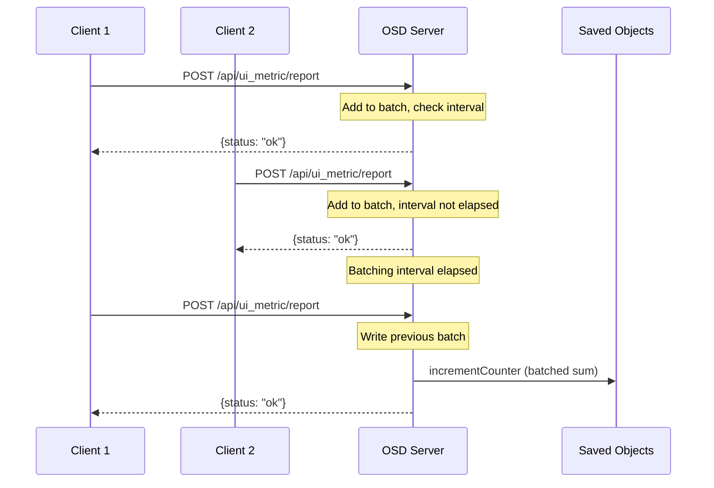

---
tags:
  - opensearch-dashboards
---
# UI Metric Collector Server-Side Batching

## Summary

OpenSearch Dashboards v2.16.0 introduces server-side batching for the UI Metric Collector, reducing the number of write operations to OpenSearch when multiple concurrent users report UI metrics. This optimization addresses performance concerns when many users interact with the dashboard simultaneously.

## Details

### What's New in v2.16.0

The UI Metric Collector now batches incoming metric reports on the server side before persisting them to saved objects. Instead of writing each metric report immediately, the server accumulates reports over a configurable interval and writes them in a single batch operation.

### Technical Changes

#### Batching Mechanism

#### Configuration

| Setting | Description | Default |
|---------|-------------|---------|
| `usageCollection.uiMetric.enabled` | Enable UI Metric Collector | `false` |
| `usageCollection.uiMetric.debug` | Enable debug mode | `false` (dev mode) |
| `usageCollection.uiMetric.batchingIntervalInS` | Batching interval in seconds | `60` |

#### Key Implementation Details

- **Batch Report Structure**: Reports are combined using a `combineReports()` function that merges:
  - User agent information
  - UI stats metrics (summing the `stats.sum` values)
  - Application usage (summing `numberOfClicks` and `minutesOnScreen`)

- **Increment Counter Enhancement**: The `SavedObjectsRepository.incrementCounter()` method now accepts an optional `incrementValue` parameter (default: 1), allowing batch writes with accumulated sums.

- **Report Endpoint**: `/api/ui_metric/report` now buffers reports and only writes to saved objects when the batching interval has elapsed.

### Files Changed

| File | Change |
|------|--------|
| `src/plugins/usage_collection/server/routes/report_metrics.ts` | Added batching logic and `combineReports()` function |
| `src/plugins/usage_collection/server/config.ts` | Added `batchingIntervalInS` configuration |
| `src/plugins/usage_collection/common/constants.ts` | Added `DEFAULT_BATCHING_INTERVAL_FOR_UI_METRIC_IN_S` constant |
| `src/core/server/saved_objects/service/lib/repository.ts` | Added `incrementValue` parameter to `incrementCounter()` |
| `src/plugins/usage_collection/server/report/store_report.ts` | Updated to use `stats.sum` for increment value |
| `src/plugins/usage_collection/server/types.ts` | Added `BatchReport` interface |

## Limitations

- Batching is performed in-memory on the server; if the server restarts during a batching interval, uncommitted metrics may be lost
- The batching interval applies globally to all metric reports, not per-metric type
- Metrics are only persisted when a new report arrives after the interval has elapsed (no background timer)

## References

### Pull Requests

| PR | Description | Related Issue |
|----|-------------|---------------|
| [#6721](https://github.com/opensearch-project/OpenSearch-Dashboards/pull/6721) | Add Server Side Batching for UI Metric Collectors | [#6375](https://github.com/opensearch-project/OpenSearch-Dashboards/issues/6375) |
| [#6203](https://github.com/opensearch-project/OpenSearch-Dashboards/pull/6203) | Enable UI Metric Collector (v2.14.0) | - |

### Related Issues

- [#6375](https://github.com/opensearch-project/OpenSearch-Dashboards/issues/6375) - Server Side batching for saving UI metrics
