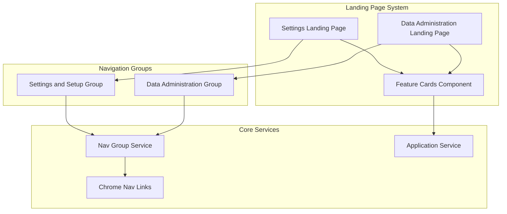

---
tags:
  - opensearch-dashboards
---
# Use Cases & Landing Pages

## Summary

OpenSearch Dashboards v2.16.0 introduces the "All use case" navigation group and landing pages for system navigation groups. The "All use case" provides a unified view containing all features across different use cases, while landing pages offer organized entry points for "Settings and Setup" and "Data Administration" navigation groups.

## Details

### What's New in v2.16.0

#### All Use Case Navigation Group
A new "All use case" navigation group aggregates features from all other use cases into a single unified view. Plugins can declare visibility in this group using the `showInAllNavGroup` property.

| Property | Description |
|----------|-------------|
| `ALL_USE_CASE_ID` | Constant identifier: `'all'` |
| `showInAllNavGroup` | Boolean flag for plugins to declare visibility in All use case |
| Order | 3000 (after Settings and Setup) |
| Type | `NavGroupType.SYSTEM` |

#### Landing Pages for System Navigation Groups
Two new landing pages provide organized entry points for system navigation groups:

| Landing Page | App ID | Description |
|--------------|--------|-------------|
| Settings and Setup | `settings_landing` | Landing page for settings and configuration features |
| Data Administration | `data_administration_landing` | Landing page for data management features |

#### Landing Page Architecture



#### Feature Cards Component
A new `FeatureCards` component renders navigation links as clickable cards organized in a grid layout:

- Displays 4 cards per row
- Groups cards by category with section headers
- Supports "Get Started" cards section
- Shows link title and description
- Navigates to app on card click

### Technical Changes

| Change | Description |
|--------|-------------|
| `ChromeRegistrationNavLink.showInAllNavGroup` | New property for plugins to declare visibility in All use case |
| `ChromeNavLink.description` | New property for nav link descriptions (displayed on landing pages) |
| `ALL_USE_CASE_ID` constant | Exported from `core/utils` for plugin use |
| `fulfillRegistrationLinksToChromeNavLinks` | Utility function exported from core for converting registration links |
| `FeatureCards` component | New React component for rendering landing page cards |
| `renderApp` function | Landing page application renderer in management plugin |

### Plugin Integration

Plugins can declare visibility in the All use case:

```typescript
core.chrome.navGroup.addNavLinksToGroup(DEFAULT_NAV_GROUPS.observability, [
  {
    id: 'myPlugin',
    title: 'My Plugin',
    showInAllNavGroup: true,  // Show in All use case
    order: 100
  }
]);
```

### Navigation Group Order Updates

| Navigation Group | Old Order | New Order |
|------------------|-----------|-----------|
| Data Administration | 1000 | 1000 |
| Settings and Setup | 2000 | 2000 |
| All | - | 3000 (new) |
| Observability | 3000 | 4000 |
| Security Analytics | 4000 | 5000 |
| Analytics | 5000 | 6000 |
| Search | 6000 | 7000 |

## Limitations

- Landing pages are only visible when the new navigation group system is enabled (`navGroupEnabled`)
- The All use case requires plugins to explicitly opt-in via `showInAllNavGroup`
- Landing pages filter out hidden nav links and the landing page itself from display

## References

### Pull Requests
| PR | Description | Related Issue |
|----|-------------|---------------|
| [#7235](https://github.com/opensearch-project/OpenSearch-Dashboards/pull/7235) | Add all use case | - |
| [#7282](https://github.com/opensearch-project/OpenSearch-Dashboards/pull/7282) | Enable landing page for settings and data administration | [#7283](https://github.com/opensearch-project/OpenSearch-Dashboards/issues/7283) |
