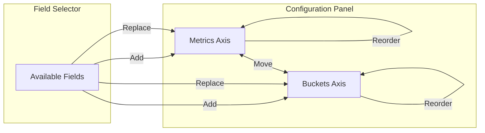

---
tags:
  - opensearch-dashboards
---
# VisBuilder Enhancements

## Summary

OpenSearch Dashboards v2.16.0 introduces significant enhancements to VisBuilder, including improved drag-and-drop functionality across axes and the capability to generate dynamic Vega specifications. These changes improve the user experience for creating visualizations and lay the groundwork for more advanced visualization customization.

## Details

### What's New in v2.16.0

#### Enhanced Drag & Drop Functionality

The drag-and-drop system has been completely overhauled using OUI's Draggable and Droppable components:

- **Cross-axis field movement**: Users can now drag fields from one axis to another, eliminating the need to remove and re-add fields
- **Field replacement**: Drag a new field from the field selector and drop it on an existing field to replace it
- **Reordering within axis**: Fields can be reordered within the same axis by dragging

#### Dynamic Vega Specification Generation

A new experimental feature allows VisBuilder to generate Vega and Vega-Lite specifications dynamically:

| Component | Description |
|-----------|-------------|
| `buildVegaSpecViaVega` | Generates full Vega specifications for complex visualizations |
| `buildVegaSpecViaVegaLite` | Generates Vega-Lite specifications for simpler charts |
| `flattenDataHandler` | Transforms aggregation data for Vega-compatible format |
| `VegaSpec` / `VegaLiteSpec` | TypeScript interfaces for type-safe spec building |

The Vega rendering can be enabled via the advanced setting `visbuilder:enableVega`.

### Technical Changes

#### New Drag & Drop Architecture

| Module | Purpose |
|--------|---------|
| `add_field_to_configuration.ts` | Handles adding new fields from selector to axis |
| `move_field_between_schemas.ts` | Handles moving fields between different axes |
| `reorder_fields_within_schema.ts` | Handles reordering within the same axis |
| `replace_field_in_configuration.ts` | Handles replacing existing fields |
| `DraggableAccordion` | Custom accordion component supporting drag operations |

#### Vega Spec Builder Components

| Component | Purpose |
|-----------|---------|
| `vega_lite_spec_builder.ts` | Builds Vega-Lite specifications |
| `vega_spec_builder.ts` | Builds full Vega specifications |
| `components/axes.ts` | Axis configuration builder |
| `components/encoding.ts` | Encoding configuration for Vega-Lite |
| `components/mark.ts` | Mark type configuration |
| `components/legend.ts` | Legend configuration |
| `components/tooltip.ts` | Tooltip configuration |

## Limitations

- Vega rendering is experimental and controlled by an advanced setting
- The Vega integration currently supports line, area, and bar chart types
- Some complex aggregation configurations may not translate perfectly to Vega specifications

## References

### Pull Requests
| PR | Description | Related Issue |
|----|-------------|---------------|
| [#7107](https://github.com/opensearch-project/OpenSearch-Dashboards/pull/7107) | Enhance Drag & Drop functionality in Vis Builder | [#7015](https://github.com/opensearch-project/OpenSearch-Dashboards/issues/7015) |
| [#7288](https://github.com/opensearch-project/OpenSearch-Dashboards/pull/7288) | Add capability to generate dynamic Vega | [#7067](https://github.com/opensearch-project/OpenSearch-Dashboards/issues/7067) |
