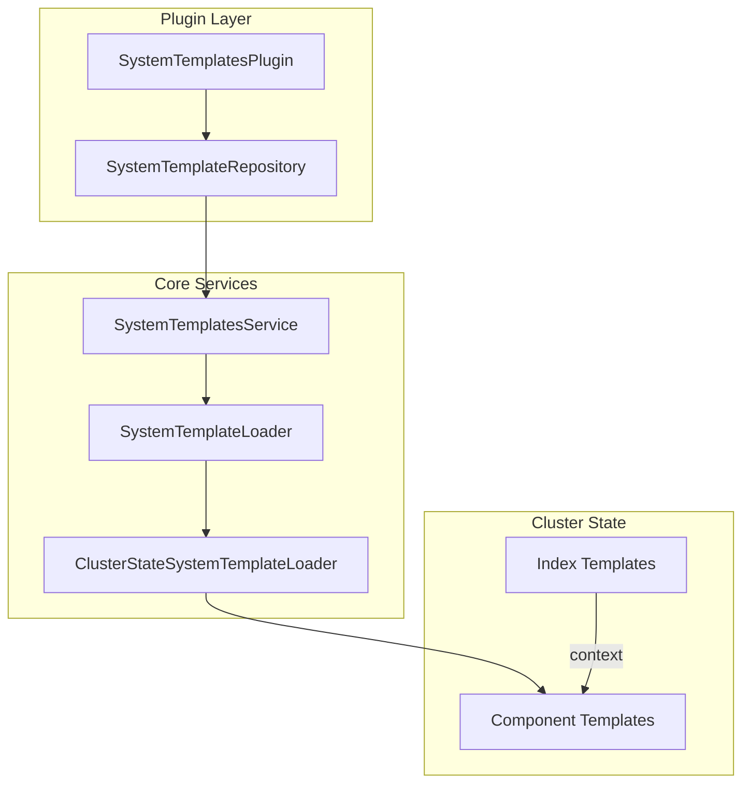

---
tags:
  - opensearch
---
# Application Configuration Templates

## Summary

OpenSearch 2.16.0 introduces Application-Based Configuration (ABC) templates as an experimental feature. ABC templates are predefined system templates that simplify index configuration by providing optimized settings and mappings for specific use cases such as logs, metrics, and events. This feature reduces the complexity of manual configuration and enables automatic application of best practices.

## Details

### What's New in v2.16.0

ABC templates provide a plugin-based SPI (Service Provider Interface) for loading application-based configuration templates into OpenSearch. The feature introduces:

1. **SystemTemplatesPlugin Interface**: A new plugin interface that allows loading templates from external repositories
2. **Context Field for Index Templates**: A new `context` field in composable index templates that references ABC templates
3. **System Template Repository**: Infrastructure for storing and managing versioned system templates
4. **Automatic Template Loading**: Templates are loaded when a node becomes cluster manager

### Architecture



### Components

| Component | Description |
|-----------|-------------|
| `SystemTemplatesPlugin` | Plugin interface for providing template repositories |
| `SystemTemplateRepository` | Repository interface for listing and fetching templates |
| `SystemTemplatesService` | Service that orchestrates template loading on cluster manager election |
| `SystemTemplateLoader` | Interface for loading templates into the cluster |
| `ClusterStateSystemTemplateLoader` | Default loader that stores templates as component templates |
| `SystemTemplateMetadata` | Metadata about a template (name, version, type) |
| `Context` | New field in `ComposableIndexTemplate` for referencing ABC templates |

### Configuration

| Setting | Description | Default |
|---------|-------------|---------|
| `cluster.application_templates.enabled` | Enable/disable ABC templates | `false` |
| `opensearch.experimental.feature.application_templates.enabled` | Feature flag to enable the experimental feature | `false` |

### Usage Example

```json
PUT _index_template/my-logs
{
  "index_patterns": ["my-logs-*"],
  "template": {
    "settings": {
      "refresh_interval": "60s"
    }
  },
  "context": {
    "name": "logs",
    "version": "_latest",
    "params": {}
  }
}
```

### Technical Changes

- New package `org.opensearch.cluster.applicationtemplates` containing all ABC template classes
- `ComposableIndexTemplate` extended with optional `Context` field
- `Metadata` class extended with `systemTemplatesLookup` for efficient template resolution
- `MetadataIndexTemplateService` updated with validation logic for context-based templates
- System templates are stored as component templates with special metadata marker (`_type: @abc_template`)

### Precedence Order

When resolving settings for an index:
1. Component templates (lowest priority)
2. Index template's declared settings
3. Context-referenced ABC template settings (highest priority)

## Limitations

- Feature is experimental and requires enabling the feature flag
- System templates can only be created/updated/deleted through the repository mechanism, not via APIs
- Once a context is configured for an index, it cannot be removed
- Settings defined in the ABC template cannot be overridden during index creation

## References

### Pull Requests
| PR | Description | Related Issue |
|----|-------------|---------------|
| [#14659](https://github.com/opensearch-project/OpenSearch/pull/14659) | Add Plugin interface for loading application based configuration templates | [#14649](https://github.com/opensearch-project/OpenSearch/issues/14649) |
| [#14811](https://github.com/opensearch-project/OpenSearch/pull/14811) | Add logic to create index templates (v2) using context field | [#12683](https://github.com/opensearch-project/OpenSearch/issues/12683) |

### Documentation
- [Index Context Documentation](https://opensearch.org/docs/latest/im-plugin/index-context/)
- [ABC Templates Blog Post](https://opensearch.org/blog/opensearch-simplified-the-power-of-application-based-templates/)

### Related Issues
- [RFC: Application Based Configuration Templates](https://github.com/opensearch-project/OpenSearch/issues/12683)
- [ABC Templates Implementation Details](https://github.com/opensearch-project/OpenSearch/issues/14649)
