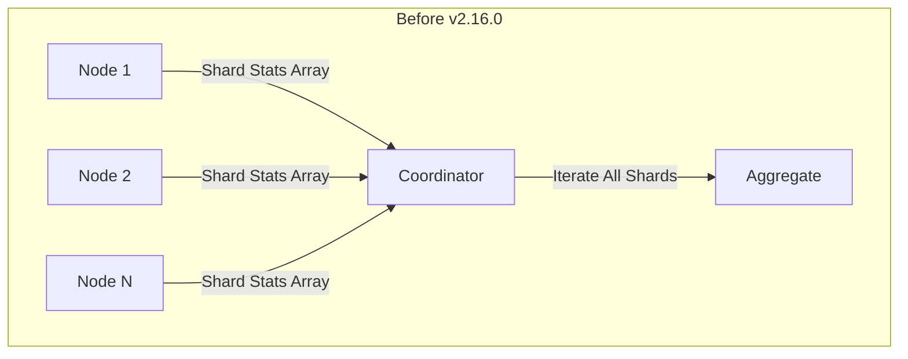
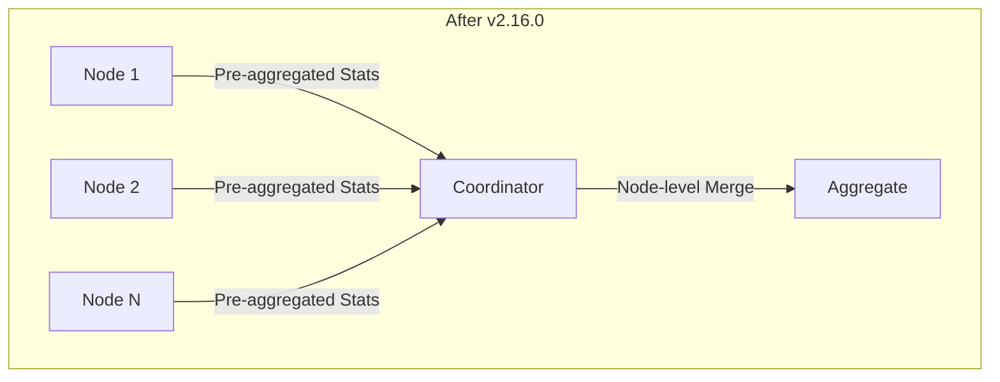

---
tags:
  - opensearch
---
# Cluster Stats Optimization

## Summary

OpenSearch v2.16.0 introduces a significant performance optimization for the Cluster Stats API (`_cluster/stats`). The optimization pre-computes shard-level statistics at each data node before sending responses to the coordinator node, reducing the computational overhead on the coordinator and improving response times by up to 74% in large clusters.

## Details

### What's New in v2.16.0

The previous implementation of cluster stats had a performance bottleneck in large clusters with many shards:

1. Each node sent individual shard-level statistics to the coordinator
2. The coordinator node accumulated all shard stats from all nodes
3. Creating hash-maps from StreamInput and iterating through them was computationally expensive

The new optimization introduces node-level pre-aggregation:

### Technical Changes

| Component | Change |
|-----------|--------|
| `ClusterStatsRequest` | Added `useAggregatedNodeLevelResponses` flag |
| `ClusterStatsNodeResponse` | Added `AggregatedNodeLevelStats` inner class for pre-computed stats |
| `ClusterStatsIndices` | Updated to handle both legacy shard-level and new node-level aggregated responses |
| `TransportClusterStatsAction` | Modified to pass aggregation flag to node responses |
| `RestClusterStatsAction` | Enabled aggregated responses by default for REST API calls |

### New Classes

| Class | Description |
|-------|-------------|
| `AggregatedNodeLevelStats` | Contains pre-computed `CommonStats` and per-index `AggregatedIndexStats` |
| `AggregatedIndexStats` | Holds aggregated shard counts (total, primaries) per index |

### Performance Improvement

Tested on a 20,000 shard (empty) cluster with 500 attempts and parallelization of 5:

| Metric | Before Optimization | After Optimization | Improvement |
|--------|--------------------|--------------------|-------------|
| Average | 0.77s | 0.20s | 74% faster |
| P90 | 1.04s | 0.33s | 68% faster |
| Max | 1.51s | 0.63s | 58% faster |
| Min | 0.27s | 0.09s | 67% faster |

### Backward Compatibility

The optimization is transparent to API consumers - the response format remains unchanged. The implementation includes version checks to maintain compatibility during rolling upgrades between v2.x and v3.0.0.

## Limitations

- The optimization is enabled by default only for REST API calls
- Internal transport calls can opt-in via the `useAggregatedNodeLevelResponses` flag
- During mixed-version clusters, nodes may fall back to legacy behavior

## References

### Pull Requests
| PR | Description | Related Issue |
|----|-------------|---------------|
| [#14426](https://github.com/opensearch-project/OpenSearch/pull/14426) | Optimize Cluster Stats Indices to precompute node level stats | [#14714](https://github.com/opensearch-project/OpenSearch/issues/14714) |

### Related Issues
| Issue | Description |
|-------|-------------|
| [#14714](https://github.com/opensearch-project/OpenSearch/issues/14714) | Cluster Stats Request performs shard level aggregations on coordinator node instead of individual data nodes |
