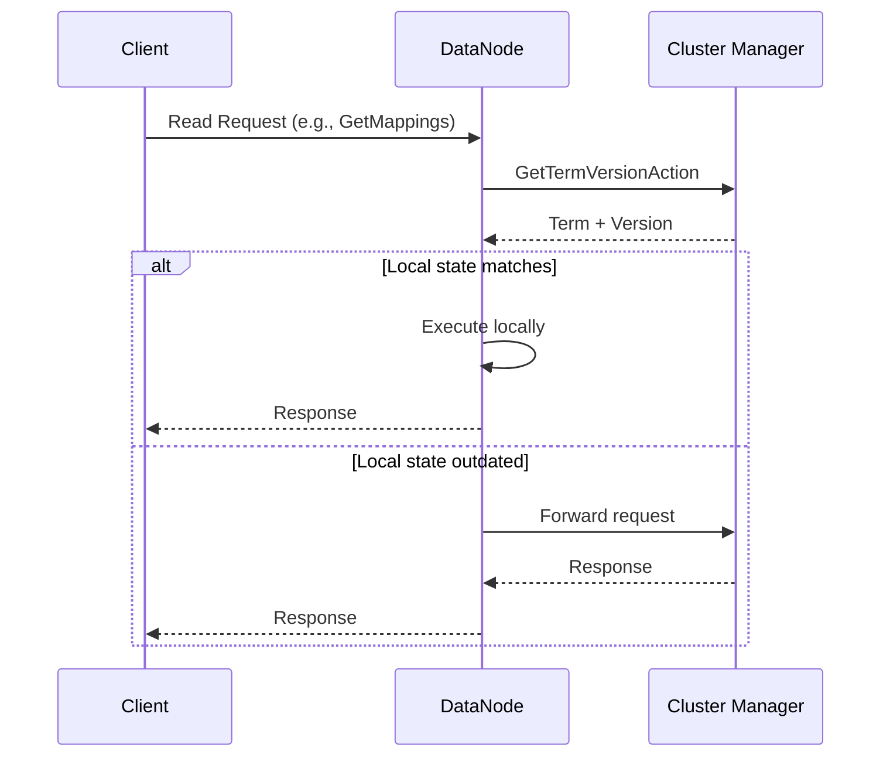

---
tags:
  - opensearch
---
# ClusterManager Optimizations

## Summary

This release enables term version check on local state for all ClusterManager Read Transport Actions. When a node receives a read request that requires cluster state data, it first performs a lightweight transport action to verify if its local cluster state is up-to-date with the cluster manager. If the local term and version match, the request is served locally without fetching cluster state from the cluster manager, reducing load on the cluster manager node.

## Details

### What's New in v2.16.0

This PR extends the term version check optimization (introduced in v2.13.0 via PR #12252) to all remaining Transport Actions that extend `TransportClusterManagerNodeReadAction`. Previously, only `TransportClusterStateAction` supported local execution with term version verification.

### Technical Changes

The implementation adds a `localExecuteSupported` flag to `TransportClusterManagerNodeReadAction` and enables it for the following transport actions:

| Transport Action | Description |
|-----------------|-------------|
| `TransportGetDecommissionStateAction` | Get decommission awareness state |
| `TransportGetRepositoriesAction` | Get snapshot repositories |
| `TransportClusterSearchShardsAction` | Get search shards information |
| `TransportGetWeightedRoutingAction` | Get weighted routing configuration |
| `TransportGetStoredScriptAction` | Get stored scripts |
| `TransportGetAliasesAction` | Get index aliases |
| `TransportIndicesExistsAction` | Check if indices exist |
| `TransportIndicesShardStoresAction` | Get shard store information |
| `TransportGetComponentTemplateAction` | Get component templates |
| `TransportGetComposableIndexTemplateAction` | Get composable index templates |
| `TransportGetIndexTemplatesAction` | Get index templates |
| `GetPipelineTransportAction` | Get ingest pipelines |
| `GetSearchPipelineTransportAction` | Get search pipelines |
| `TransportClusterInfoAction` (base class) | All cluster info actions (mappings, settings) |

### Actions Excluded from Local Execution

Some actions explicitly disable local execution due to their nature:

| Transport Action | Reason |
|-----------------|--------|
| `TransportClusterHealthAction` | Requires real-time cluster health from cluster manager |
| `TransportPendingClusterTasksAction` | Pending tasks only exist on cluster manager |

### Flow Diagram

## Limitations

- Local execution only works when the local node's cluster state term and version match the cluster manager's
- Actions that inherently require cluster manager state (health, pending tasks) cannot use local execution

## References

### Pull Requests
| PR | Description | Related Issue |
|----|-------------|---------------|
| [#14273](https://github.com/opensearch-project/OpenSearch/pull/14273) | Enabling term version check on local state for all ClusterManager Read Transport Actions | Follow-up to #12252 |
| [#12252](https://github.com/opensearch-project/OpenSearch/pull/12252) | Light weight Transport action to verify local term before fetching cluster-state from remote | [#12272](https://github.com/opensearch-project/OpenSearch/issues/12272) |
