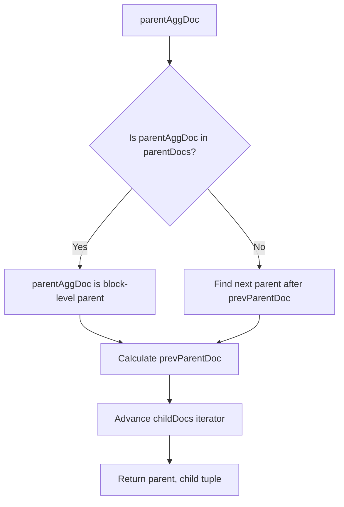

---
tags:
  - opensearch
---
# Nested Aggregations Fix

## Summary

Fixed a bug where nested aggregations with sub-nested aggregators could return inaccurate document counts. The issue occurred when the parent document ID was incorrectly assumed to always be greater than child document IDs during aggregation processing.

## Details

### What's New in v2.16.0

This release fixes a critical bug in `NestedAggregator` that caused incorrect aggregation results when using nested aggregations with sibling nested paths.

### Problem

When performing nested aggregations with multiple sibling nested paths (e.g., `nested1` and `nested2` at the same level), the aggregation results could be inaccurate. The bug manifested when:

1. A document has multiple nested objects at the same level (e.g., `nested1` and `nested2`)
2. An outer nested aggregation on one path contains an inner nested aggregation on a sibling path
3. The document ordering in Lucene didn't match the assumed parent-child relationship

**Example of affected query:**
```json
POST index/_search
{
  "aggregations": {
    "out_nested": {
      "nested": { "path": "nested2" },
      "aggregations": {
        "out_terms": {
          "terms": { "field": "nested2.age" },
          "aggregations": {
            "inner_nested": {
              "nested": { "path": "nested1" },
              "aggregations": {
                "inner_terms": {
                  "terms": { "field": "nested1.name" }
                }
              }
            }
          }
        }
      }
    }
  }
}
```

### Technical Changes

The fix introduces a new `getParentAndChildId()` method in `NestedAggregator` that correctly determines the parent-child relationship regardless of document ordering:



Key changes:
- Added `isParent()` method to validate parent-child relationships using `ObjectMapper.getParentObjectMapper()`
- Introduced `getParentAndChildId()` static method to correctly map document IDs
- Updated `LeafBucketCollector.collect()` to use the new parent-child resolution logic
- Fixed both single-bucket and buffering collectors

## Limitations

- This fix addresses sibling nested aggregations; deeply nested (parent-child) aggregations may still have edge cases in complex scenarios

## References

### Pull Requests
| PR | Description | Related Issue |
|----|-------------|---------------|
| [#13324](https://github.com/opensearch-project/OpenSearch/pull/13324) | Fix aggs result of NestedAggregator with sub NestedAggregator | [#13303](https://github.com/opensearch-project/OpenSearch/issues/13303) |

### Issues
- [#13303](https://github.com/opensearch-project/OpenSearch/issues/13303): Bug report describing inaccurate nested aggregation results
