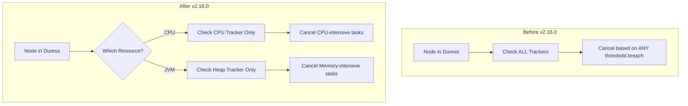

---
tags:
  - opensearch
---
# SBP (Search Backpressure) Bug Fix

## Summary

Fixed a bug in the Search Backpressure (SBP) cancellation logic that caused incorrect task cancellations. Previously, when a node was under CPU duress, tasks could be incorrectly cancelled based on heap usage thresholds even when the system had sufficient heap memory. This fix introduces resource-wise cancellation, ensuring tasks are only cancelled based on the specific resource causing the node duress.

## Details

### What's New in v2.16.0

The Search Backpressure service was refactored to introduce resource-wise cancellation when a node is in duress. The key changes include:

1. **Resource-Specific Cancellation**: When a node is under duress due to a specific resource (CPU or JVM heap), only tasks breaching thresholds for that specific resource are considered for cancellation.

2. **New Architecture**: Introduced `NodeDuressTrackers` class to manage multiple resource trackers and determine which specific resource is causing node duress.

3. **Tracker Refactoring**: All resource trackers were consolidated into `TaskResourceUsageTrackers` class with a cleaner interface for evaluating resource usage breaches.

### Technical Changes

The new cancellation logic:

| Node Duress Cause | Trackers Applied | Cancellation Criteria |
|-------------------|------------------|----------------------|
| CPU | CPU Usage Tracker, Elapsed Time Tracker | Tasks exceeding CPU time threshold |
| JVM Heap | Heap Usage Tracker, Elapsed Time Tracker | Tasks exceeding heap usage threshold |
| Both | All Trackers | Tasks exceeding any threshold |

### New Classes

| Class | Description |
|-------|-------------|
| `ResourceType` | Enum defining resource types (CPU, JVM) |
| `NodeDuressTrackers` | Container for node-level duress trackers with resource-specific checks |
| `TaskResourceUsageTrackers` | Container for task-level resource usage trackers |

### Configuration

No new configuration settings were added. Existing Search Backpressure settings continue to work as before:

- `search_backpressure.mode`: `monitor_only` (default), `enforced`, or `disabled`
- `search_backpressure.node_duress.cpu_threshold`: CPU usage threshold (default: 90%)
- `search_backpressure.node_duress.heap_threshold`: Heap usage threshold (default: 70%)

## Limitations

- The fix applies only when Search Backpressure is enabled (`enforced` mode)
- Elapsed time tracker is always applied regardless of the resource causing duress

## References

### Pull Requests

| PR | Description | Related Issue |
|----|-------------|---------------|
| [#13474](https://github.com/opensearch-project/OpenSearch/pull/13474) | Bug/sbp cancellation - Main fix | [#13295](https://github.com/opensearch-project/OpenSearch/issues/13295) |
| [#14502](https://github.com/opensearch-project/OpenSearch/pull/14502) | Backport to 2.x branch | - |

### Documentation

- [Search Backpressure Documentation](https://docs.opensearch.org/2.16/tuning-your-cluster/availability-and-recovery/search-backpressure/)
