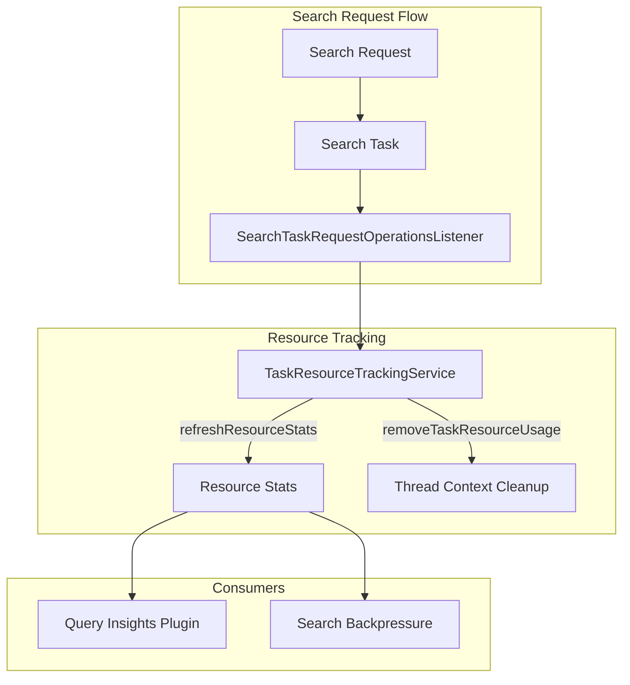

---
tags:
  - opensearch
---
# Search Thread Resource Usage

## Summary

OpenSearch 2.16.0 introduces a new listener mechanism (`SearchTaskRequestOperationsListener`) that refreshes search thread resource usage statistics upon request completion. This enables plugins like Query Insights to access accurate task resource usage data for search operations.

## Details

### What's New in v2.16.0

A new `SearchTaskRequestOperationsListener` class has been added to the OpenSearch core. This listener subscribes to search task operations and ensures resource statistics are refreshed when search requests complete.

### Technical Changes

The implementation adds:

1. **SearchTaskRequestOperationsListener**: A new listener class that extends `SearchRequestOperationsListener`
2. **Integration with TaskResourceTrackingService**: The listener calls `refreshResourceStats()` on request completion to capture accurate resource usage
3. **Node initialization changes**: The `TaskResourceTrackingService` is now initialized earlier in the node startup sequence to support the new listener

```java
public final class SearchTaskRequestOperationsListener extends SearchRequestOperationsListener {
    private final TaskResourceTrackingService taskResourceTrackingService;

    public SearchTaskRequestOperationsListener(TaskResourceTrackingService taskResourceTrackingService) {
        this.taskResourceTrackingService = taskResourceTrackingService;
    }

    @Override
    public void onRequestEnd(SearchPhaseContext context, SearchRequestContext searchRequestContext) {
        taskResourceTrackingService.refreshResourceStats(context.getTask());
        taskResourceTrackingService.removeTaskResourceUsage();
    }

    @Override
    public void onRequestFailure(SearchPhaseContext context, SearchRequestContext searchRequestContext) {
        taskResourceTrackingService.removeTaskResourceUsage();
    }
}
```

### Architecture



### Key Components

| Component | Description |
|-----------|-------------|
| `SearchTaskRequestOperationsListener` | Listener that captures search task resource usage on request completion |
| `TaskResourceTrackingService` | Service that tracks and refreshes resource statistics for tasks |
| `SearchRequestOperationsCompositeListenerFactory` | Factory that registers the new listener alongside existing listeners |

### Use Cases

This feature primarily benefits:

- **Query Insights Plugin**: Can now access accurate CPU and memory usage for search tasks at the coordinator node level
- **Search Backpressure**: Enhanced resource tracking for better backpressure decisions
- **Custom Plugins**: Any plugin implementing `SearchRequestOperationsListener` can leverage accurate resource stats

## Limitations

- Resource tracking adds minimal overhead to search request processing
- Statistics are captured at request completion, not during execution phases

## References

### Pull Requests

| PR | Description | Related Issue |
|----|-------------|---------------|
| [#14832](https://github.com/opensearch-project/OpenSearch/pull/14832) | Create listener to refresh search thread resource usage | Related to Query Insights plugin |

### Related Resources

- [Query Insights Plugin](https://github.com/opensearch-project/query-insights)
- [Search Backpressure Documentation](https://docs.opensearch.org/2.16/tuning-your-cluster/availability-and-recovery/search-backpressure/)
- [Query Insights Documentation](https://docs.opensearch.org/2.16/observing-your-data/query-insights/index/)
