---
tags:
  - opensearch
---
# System Index Registry

## Summary

OpenSearch v2.16.0 introduces the `SystemIndexRegistry` class, a centralized registry for managing system index descriptors. This feature provides static helper methods to determine if index expressions match system index patterns registered by plugins, enabling better system index protection and plugin-aware access control.

## Details

### What's New in v2.16.0

The `SystemIndexRegistry` class was created to centralize system index management that was previously scattered across `SystemIndices`. This refactoring enables:

1. **Centralized Pattern Matching**: Static methods to check if index expressions match registered system index patterns
2. **Plugin-Specific Matching**: New `matchesPluginSystemIndexPattern` method to identify system indices owned by specific plugins
3. **Overlap Detection**: Built-in validation to prevent overlapping system index patterns between plugins

### Technical Changes

#### New SystemIndexRegistry Class

```java
@ExperimentalApi
public class SystemIndexRegistry {
    // Check if indices match any system index pattern
    public static Set<String> matchesSystemIndexPattern(Set<String> indexExpressions);
    
    // Check if indices match a specific plugin's system index patterns
    public static Set<String> matchesPluginSystemIndexPattern(
        String pluginClassName, 
        Set<String> indexExpressions
    );
    
    // Get all registered system index descriptors
    static List<SystemIndexDescriptor> getAllDescriptors();
}
```

#### Key Implementation Details

- System index descriptors are stored in a map keyed by plugin canonical class name
- The Task Result Index (`.tasks*`) is automatically registered as a built-in system index
- Pattern overlap checking uses Lucene automaton operations for accurate detection
- Method signatures changed from `List` to `Set` for better performance in security use cases

#### SystemIndexDescriptor API Change

The `SystemIndexDescriptor` class was promoted from `@opensearch.internal` to `@PublicApi(since = "2.16.0")`, making it part of the stable public API.

### Architecture

```mermaid
graph TB
    subgraph "Plugin Registration"
        P1[Plugin 1] --> |getSystemIndexDescriptors| SIR[SystemIndexRegistry]
        P2[Plugin 2] --> |getSystemIndexDescriptors| SIR
        P3[Plugin N] --> |getSystemIndexDescriptors| SIR
    end
    
    subgraph "SystemIndexRegistry"
        SIR --> MAP[Descriptor Map<br/>pluginClass → descriptors]
        SIR --> PAT[Pattern Array]
    end
    
    subgraph "Query Methods"
        Q1[matchesSystemIndexPattern] --> PAT
        Q2[matchesPluginSystemIndexPattern] --> MAP
    end
```



### Motivation

This change supports the broader initiative to strengthen system index protection in the plugin ecosystem (see [security#4439](https://github.com/opensearch-project/security/issues/4439)). Previously, the security plugin maintained a hardcoded list of system indices. With this registry:

- Plugins properly register system indices via `SystemIndexPlugin.getSystemIndexDescriptors()`
- The security plugin can dynamically discover all registered system indices
- Plugin-specific access control becomes possible (a plugin can only access its own system indices)

## Limitations

- The `SystemIndexRegistry` is marked as `@ExperimentalApi` and may change in future versions
- Pattern matching is performed at registration time; dynamic pattern changes require re-registration

## References

### Pull Requests

| PR | Description | Related Issue |
|----|-------------|---------------|
| [#14415](https://github.com/opensearch-project/OpenSearch/pull/14415) | Create SystemIndexRegistry with helper method matchesSystemIndex | [security#4439](https://github.com/opensearch-project/security/issues/4439) |
| [#14750](https://github.com/opensearch-project/OpenSearch/pull/14750) | Add matchesPluginSystemIndexPattern to SystemIndexRegistry | [#14733](https://github.com/opensearch-project/OpenSearch/issues/14733) |

### Related Issues

- [security#4439](https://github.com/opensearch-project/security/issues/4439) - RFC: Strengthen System Index Protection in the Plugin Ecosystem
