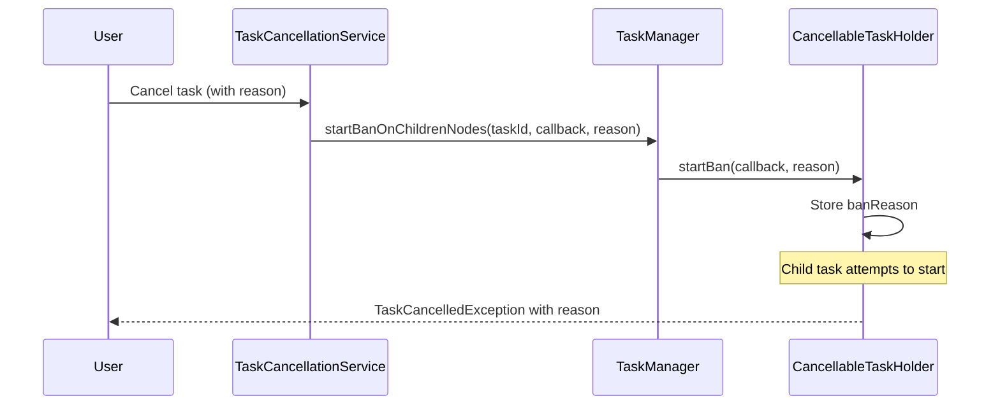

---
tags:
  - opensearch
---
# Task Cancellation

## Summary

Enhanced task cancellation error messages to include the reason why a parent task was cancelled. Previously, when a parent task was cancelled, child tasks would fail with a generic message. Now the cancellation reason is propagated to provide better debugging information.

## Details

### What's New in v2.16.0

When a parent task is cancelled in OpenSearch, any attempt to start child tasks will now include the cancellation reason in the error message. This helps operators understand why tasks failed.

**Before:**
```
TaskCancelledException: The parent task was cancelled, shouldn't start any child tasks
```

**After:**
```
TaskCancelledException: The parent task was cancelled, shouldn't start any child tasks, by user request
```

### Technical Changes

The implementation adds a `banReason` field to `CancellableTaskHolder` in `TaskManager.java`:

| Component | Change |
|-----------|--------|
| `TaskManager.CancellableTaskHolder` | Added `banReason` field to store cancellation reason |
| `TaskManager.startBanOnChildrenNodes()` | New overload accepting `reason` parameter |
| `TaskCancellationService` | Passes cancellation reason to `startBanOnChildrenNodes()` |

### Code Flow



## Limitations

- The reason is only included when child tasks attempt to start after the parent is cancelled
- Existing running child tasks are not affected by this change

## References

### Pull Requests
| PR | Description | Related Issue |
|----|-------------|---------------|
| [#14604](https://github.com/opensearch-project/OpenSearch/pull/14604) | Print reason why parent task was cancelled | [#11830](https://github.com/opensearch-project/OpenSearch/issues/11830) |

### Issues
- [#11830](https://github.com/opensearch-project/OpenSearch/issues/11830): Feature request to print detail reason why the parent task cancelled
