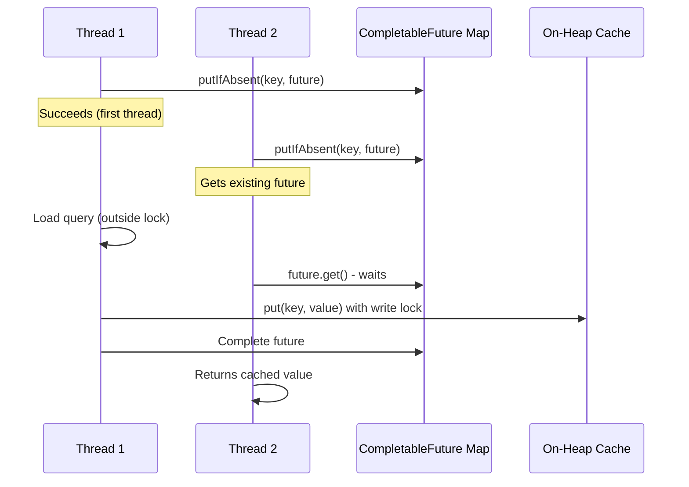

---
tags:
  - opensearch
---
# Tiered Caching Performance Improvement

## Summary

OpenSearch v2.16.0 improves tiered caching performance by moving query recomputation logic outside the write lock. This change significantly reduces thread contention during cache misses, allowing multiple threads to compute queries concurrently rather than waiting for a single global write lock.

## Details

### What's New in v2.16.0

The key change in this release addresses a performance bottleneck in the `TieredSpilloverCache.computeIfAbsent()` method. Previously, when a cache miss occurred, the query recomputation was performed while holding a write lock, causing all other threads to wait.

### Technical Changes

The implementation introduces a `CompletableFuture`-based approach to handle concurrent requests for the same key:

Key implementation details:
- A `ConcurrentHashMap<ICacheKey<K>, CompletableFuture<Tuple<ICacheKey<K>, V>>>` tracks in-flight computations
- Only the first thread for a given key performs the actual query computation
- Other threads wait on the `CompletableFuture` and receive the computed value
- The write lock is only held during the final `put()` operation, not during query computation
- Proper exception handling ensures the future map is cleaned up even when errors occur

### Performance Impact

This change provides significant performance improvements in high-concurrency scenarios:
- Eliminates thread blocking during query recomputation
- Reduces lock contention on the global write lock
- Ensures each unique key is loaded only once, even with concurrent requests
- Maintains thread safety while improving throughput

## Limitations

- This is part of the experimental tiered caching feature
- The improvement specifically targets the `computeIfAbsent()` path during cache misses
- A follow-up change to make TieredCache segmented was planned for further improvements (delivered in v2.18.0)

## References

### Pull Requests
| PR | Description | Related Issue |
|----|-------------|---------------|
| [#14187](https://github.com/opensearch-project/OpenSearch/pull/14187) | Move query recomputation logic outside write lock | [#13989](https://github.com/opensearch-project/OpenSearch/issues/13989) |

### Issues
- [#13989](https://github.com/opensearch-project/OpenSearch/issues/13989): Performance improvement for TieredCaching
