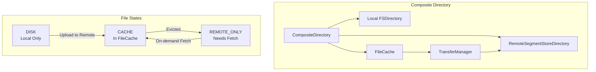

---
tags:
  - opensearch
---
# Writable Warm

## Summary

OpenSearch v2.16.0 introduces the foundational components for Writable Warm, a feature that enables cost-effective storage tiering by allowing indices to be stored partially on local disk with on-demand fetching from remote storage. This release adds the Composite Directory implementation integrated with FileCache, and REST/transport layer APIs for hot-to-warm tiering operations.

## Details

### What's New in v2.16.0

This release establishes the core infrastructure for Writable Warm with two major components:

1. **Composite Directory with FileCache Integration** - A new directory implementation that combines local and remote storage, enabling on-demand block-level fetching from remote stores
2. **Hot-to-Warm Tiering API** - REST and transport layer changes for initiating index migration from hot to warm tier

### Architecture



### Technical Changes

#### Composite Directory

The `CompositeDirectory` class provides a unified interface for accessing data stored across local and remote storage:

- **File Creation**: New files are written to local directory and tracked in FileCache
- **File Reading**: Files are served from FileCache if present; otherwise fetched on-demand from remote in blocks
- **File Deletion**: Removes files from FileCache; remote cleanup handled by garbage collection
- **Block-level Fetching**: Uses `OnDemandBlockSnapshotIndexInput` for efficient partial file retrieval

Key classes introduced:
- `CompositeDirectory` - Main directory implementation combining local and remote
- `CloseableFilterIndexOutput` - IndexOutput wrapper that adds files to FileCache on close
- `CachedFullFileIndexInput` - CachedIndexInput implementation for full files
- `FullFileCachedIndexInput` - FileCachedIndexInput extension handling clones and slices
- `BlockIOContext` - IOContext extension for passing block information to openInput
- `FileTypeUtils` - Utility class for file type detection (temp, block, lock files)

#### Hot-to-Warm Tiering API

New REST endpoint for initiating hot-to-warm migration:

```
POST /{index}/_tier/warm
```

Parameters:
- `timeout` - Request timeout
- `cluster_manager_timeout` - Cluster manager node timeout
- `wait_for_completion` - Whether to wait for tiering completion

Response format:
```json
{
  "acknowledged": true,
  "failed_indices": [
    {
      "index": "index1",
      "error": "index is not backed up by the remote store"
    }
  ]
}
```

#### Validation Rules

The tiering request validator performs the following checks:
- Cluster must have nodes with search role
- Disk threshold low watermark must not be breached on all eligible nodes
- Index must be remote store backed
- Index must be in HOT tiering state
- Index must be open
- Index health must not be RED
- Sufficient capacity must exist on warm tier nodes

### New Settings

| Setting | Description | Default |
|---------|-------------|---------|
| `index.store.data_locality` | Data locality type: `FULL` (all data local) or `PARTIAL` (subset cached locally) | `FULL` |
| `index.tiering.state` | Current tiering state of the index: `HOT`, `HOT_TO_WARM`, `WARM`, `WARM_TO_HOT` | `HOT` |

### Feature Flag

This feature is gated behind the `opensearch.experimental.feature.tiered.remote.index.enabled` feature flag. Enable it by adding to `opensearch.yml`:

```yaml
opensearch.experimental.feature.tiered.remote.index.enabled: true
```

## Limitations

- Feature is experimental and requires feature flag to be enabled
- Only supports remote store backed indices
- Composite Directory requires local directory to be of type FSDirectory
- FileCache must be initialized on the node
- Block-level fetching adds latency compared to local reads
- Temporary files are not tracked in FileCache
- Hot indices support in Composite Directory is not yet implemented

## References

### Pull Requests
| PR | Description | Related Issue |
|----|-------------|---------------|
| [#12782](https://github.com/opensearch-project/OpenSearch/pull/12782) | Composite Directory implementation and FileCache integration | [#12781](https://github.com/opensearch-project/OpenSearch/issues/12781) |
| [#13980](https://github.com/opensearch-project/OpenSearch/pull/13980) | REST and transport layer changes for hot-to-warm tiering | [#14545](https://github.com/opensearch-project/OpenSearch/issues/14545) |

### Issues
- [#12781](https://github.com/opensearch-project/OpenSearch/issues/12781): Design and implement Composite Directory and integrate with FileCache
- [#14545](https://github.com/opensearch-project/OpenSearch/issues/14545): Implement PoC for hot to warm migration - dedicated setup
- [#12501](https://github.com/opensearch-project/OpenSearch/issues/12501): Writable Warm feature request
- [#13294](https://github.com/opensearch-project/OpenSearch/issues/13294): Writable Warm proposal
