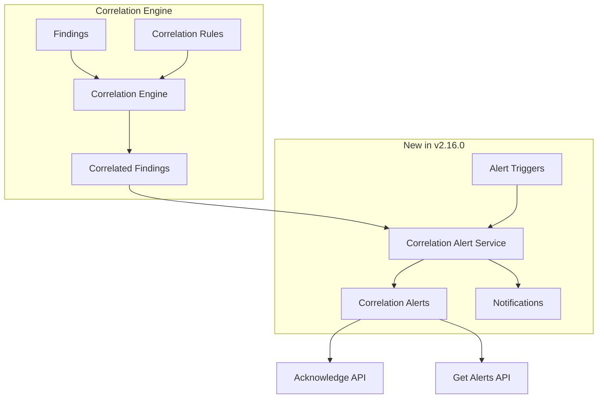

---
tags:
  - security-analytics
---
# Security Alerts & Correlations

## Summary

OpenSearch v2.16.0 introduces Correlation Alerts, a new feature in Security Analytics that enables alert triggers based on correlation rules. This allows users to receive notifications when correlated security findings match predefined correlation rules, enhancing threat detection capabilities across multiple log sources.

## Details

### What's New in v2.16.0

The Correlation Alerts feature adds alerting capabilities to the existing correlation engine:



### New APIs

#### Get Correlation Alerts API

Retrieves a list of correlation alerts with filtering and pagination support.

```
GET /_plugins/_security_analytics/correlationAlerts
```

| Parameter | Type | Description |
|-----------|------|-------------|
| `severityLevel` | String | Filter by severity level |
| `alertState` | String | Filter by alert state |
| `sortString` | String | Field to sort results by |
| `sortOrder` | String | Sort order (asc/desc) |
| `size` | Integer | Maximum results per page |
| `startIndex` | Integer | Pagination offset |
| `searchString` | String | Search filter |
| `correlation_rule_id` | String | Filter by correlation rule |

#### Acknowledge Correlation Alerts API

Updates the state of correlation alerts to ACKNOWLEDGED.

```
POST /_plugins/_security_analytics/_acknowledge/correlationAlerts
```

Request body:
```json
{
  "alerts": ["<alert-id-1>", "<alert-id-2>"]
}
```

Response:
```json
{
  "acknowledged": [<list of acknowledged alerts>],
  "failed": [<list of failed alerts>]
}
```

### Alert Trigger Behavior

- Alerts are triggered within the time window defined in correlation rules
- Only one correlation alert is generated per rule match within a time window
- If the same rule matches again within the time window, the existing alert is updated rather than creating a new one
- Alert states: ACTIVE, ACKNOWLEDGED, ERROR

### System Index

Correlation alerts are stored in the `.opensearch-sap-correlation-alerts` system index.

## Limitations

- Correlation alerts are rule-based only; auto-correlations (findings correlated without rules) do not generate alerts
- Requires correlation rules to have alert triggers configured
- Feature is marked as experimental in v2.16.0

## References

### Pull Requests
| PR | Description | Related Issue |
|----|-------------|---------------|
| [#1040](https://github.com/opensearch-project/security-analytics/pull/1040) | Alerts in correlations - index management and notification service | [#988](https://github.com/opensearch-project/security-analytics/issues/988) |
| [#1062](https://github.com/opensearch-project/security-analytics/pull/1062) | Alerts in Correlations Part 2 - Get and Acknowledge APIs | [#988](https://github.com/opensearch-project/security-analytics/issues/988) |
| [#1068](https://github.com/opensearch-project/security-analytics/pull/1068) | Backport to 2.x branch | - |
| [#1069](https://github.com/opensearch-project/security-analytics/pull/1069) | Backport Part 2 to 2.x | - |
| [#1099](https://github.com/opensearch-project/security-analytics/pull/1099) | Correlation Alert integration tests | - |

### Documentation
- [Working with Alerts](https://docs.opensearch.org/2.16/security-analytics/usage/alerts/): Security Analytics alerts documentation
- [Correlation Engine APIs](https://docs.opensearch.org/2.16/security-analytics/api-tools/correlation-eng/): API reference
